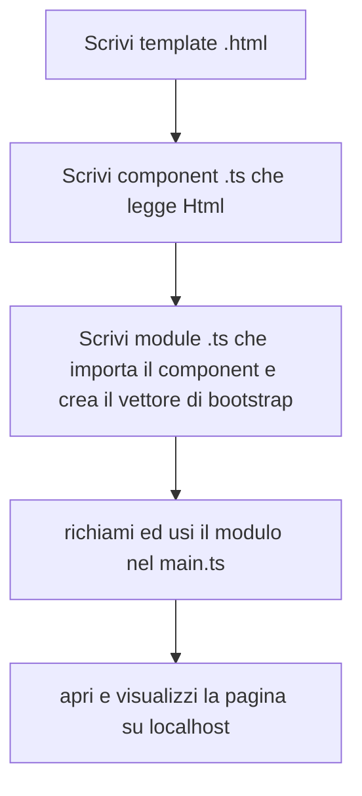
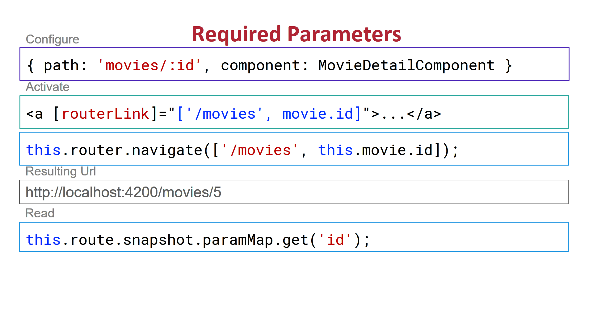
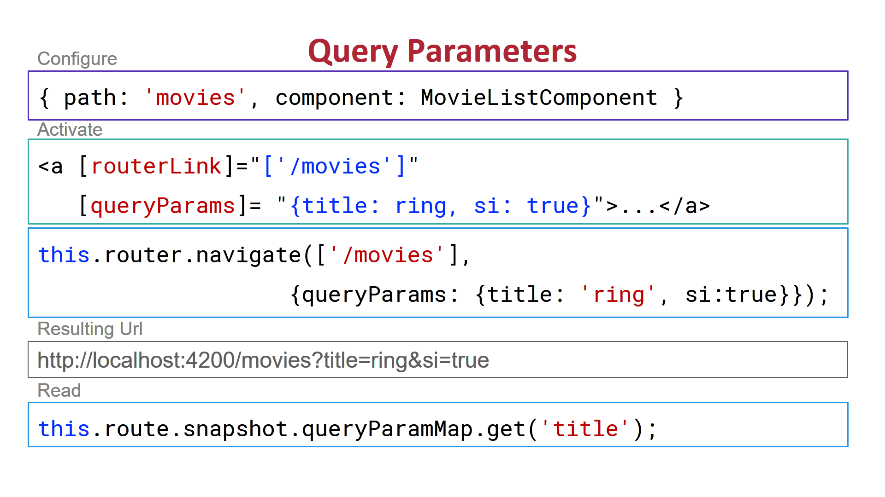
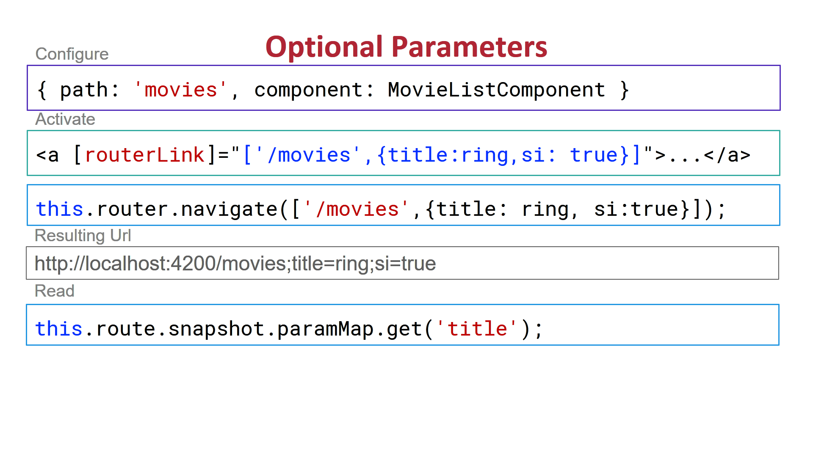
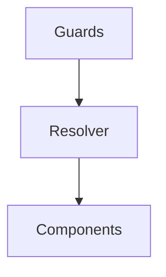
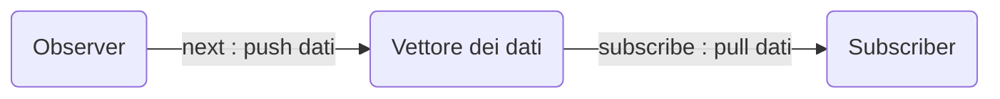
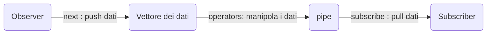

# Angular UDEMY

*A cura di* `Davide Galati (in arte PsykeDady)`

____

## LICENZA

Il seguente documento è rilasciato sotto licenza `GNU Free Documentation License`.

Qui un estratto dell'header:

```plain
GNU Free Documentation License
                 Version 1.3, 3 November 2008


 Copyright (C) 2000, 2001, 2002, 2007, 2008 Free Software Foundation, Inc.
     <https://fsf.org/>
 Everyone is permitted to copy and distribute verbatim copies
 of this license document, but changing it is not allowed.
```


Per la versione completa consultare [Il Sito Ufficiale](https://www.gnu.org/licenses/fdl-1.3.txt).

Potete trovare il sorgente originale


## Strumenti usati 

Per stilare la guida son stati utilizzati i seguenti strumenti :

-  [Typora](https://typora.io), la guida è scritta interamente in Markdown
  - Son stati utilizzati i grafici [Mermaid](https://mermaid-js.github.io/mermaid/#/)
- [Il corso Udemy di Academind](https://www.udemy.com/course/the-complete-guide-to-angular-2) 

## I MIEI PROGETTI: 

Puoi trovare i progetti su cui mi sto esercitando nei seguenti link:

- [Primo Progetto](https://github.com/PsykeDady/angularPrimaApplicazione.git) 
- [ServerBlue Server](https://github.com/PsykeDady/ServerBluePrint) 
- [Ricette](https://github.com/PsykeDady/RecipeAngularUdemy.git)
- [ServerUsers](https://github.com/PsykeDady/serverusers)


## Angular 

Angular &egrave; un framework open source di nodejs che consente di scrivere in maniera molto semplice delle single app application.


Angular utilizza **Typescript**, ovvero un linguaggio (Sviluppato da Microsoft) derivato da Javascript che lo completa aggiungendo la tipizzazione statica (rendendolo di fatti un linguaggio più robusto). Il client di Angular trasforma poi [Typescript in JavaScript](typescript.md).

### Versioni di angular

Angular ha fondamentalmente due rilasci Major : 

- Angular 1 ( o angular JS ) 
- Angular 2 ( o semplicemente Angular )


A sua volta, Angular viene rilasciato con degli aggiornamenti minori con una schedulazione fissa ( più o meno ogni 6 mesi ), attualmente siamo **alla versione 12**.


## Angular e npm

Angular &egrave; un framework di *node*, per installare il suo client (`Angular/cli`) nel nostro progetto sarà necessario quindi utilizzare il package manager di node, cio&egrave; **npm** ( e **yarn** )

Installiamo i client di `npm` e `yarn` con i nostri sistemi operativi (in modalità di amministratore).

Procediamo con: 

```bash
npm install -g @angular/cli
```


Si può forzare l'ultima release ( o una release specifica ) scrivendo: 

```bash
npm install -g @angular/cli@lastest
```


Il client di Angular si richiama poi con l'istruzione `ng`.

## NG - creare un nuovo progetto 


Per creare un nuovo progetto: 

```bash
ng new nomeprogetto
```


Normalmente i progetti angular son ottimizzati con la **strict mode** ( che rende i controlli sul codice js più rigidi ). Per disattivarli: 

```bash
ng new nomeprogetto --no-strict
```


Il tutorial ci chiederà alcune informazioni: 

- se vogliamo usare il routing di angular
- quale tipologia di fogli di stile utilizeremo 


Quindi entrare nella directory di progetto, digitare: 

```bash 
cd nomeprogetto
```


e quindi: 

```bash
ng serve
```

Questo comando crea fondamentalmente un server che ascolta sulla *porta 4200* ( valore predefinito) per poter navigare la tua applicazione. Navigare quindi all'indirizzo http://localhost:4200.


Al primo avvio ci saranno alcune importanti informazioni su Angular stesso ( *documentazioni, tutorial, blog ecc..*)


### Installazione di dipendenze in un progetto già esistente

Quando ci si scarica un progetto già esistente, conviene sempre installare tutte le dipendenze.   

Generalmente i progetti npm non si portano dietro la cartella delle dipendenze ( `node_modules` ) ritenuta molto pesante e facilmente rigenerabile in locale tramite questo comando: 

```bash
npm i
```


### Cambiare porta 

Si può pensare di cambiare porta di ascolto con angular utilizzando il flag `--port`. Supponiamo di voler usare la porta `8080`

```bash
ng serve --port 8080
```


### Raggiungere angular in test da qualunque device casalingo

Normalmente angular permette solo al **pc corrente** ( `localhost` ) di accedere all'applicazione.  

Per disabilitare questo controllo si può agire fondamentalmente in due modi, il primo è quello di impostare manualmente il proprio host locale, supponendo di essere sotto la normale rete casalinga `192.168.1.1` e che il nostro host sia il numero `30` scriveremo: 

```bash
ng serve --host 192.168.1.30
```

Tuttavia facendo così, non potremmo più collegarci dal browser utilizzando "`http://localhost:4200`".  

C'è un modo ancora più efficiente e generale di questo, che ci consente di connetterci in qualsiasi modalità, combinando due flag: `--host` e `--disable-host-check`:

```bash
ng serve --host 0.0.0.0 --disable-host-check true
```


In questo caso si utilizza l'host simbolico `0.0.0.0`, che generalmente si utilizza per indicare un indirizzo non raggiungibile. 


### comando completo 

Ecco un comando completo da copiarsi e incollarsi per il caso più generico possibile: 

```bash
ng serve --host 0.0.0.0 --disable-host-check true --port 4200
```


Se la porta `4200` è occupata, angular stesso ci chiederà se vogliamo che lui cerchi un altra porta disponibile 


### SSL - OPENSSL deprecato

Su alcune installazioni, visto che openssl è stato deprecato, potrebbe dare un problema: 

```
code: 'ERR_OSSL_EVP_UNSUPPORTED'
```


Per risolverlo è necessario sovrascrivere la variabile di sistema: `NODE_OPTIONS` con il valore: 

```bash
NODE_OPTIONS=--openssl-legacy-provider
```


Su linux scriveremo: 
```bash
set NODE_OPTIONS=--openssl-legacy-provider
```


Su Windows CMD anche: 

```bash
set NODE_OPTIONS=--openssl-legacy-provider
```


Su Windows powershell invece: 
```powershell
$env:NODE_OPTIONS="--openssl-legacy-provider";
```


Ecco i comandi completi: 

#### Linux e Windows CMD

```bash
set NODE_OPTIONS=--openssl-legacy-provider && ng serve --host 0.0.0.0 --disable-host-check true --port NUMEROPORTA
```


#### Windows Powershell

```powershell
$env:NODE_OPTIONS="--openssl-legacy-provider"; ng serve --host 0.0.0.0 --disable-host-check true --port NUMEROPORTA
```


## Prime modifiche al progetto


Diamo un occhiata ai file più importanti nel progetto: 

il `package.json` contiene le dipendenze node del progetto.  

in `src/app/app.component.html` troviamo l'homepage che vediamo andando nella pagina del server.  Possiamo quindi modificarla e ricaricare la pagina ( a server acceso. Lui ricompila automaticamente il server ) 


**<u>Compila?</u>**  si compila. Ciò che in realtà succede &egrave; che quel file che sembra html &egrave; un **template** nel quale si possono inserire alcune speciali formattazioni di *Typescript*

Il template deve però poi essere compilato, questo avviene in un file typescript.  

Nel progetto d'esempio ciò avviene tramite i file`src/app/app.component.ts`  e `src/app/app.module.ts` 


Precisamente: 

- `app.component.ts` = definisce le variabili 
- `app.modul.ts` = importa le varie librerie 


Ovviamente la struttura può cambiare di progetto in progetto


## Usare bootstrap con angular


Per installare una determinata versione di bootstrap (ad esempio la 3) utilizzare `npm`: 

```bash
npm install --save bootstrap@3
```


l'istruzione `--save` lo salverà nella cartella dei **node modules**


Ancora però non basta.   
Normalmente non si mette mano al file `angular.json`, che contiene alcune configurazioni decise dall'inizio. Tuttavia in questo caso dobbiamo fare delle modifiche per indicare il percorso locale di bootstrap.
Apriamo il file e cerchiamo dentro la sezione **architect** del json la voce **styles**, che rappresenta un vettore. 

Quindi aggiungiamo al vettore "`node_modules/bootstrap/dist/css/bootstrap.min.css`"


## Single Page Application 


Nonostante la pagina da noi modificata sia `app/app.component.html` la vera pagina caricata dal server sul browser &egrave; `index.html`. 

Ma come avviene questa sostituzione? 

Nel file **index** troviamo tra le altre questa riga: 

```html
<app-root></app-root>
```

 

### Component

Questo strano tag, che non &egrave; uno standard di *html*, lo possiamo ritrovare anche nel file *app/app.component.ts* nella notazione `@Component` proprietà `selector`: 

```typescript
@Component({
  selector: 'app-root',
  templateUrl: './app.component.html',
  styleUrls: ['./app.component.css']
})
```

Quest'istruzione sta dicendo a `ng` di sostituire il tag html `<app-root>` con ciò che viene generato dal template `app/app.component.html` ( opportunamente poi compilato da typescript )


Queste informazioni son memorizzate poi nella classe a cui si riferisce l'annotazione ( nel nostro caso `AppComponent` ), &egrave; necessario ora che quest'informazione venga riportata a sua volta ai componenti più alti. 


### Module

Innanzitutto tutte quste informazioni vengono dichiarate all'interno del **modulo** `app/app.module.ts`, e quindi importate dal  `main.ts` che &egrave; il file che viene compilato da **angular**

```typescript
import { enableProdMode } from '@angular/core';
import { platformBrowserDynamic } from '@angular/platform-browser-dynamic';

import { AppModule } from './app/app.module';
import { environment } from './environments/environment';

if (environment.production) {
  enableProdMode();
}

platformBrowserDynamic().bootstrapModule(AppModule)
  .catch(err => console.error(err));
```


#### bootstrap

In questa procedura &egrave; importatissimo il concetto di `bootstrap` ( non la libreria, ma un istruzione di Angular)

Notiamo nel file main.ts l'istruzione `bootstrapModule` riferita all'ngmodule che &egrave; definito in `app/app.module.ts`. Diamo un occhiata a quest'ultimo file: 

```typescript
import { NgModule } from '@angular/core';
import { FormsModule } from '@angular/forms';
import { BrowserModule } from '@angular/platform-browser';

import { AppComponent } from './app.component';

@NgModule({
  declarations: [
    AppComponent
  ],
  imports: [
    BrowserModule, FormsModule
  ],
  providers: [],
  bootstrap: [AppComponent]
})
export class AppModule { }
```


Notiamo quindi un vettore che si chiama `bootrap`, che contiene il Component `AppComponent`. 

*Quella &egrave; la lista di componenti che deve essere nota ad angular nel momento in cui sostituisce i valori di typescript nell'html* 


### Uno schema riassuntivo





## Component 

Analizziamo nel dettaglio un component 
Partiamo dal suo typescript.

Creiamo una classe vuota scrivendone il nome
```typescript
export class NomeComponent{

}
```


Prima del nome della classe, vanno specificate alcune informazioni aggiuntive tramite l'annotazione `Component` ( le annotazioni in angular son dette anche `Decorators`). 

le annotazioni vanno opportunamente importate: 

```typescript
import { Component } from '@angular/core';
```


Quindi scriviamo le informazioni `selector`, `templateUrl` , `StyleUrls` nell'annotazione :

- **selector** = specifica il nome del tag a cui sarà sostituito quel componente. Stiamo molto attenti a non inserire dei tag già esistenti
- **templateUrl** = specifica il path del file html (relativo) che descriverà la struttura del nostro componente 
- **styleUrls** = path dei file (relativo) di style (css, scss, etc..) che descriveranno  la forma e i colori del componente. Possono essere più di uno

```typescript
@Component({
    selector: '', 
    templateUrl:'',
    styleUrls:['']
})
```


### Creare component da cli

I componenti possono essere creati anche da terminale utilizzando il cli con l'istruzione : 

```bash
ng generate component <nomecomponent>
```

O più semplicemente con: 

```bash
ng g c <nomecomponent> 
```


Il componente viene creato in maniera ordinata in una cartella tutta sua, e viene automaticamente importato nel modulo 

> **ATTENZIONE:** 
>
> controllare comunque tutte le aggiunte fatte 


Se non dovete creare i file di test, potete utilizzare 

```bash
ng generate component nomecomponente --skip-tests
```


### definire codice html inline

il codice html può essere definito anche all'interno di typescript stesso, senza utilizzare il file di template.


All'interno dell'annotazione @Component, sostituiamo `templateUrl` con `template`: 

```typescript
@Component({
	selector:'tag',
	template: `
	<p> il nostro codice html </p>
	`
})
```


Nota che per inserire codice su più linee, &egrave; necessario usare il `backtip` ovvero il carattere **&#96;** e non le normali virgolette `'`

> <u>**ATTENZIONE:**</u> 
>
> &egrave; necessario avere o `template` o `templateUrl` in un url!


#### css 

La stessa identica cosa &egrave; possibile farla con la proprietà `styles` e quindi con i css 

## Module 

il modulo &egrave; un file typescript particolare che si occupa di descrivere le parti di un componente e come utilizzarlo


Analizziamo quello presente, l'**AppModule**:

```typescript
export class AppModule{}
```


Al suo interno troviamo l'annotazione `NgModule`, importata dall'istruzione: 

```typescript
import {NgModule} from '@angular/core';
```


I valori che troviamo al suo interno sono:

- **declarations**: lista dei componenti che fanno parte del modulo ( i componenti vanno anche importati sopra con la direttiva `import`)
- **imports**: in un modulo ne puoi importare altri che poi possono essere utilizzati all'interno dei vari file
- **providers**: funzionalità avanzata che permette di avere una gestione delle dipendenze di un modulo
- **bootstrap**: lista dei componenti da caricare all'inizio

```typescript
@NgModule({
    declarations: [],
    imports:  [],
    providers: [],
    bootstrap: []
})
```


## Usare un component in un altro 

Creiamo un component semplice: 


`app/mio.componente.ts`:

```typescript
import {Component} from '@angular/core';

@Component({
    selector:'miocomponente',
    templateUrl:'mio.componente.html'
})
export class Component {
    
}
```


`app/mio.componente.html`:

```html
<h2>
    Scrivo dal mio componente!
</h2>
```


Aggiungiamolo al module già esistente

`app/app.module.ts`: 

```typescript
import { NgModule } from '@angular/core';
import { FormsModule } from '@angular/forms';
import { BrowserModule } from '@angular/platform-browser';
import {MioComponente} from './mio.componente'
import { AppComponent } from './app.component';

@NgModule({
  declarations: [
    AppComponent,
    MioComponente
  ],
  imports: [
    BrowserModule, FormsModule
  ],
  providers: [],
  bootstrap: [AppComponent]
})
export class AppModule { }
```


Quindi possiamo richiamarlo in AppComponent: 

```html
<h3>Sono app.component</h3>

<miocomponente></miocomponente>
```

Adesso dovremmo vedere il nuovo componente usando AppComponent


## Databinding 

Uno dei pregi di sviluppare web app con angular &egrave; quello di inserire elementi dinamici nelle pagine html. 
Ad esempio attraverso l'interpolazione &egrave; facilmente possibile inserire i valori di alcune variabili in html.


Dato il component: 

```typescript
export class MioComponente{
    frase_componente="ciao"
}
```


E dato l'html: 

```html
<p>
     {{frase_componente}}
</p>
```


Il risultato finale sarà "**ciao**".


Oltre la string interpolation si ha: 

- **property binding**  

- **event binding**
- **two way binding**


### string interpolation 

Tramite la string interpolation &egrave; molto semplice inserire del testo calcolato dinamicamente tramite codici typescript in un testo html.

La string interpolation avviene con le doppie parentesi graffe= 

```html
<p>
    2&times;2={{2*2}}
</p>
```

output 

```html
2×2=4
```


Attraverso le doppie parentesi si può inserire qualunque istruzione typescript che riempirà quello spazio attraverso la stringa che genera (**deve generare una stringa**).

**Scrivendo una variabile, sarà sostituita con il suo valore.**


> **<u>NOTA BENE</u>**:
>
> supporta solo istruzioni singole, non si possono inserire più funzioni utilizzando il punto e virgola.


### Static variables String interpolation

Nel caso di variabili statiche, per richiamare l'interpolazione è leggermente più complesso il procedimento. Va creata una variabile che rappresenta la classe statica da cui richiamare i nostri valori statici: 

```typescript
export class MioComponente{
    classestatica=MioComponente
    static frase_componente: string="ciao"
}
```

Quindi possiamo scrivere: 

```html
<p>
     {{classestatica.frase_componente}}
</p>
```


### property binding 

La property binding consente di inserire delle condizioni booleane che vanno ad abilitare o disabilitare alcune proprietà degli elementi html. 

La property binding avviene con le parentesi quadre: 

```html
[proprietà_html]="condizione_booleana"
```

Facciamo l'esempio con un pulsante: 

```typescript
@Component({
  selector: 'CIAOAMIKI',
  //templateUrl: './app.component.html',
  template: `
  <button class="btn btn-primary" [disabled]="allowNewServer">Aggiungi server</button>
  `,
  styleUrls: ['./app.component.css']
})
export class AppComponent {
  title = 'primoprogetto';
  name = 'Testo d\'esempio';
  
  allowNewServer:boolean=false;
  
  constructor(){
    setTimeout(() => {
      this.allowNewServer=true;
    },2000)
  }
}
```


### event binding 

Serve collegare anche come reagisce un eventuale componente con l'utente e quindi con il codice ts che c'&egrave; dietro
a questo serve l'event binding. 
L'event binding avviene con parentesi tonde:

```html
(nome_evento)="nomemetodo()"
```

Facciamo esempio con un pulsante

```typescript
import { Component } from '@angular/core';

@Component({
  selector: 'CIAOAMIKI',
  //templateUrl: './app.component.html',
  template: `<button class="btn btn-primary" [disabled]="!allowNewServer" (click)="onCreateServer()">{{serverCreateStatus}}</button>`,
  styleUrls: ['./app.component.css']
})
export class AppComponent {
  title = 'primoprogetto';
  name = 'Testo d\'esempio';
  
  allowNewServer:boolean=false;
  serverCreateStatus:string="No Server was created!"
  
  constructor(){
    setTimeout(() => {
      this.allowNewServer=true;
    },2000)
  }

  onCreateServer(){
    this.serverCreateStatus="server was created";
  }
}
```

#### Lista degli eventi 

la lista degli eventi disponibili sono gli stessi che si avrebbero in html, senza il prefisso *on*.   
`onClick` diventa `click` ad esempio. 

Ecco alcuni degli elementi catturati da angular:

- click
- dblclick
- submit
- blur
- focus
- scroll
- cut
- copy
- paste
- keyup
- keypress
- keydown
- mouseup
- mousedown
- mouseenter
- drag
- drop
- dragover

- input 


### event data

Supponiamo un text input, vogliamo collezionarne il contenuto o tasto per tasto o comunque analizzarne pezzo per pezzo: 

```html
<input form="input" (input)="scrivi($event)"/> 
```

Dove la funzione scrivi &egrave; siffatta

```typescript
scrivi(event:any){
	console.log(event);
}
```


La variabile `$event` consente di passare il contenuto nonché l'ultima lettera inserita per ogni tasto che si digita all'interno del form input.   

La variabile al suo interno possiede alcuni campi come: 

- `data` = il tasto premuto
- `target.value` = il valore del testo


```typescript
scrivi (event:any){
	console.log("event",event)
	console.log("event.data",event.data)
	console.log("event.target.value",event.target.value)
}
```


Possiamo interpretare l'event come oggetto per l'appunto "`Event`", cambiano un po' le carte in tavole, prima di poterlo utilizzare.
`Event` &egrave; un interfaccia generica, noi nello specifico abbiamo a che fare con un `InputEvent`.   
All'interno di essi la variabile `target` &egrave; a sua volta di un interfaccia generica `EventTarget`, dobbiamo convertirlo in `HtmlInputElement`

```typescript
scrivi (event:Event){
	console.log("event",event)
	let ievent:InputEvent=event as InputEvent
	console.log("ievent.data",ievent.data)
	let etarget:EventTarget=ievent.target;
	let hielement:HTMLInputElement= etarget as HTMLInputElement;
	console.log("hielement.value",hielement.value)
}
```


### Two Way Binding


La two way binding combina la *event binding* con la *property binding*, infatti si utilizza combinando le due sintassi ( parentesi quadre e parentesi tonde ).  

Fondamentalmente questo genere di approccio consente di modificare il valore delle proprietà di una classe typescript appena si scatena un evento sul componente, mappando il valore dell'elemento in contemporanea al valore dell'evento che scatena il binding. 


Per effettuare la Two-Way-Binding con i form di input &egrave; necessario importare i `FormsModule` nell'apposito vettore degli `import` di **AppModule** (questo abiliterà la direttiva `ngModel`) e importare nel file `FormModule` dal package `@angular/forms` 

```typescript
import {FormModule} from "@angular/forms";
```


Quindi nell'html scriveremo che:

```html
<input form="input" name="nome" [(ngModel)]="variabile">
```

In questo modo la variabile cambierà insieme al valore della input text


> <u>**NOTA BENE**</u>: 
>
> Nel caso di `ngModel` e di `FormModule`, nel tag input vi &egrave; bisogno che ci sia specificata la proprietà `name` per evitare errori!


## Direttive

Attraverso le direttive &egrave; possibile inserire della logica all'interno del nostro codice HTML. 
Per creare una direttiva nuova si deve utilizzare l'annotazione `@Directive`: 

```html
<p turnToGreen> </p>
```


``` typescript
@Directive ({
    Selector:'[turnToGreen]'
})
export class turnToGreen{
    ....
}
```

Ma molte direttive sono già incluse nel core di angular, vediamo come si utilizzano.


### direttive strutturali e di attributo 

Esistono due tipi di direttive, quelle che cambiano l'html (dette strutturali) e quelle che invece cambiano gli elementi al suo interno.

Una direttiva che rimuove o aggiunge in particolari condizioni un elemento dall'html &egrave; definita strutturale
Una direttaiva che cambia il suo stile o la sua classe **Attributiva**

Le <u>direttive strutturali</u> vanno richiamate con un `*` davanti


> <u>**NOTA:**</u> 
> 
> Non possiamo avere più di una direttiva strutturale per tag

### *ngIf

Questa direttiva ci consente di abilitare parte del codice html solo se una determinata condizione &egrave; soddisfatta. Ad esempio: 

```html
<p *ngIf="false">
    Ciao fammi sparire
</p>
```

Il seguente paragrafo non verrà mai mostrato. 
Come si può notare la direttiva si usa così : 

```html
*ngIf="condizione"
```

> NOTA BENE:   
>
> il componente non viene nascosto, viene proprio eliminato dal DOM


Ovviamente ogni buon if ha un suo else. 
Per implementare un else nell'`ngIf` si utilizza la `local directive`, così: 

```html
<p *ngIf="variabile!==''; else altrimenti">
    {variabile} ha un valore
</p>

<ng-template #altrimenti>
    <p>
        la variabile non aveva un valore
    </p>
</ng-template>
```


&egrave; possibile (anche e ci sono strumenti migliori per farlo) strutturare un else if 

```html
<p *ngIf="condizione1; else elif">
    condizione1
</p>

<ng-template #elif>
    <p *ngIf="condizione2; else fine">
        condizione2
    </p>
</ng-template>

<ng-template #fine>
    <p>
        condizione3
    </p>
</ng-template>
```
> **NOTA BENE**: 
> 
> ng-if e ng-template devono stare su due tag separati se ng-template &egrave; a sua volta richiamato da un if.


### ngStyle

Tramite la direttiva ngStyle possiamo cambiare in maniera dinamica lo stile dei nostri componenti.

`[ngStyle]="{proprietàCss:'assegnamento'}"`

>**NOTA BENE** : 
>
>la proprietà può essere scritta sia come in css (tipo *background-color*) sia trasfomando il `kebab-case` in `camelCase` ( tipo *backgroundColor*)

esempio: 
```html
<span [ngStyle]:'{color:"white",backgroudColor:"red"}'>testo bianco sfondo rosso</span>
```


Quello che in realtà accetta ngStyle non &egrave; propriamente quello che scriveresti in un css, ma un customType (o un json) di typescript: 

```typescript
{
    oggetto1:"",
    oggetto2:""
}
```

la particolarità &egrave; che quindi possiamo mettere su anche un metodo che restituisce la proprietà. Così ad esempio: 

```html
<span [ngStyle]:'{color:"white",backgroudColor:coloreCasuale()}'>testo bianco sfondo rosso</span>
```

```typescript
coloreCasuale(){
    return Math.random()> 0.5? "red":"green";
}
```


O ancora meglio: 
```html
<span [ngStyle]:'coloreCasuale()'>testo bianco sfondo rosso</span>
```

```typescript
coloreCasuale(){
    return { color:"white", backgroundColor:Math.random()> 0.5? "red":"green"};
}
```


### ngClass

Similarmente a ngStyle, &egrave; possibile aggungere classi dinamicamente utilizzando typescript. Ecco la sintassi: 
`[ngClass]="{classe:boolean}"`  

Ad esempio dato il css: 

```css
.sfondoRossoTestoBianco{
    color: white;
    background: red
}
```


Quindi nell'html: 

```html
<span [ngClass]:"{sfondoRossoTestoBianco:sfondo==='rosso'}">Testo casualmente bianco su sfondo rosso</span>
```

e nel ts: 

```typescript
var sfondo=Math.random()>0.5?"rosso":"bianco"
```


### *ngFor 

una direttiva molto utile &egrave; `ngFor`, che consente di cambiare dinamicamente il contenuto di una pagina in base al contenuto di una lista.

Supponiamo di avere nel typescript la lista: 

```typescript
lista=["patate","carciofi"]
```

Quindi nell'html avere: 

```html
<p *ngFor="let ortaggio of lista">{{ortaggio}}</p>
```

il risultato sarà: 

```
patate
carciofi
```


Tuttavia potremmo aver bisogno anche di informazioni sull'indice, in tal caso possiamo ottenerla aggiungendo `let nomevariabile =index`: 

```html
<p *ngFor="let ortaggio of lista; let indice = index ">Ortaggio numero {{indice}} = {{ortaggio}}</p>
```

In tal caso otterremo: 

```
Ortaggio numero 1 = patate
Ortaggio numero 2 = carciofi
```

Queste variabili possiamo poi utilizzarle anche in altre direttive o codici typescript interni.

s

#### bug con input-group

Usando un Ng for con un input group vi è un bug che riporta allo stato di default l'elemento dell'input appena lo si smette di editare, per superarlo bisogna usare la funzione trackby. Scrivere il seguente template nell'html:

```html
<div class="input-group" *ngFor="let ingredient of recipe.ingredients; trackBy: trackByFn;">
```

Definire nel typescript la funzione trackByFn: 

```typescript
trackByFn(index, item) {
    return index;  
}
```

### [ngSwitch]

Una particolare direttiva è quella dell' `ngSwitch` che di per se è una direttiva "**attribuitiva**" ma che utilizza al suo interno delle direttive "**strutturali**". 
Vediamo come si usa: 

```html
<div [ngSwitch]="variabile">
    <p *ngSwitchCase="valore1">Cosa mostrare per variabile = valore1</p>
    <p *ngSwitchCase="valore2">Cosa mostrare per variabile = valore2</p>
    <p *ngSwitchCase="valore3">Cosa mostrare per variabile = valore3</p>
    <p *ngSwitchDefault>Cosa mostrare per tutti gli altri valori</p>
</div>
```


Vediamo un esempio concreto: 

```typescript
export class AppComponent {
  valore=-1;
}
```

e html: 

```html
<input type="text" [(ngModel)]="valore" id="inpValore" name="inpValore">
<div [ngSwitch]="valore">
	<p *ngSwitchCase="10">valore=10</p>
	<p *ngSwitchCase="100">valore=100</p>
	<p *ngSwitchCase="1000">valore=1000</p>
	<p *ngSwitchDefault>Non valido</p>
</div>
```


## Debug application 


### Gli errori 

La gestione e la stampa degli errori in console ( sugli strumenti di sviluppatore del nostro browser ) son migliorati da Angular e risultano leggermente più utili di quelli che normalmente stamperebbe Javascript. 


### Il debug 

Angular supporta *il source mapping*.  

In parole povere possiamo mandare in debug l'applicazione dagli strumenti per sviluppatori del nostro browser accedendo al codice typescript originale nonostante in realtà il browser utilizzi un bundle compresso.

#### step-by-step

Inserire un punto di debug nel codice ( risulterà un codice unico sotto il nome di `main.js` o `main.bundle.js`) in uno dei qualunque metodi typescript di cui farne il debug. Quando un evento scatenerà quel punto di debug, si verrà reindirizzati su un file typescript con il codice originale.

Nei vari browser esistono diversi modi per accedere alla pagina del "codice sorgente" dove poter inserire il punto di debug. Esempi: 

- chrome : strumenti per sviluppatori &rarr; origini &rarr; main.js
- firefox : strumenti per sviluppatori &rarr; Debugger &rarr; main.js 


#### WEBPACK 

Sempre nella scheda dei codici sorgenti possiamo anche identificare direttamente il nostro codice sorgente in typescript andando nella sorgente denominata WEBPACK, la quale scandisce il nostro file system nella cartella del progetto facendoci vedere le varie parti ( cartella src/app e i vari ts )


## Custom Property Binding

Di default gli attributi di una determinata classe che rappresenta un component sono accessibili solo dal componente html di quello stesso componente. 
Supponendo di avere quindi un certo componente server: 

```typescript
export class ServerElementComponent  {

  server:{name:string, type:string, content:string};
}
```

Lo stesso &egrave; visibile in tutte le sue proprietà all'interno del componente html del suo template: 

```typescript
@Component({
  selector: 'app-server-element',
  templateUrl: './server-element.component.html',
  styleUrls: ['./server-element.component.css']
})
```

`server-element-component.html`:

```html
<div class="panel panel-default">
	<div class="panel-heading">{{server.name}}</div>
	<div class="panel-body">
		<p [ngStyle]=coloreBody()>
			{{server.content}}
		</p>
	</div>
</div>
```

Ma non ai componenti che lo usano, per cui un operazione del genere definita in un componente esterno: 

```html
<app-server-element
                    [server]="{'name':'Nome','type':'server','content':'Il contenuto'}">
</app-server-element>
```

Fallirà.  

Quello che serve qui &egrave; un annotazione (decorator) chiamata `@Input` (importata da `@angular/core`) sulla proprietà che vogliamo esporre. 
Ecco come cambia il nostro codice di `ServerElementComponent`: 

```typescript
export class ServerElementComponent  {
  @Input() server:{name:string, type:string, content:string};
}
```

 Adesso possiamo fare il binding delle proprietà dall'esterno come scritto sopra.


#### Property binding senza quadre 

Si può fare un property binding senza parentesi quadre se l'elemento che si vuole passare è una stringa. Normalmente il property binding di una stringa avviene così : 

```html
<elemento-custom
  [proprietà]="'valore'"               
>     
</elemento-custom> 
```


Si può accorciare la sintassi in 

```html
<elemento-custom
  proprietà="valore"               
>     
</elemento-custom> 
```


Anche se non è una pratica molto leggibile, si potrebbe confondere *la custom property* con un attributo di html.


#### Direttive strutturali viste come property binding 

In realtà le direttive strutturali sono delle property binding dell'elemento `ng-template`, dunque il codice: 

```html
<p *ngIf="condizione">
    Se condizione &egrave; falsa io sparisco!
</p>
```


&egrave; la stessa di 

```html
<ng-template [ngIf]="condizione">
	<p>
        Se condizione &egrave; falsa io sparisco!
    </p>
</ng-template>
```


### Rinominare un Input property ( alias )

L'annotazione Input va richiamata davanti la proprietà da "esporre" come fosse una funzione. Ma cosa possiamo inserire all'interno di quella funzione? 

Possiamo creare ad esempio un alias per far si che all'esterno l'etichetta della proprietà richiamata sia diversa dal nome della proprietà interna.   

Supponendo ad esempio che il nostro codice **Typescript** di `ServerElementComponent` sia così: 

```typescript
export class ServerElementComponent  {
  @Input("srv") server:{name:string, type:string, content:string};
}
```

Dall'esterno possiamo richiamare la proprietà così: 

```html
<app-server-element
                    [srv]="{'name':'Nome','type':'server','content':'Il contenuto'}">
</app-server-element>
```

Se utilizziamo un alias non possiamo ovviamente più richiamare la proprietà come il nome della variabile


## Custom Event Binding 

Similmente a come si possono esporre delle proprietà, possiamo esporre degli eventi. In realtà gli eventi in una classe con anch'essi degli attributi di tipo `EventEmitter` da `angular/core`. 

La classe `EventEmitter` &egrave; una classe con parametri generici, cio&egrave; dobbiamo specificare attraverso le parentesi angolate il tipo di dato che viene restituito nel momento in cui l'evento viene catturato. 

```typescript
variabileEvento=new EventEmitter<TipoDaRestituire>();
```

Ma come fare scaturire l'evento? All'interno della classe che definisce i due attributi evento deve essere chiamata (al momento in cui si desidera che l'evento venga scaturito il metodo `emit(OggettoDaRestituire)` sulla variabile `EventEmitter`)

```typescript
scaturisciEvento(){
	variabileEvento.emit(new TipoDaResistuire());
}
```


Ora costruiamoci su un ragionamento. Le *property binding* rappresentano delle proprietà che *dall'esterno* vanno a modificare degli attributi della nostra classe *interna*. Per ciò prima abbiamo utilizzato *l'annotazione @Input*.  

Le **event binding** son proprietà che **dall'interno** della nostra classe devono in un qualche modo influenzare l'**esterno**, questo ci dovrebbe già fare intuire che l'annotazione corretta da premettere alle nostre variabili in questo frangente &egrave; `@Output` (sempre importata da `angular/core`): 

```typescript
@Output() variabileEvento=new EventEmitter<TipoDaRestituire>();
```


Supponiamo di avere due pulsanti per aggiungere due tipi diversi di server alla nostra lista. 

Scriviamo un `CockpitComponent` con due label che legano due variabili (una per il nome e una per il contenuto) e due bottoni che scatenano due eventi creati da noi.

Ecco il template html: 

```html
<div class="row">
	<div class="col-xs-12">
		<p>Add new Servers or blueprints!</p>
		<label>Server Name</label>
		<input type="text" class="form-control" [(ngModel)]="newServerName">
		<label>Server Content</label>
		<input type="text" class="form-control" [(ngModel)]="newServerContent">
		<br>
		<button [disabled]="newServerContent===''||newServerName===''" class="btn btn-primary" (click)="onAddServer()">Add Server</button>
		<button [disabled]="newServerContent===''||newServerName===''" class="btn btn-primary" (click)="onAddBlueprint()">Add Server Blueprint</button>
	</div>
</div>
```

Dunque il typescript: 

```typescript
import {Component,EventEmitter,Output} from "@angular/core";

export class CockpitComponent {

	@Output() serverAdded = new EventEmitter<{name:string,content:string}>();
	@Output() blueprintAdded = new EventEmitter<{name:string,content:string}>();
	newServerName;string =""; 
	newServerContent:string="";
  

  onAddServer(){
	this.serverAdded.emit({"name":this.newServerName,"content":this.newServerContent})
  }

  onAddBlueprint(){
	this.blueprintAdded.emit({"name":this.newServerName,"content":this.newServerContent})
  }

}
```


A questo punto il componente esterno che utilizzerà quello appena definito andrà a catturare gli eventi con un eventBinding siffatto: 

```html
<app-cockpit
		(serverAdded)="onServerAdded($event)"
		(blueprintAdded)="onBlueprintAdded($event)"
></app-cockpit>
```

E il tuo typescript conterrà i metodi di cattura che sfrutteranno i dati dell'evento: 

```typescript
onServerAdded(data:{name:string,content:string}){
    this.serverElements.push({
        "type":"server",
        "name":data.name,
        "content":data.content
    })
}
onBlueprintAdded(data:{name:string,content:string}){
    this.serverElements.push({
        "type":"blueprint",
        "name":data.name,
        "content":data.content
    })
}
```


#### Rinominare un Output property (alias) 

Anche nel caso dell'output si può creare un alias da utilizzare al posto del nome della variabile semplicemente passando una stringa al tempo della creazione dell'annotazione `Output`. Nell'esempio precedente possiamo modificare come segue: 

```typescript
 @Output("server") serverAdded = new EventEmitter<{name:string,content:string}>();
 @Output("blueprint") blueprintAdded = new EventEmitter<{name:string,content:string}>();
```

In fase di uso quindi: 

```html
<app-cockpit
		(server)="onServerAdded($event)"
		(blueprint)="onBlueprintAdded($event)">
</app-cockpit>
```


Ovviamente anche in questo caso se viene definito un alias non &egrave; poi possibile riutilizzare il nome della variabile! 


## CSS style e View Encapsulation 

Normalmente lo stile su Angular viene poi replicato con una tecnica chiamata "emulazione". Ma emulazione di che? Ciò che viene emulato &egrave; una tecnica chiamata **ShadowDOM** 


### Shadow DOM 

lo **Shadow DOM** &egrave; una tecnologia presente in alcuni browser capace di generare codice HTML al runtime sotto alcune condizioni senza che sia necessariamente presente il file html.

Sostanzialmente si tratta di alcuni metodi javascript, attraverso questo metodo si &egrave; capaci di strutturare modularmente HTML creando dei frammenti in cui sono applicati stili e regole js senza influenzare il resto del documento, senza appesantire troppo il caricamento quindi di script e fogli di stile (che vengono caricati invece quando richiesti e non a priori) e soprattutto in un modo strutturato e ben organizzato, spesso generato automaticamente da alcuni framework

Lo shadow DOM non &egrave; però supportato da qualunque browser ( i nuovi browser dovrebbero essere tutti capaci di interpretarlo )

[Qui si trova un esempio di codice che genera uno Shadow DOM](https://gist.github.com/ebidel/2d2bb0cdec3f2a16cf519dbaa791ce1b) ( e verifica anche il browser con un eventuale compatibilità)

### Angular e l'emulazione dello shadow DOM

Per comportamento predefinito Angular emula il comportamento dello shadow DOM, questo rende comunque l'applicazione modulare ma meno leggera di come se usasse realmente lo shadow DOM, &egrave; comunque compatibile con tutti i tipi di browser. 
All'interno di un componente &egrave; possibile definire se esso deve o no utilizzare l'incapsulamento agendo sull'annotazione `Component`, ecco come: 

```typescript
@Component({
  selector: '...',
  templateUrl: '...',
  styleUrls: ['...'],
  encapsulation: VALORE
})
```


i possibili valori sono: 

- `ViewEncapsulation.None` : non utilizza alcun incapsulamento
- `ViewEncapsulation.Emulated` : gli stili non sono globali come se ci fosse lo shadow dom, ma son comunque tutti caricati inizialmente
- `ViewEncapsulation.ShadowDom` : utilizza lo ShadowDOM


## Etichette ( Element References )

Ogni elemento di HTML può avere un etichetta, abbiamo già utilizzato questa funzione negli `ngIf` nel momento in cui si &egrave; specificato quale blocco attivare in caso dell'`else`.  

A cos'altro può servire utilizzare un etichetta locale ? Ad esempio per passare ad un metodo richiamato un componente html:

```html
<input type="text" #etichetta>
<button (click)="reset(etichetta)">
    Reset Input
</button>
```

```typescript
reset(inputElement: HTMLInputElement){
    inputElement.value="";
}
```

Il suo valore può essere utilizzato anche all'interno dell'html usando la string interpolation: 

```html
<p>
     {{etichetta.value}}
</p>
```


> **<u>Attenzione</u>**   
>
> Normalmente questo valore &egrave; statico e non viene aggiornato dinamicamente con il mutare dell'elemento in html ( a meno che non venga scaturito un qualche evento). Motivo per cui il modo più corretto di utilizzarlo potrebbe essere: 
>
> ```html
> <p>
>      {{etichetta?etichetta.value:""}}
> </p>
> ```
> **Data la natura della staticità di questo dato, non &egrave; consigliato modificare i dati del DOM usando questo metodo** 


### @ViewChild

Tramite l'annotazione `@ViewChild` &egrave; possibile inizializzare all'interno del codice TypeScript una variabile che riflette un determinato componente con una certa etichetta locale.

Per utilizzare questa funzionalità &egrave; sufficiente inizializzare una variabile con l'annotazione che la precede: 

```typescript
@ViewChild("etichetta") nomevariabile:ElementRef
```


Che classe &egrave; `ElementRef`? é letteralmente un riferimento all'elemento HTML, per prelevare il contenuto si deve prima controllare che sia definita la variabile, quindi utilizzare l'attributo `nativeElement`. Ad esempio così: 

```typescript
contenuto= this.ext && this.etx.nativeElement ? this.etx.nativeElement : null; 
```


Riprendiamo l'esempio dell'etichetta di input, &egrave; possibile evitare di passare l'etichetta come parametro del metodo sfruttando questo meccanismo: 

```html
<input type="text" #etichetta>
<button (click)="reset()">
    Reset Input
</button>
```

```typescript
@ViewChild("etichetta") etx:ElementRef; 
reset(){		
    if(! this.etx || ! this.etx.nativeElement ) return ;
    (this.etx.nativeElement as HTMLInputElement).value="" 
}
```


#### Da Angular 8+ 

da angular 8+ non &egrave; più necessario aggiungere come secondo parametro `{static:true}`


### @ContentChild

Similmente  Potreste utilizzare il `ContentChild` l'interno di un contenuto  

```typescript
@ContentChild("etichetta") nomevariabile:ElementRef
```


> <u>NOTA</u> : 
>
> Non sono attualmente riuscito a fare funzionare questa cosa (da un `undefined`), ho letto che ci sono numerose perplessità in giro a riguardo

## Il contenuto di un tag di un componente custom (ng-content)

Quando si crea un componente si viene a perdere per comportamento predefinito ciò che si scrive all'interno del suo tag. Questo contenuto può essere poi prelevato da angular.

### ng-content

Attraverso il tag `<ng-content>` &egrave; possibile recuperare il contenuto del tag direttamente nell'HTML, supponiamo il componente `titolo-blu` ed il contenuto del suo file html: 

```html
<h1 style:"color:blue">
    <ng-content> 
    </ng-content>
</h1>
```

All'interno del tag non &egrave; possibile scrivere nient'altro.

Ora semplicemente possiamo passare il contenuto dal componente padre: 

```html
<titolo-blu>
    Titolo
</titolo-blu>
```


## Lifecycle 

Ogni componente ha di per se alcuni eventi che vengono scatenati automaticamente e indipendentemente dal fatto che siano o meno chiamati e gestiti dal programmatore.

Questi sonoi: 

- `ngOnInit` : chiamato quando viene creato un componente ( dopo il costruttore però )
- `ngOnChanges` : chiamato ogni modifica di una certa proprietà definita come `@Input` di un componente ( anche quando vengono create )
- `ngOnDoCheck` : creato ogni cambiamento del modello html, viene scatenato un evento o viene reinderizzato il componente
- `ngAfterContentInit` : quando viene creato e visualizzato il contenuto del componente (`<ng-content>`)
- `ngAfterContentChecked` : dopo che il contenuto viene aggiornato ( o modificato ) 
- `ngAfterViewInit` : dopo che il contenuto e tutti i suoi figli vengono caricati visualmente 
- `ngAfterViewChecked` : dopo il contenuto e tutti i suoi figli vengono aggiornati ( o modificati )
- `ngOnDestroy` : il componente viene rimosso dal DOM 


### ngOnInit

Questo hook viene chiamato ogni volta che il componente viene creato ma solo dopo il suo costruttore. 
Per sfruttarne il meccanismo bisogna importare `OnInit` da `@angular/core` e implementare il metodo `ngOnInit` (senza parametri). 
Vediamo un esempio: 

```typescript
export class AppComponent implements OnInit, OnChanges {
  constructor() {
    console.log("app.component constructor")
  }

  ngOnInit() {
    console.log("init on app.component")
  }
}
```

Se avviamo la nostra applicazione vedremo in log: 

```typescript
app.component constructor
init on app.component
```


### ngOnChanges

Questo hook viene chiamato per ogni cambiamento delle proprietà di un componente.  Se una determinata variabile all'interno del Typescript muta ad esempio, viene chiamato.  

Per sfruttare le sue funzionalità bisogna  implementare `OnChanges` da `@angular/core` e quindi creare un metodo con intestazione `ngOnChanges(variabile:SimpleChanges)`. Ad esempio: 

```typescript
export class AppComponent  implements OnChanges {

  @Input('srv') server:{name:string, type:string, content:string};

  ngOnChanges(changes:SimpleChanges){
    console.log("change on AppComponent")
    console.log(changes)
  }
}
```

Se inseriamo un elemento di questo tipo, ne cambiamo quindi le proprietà ed il risultato sarà il seguente :

```json
change on AppComponent
    {server: SimpleChange}
        server: SimpleChange
        currentValue: {type: 'server', name: 'asd', content: 'dsa'}
        firstChange: true
        previousValue: undefined
        [[Prototype]]: Object
    [[Prototype]]: Object
```

Da notare come viene *creato in realtà un json di* `SimpleChange`.

Proviamo a stampare direttamente l'elemento di cui ci interessa il cambiamento: 

```typescript
export class AppComponent  implements OnChanges {

    @Input('srv') server:{name:string, type:string, content:string};

    ngOnChanges(changes:SimpleChanges){
        if(! changes || ! changes["server"]) return ; 
        console.log("server change on ServerElementComponent")
        console.log(changes["server"])
    }
}
```

Alla creazione di un server :

```json
 {server: SimpleChange}
    server: SimpleChange
    currentValue: {type: 'server', name: 'asd', content: 'dsa'}
    firstChange: true
    previousValue: undefined
    [[Prototype]]: Object
    [[Prototype]]: Object
```


Quali sono i campi interessanti di questa classe ?

- `firstChange` : true se &egrave; la prima volta che cambia 
- `currentValue` : contiene il valore attuale della variabile 
- `previousValue` : contiene il valore precedente della variabile 


Per capire meglio come funzionano gli altri campi creiamo un nuovo componente che preleva un dato "testo" da un input form di un componente esterno: 

```typescript
export class ComponenteTesto implements OnChanges{
	@Input() testo: string;

	ngOnChanges(changes: SimpleChanges) {
		if(! changes || ! changes["testo"]) return;
		console.log("changes detected")
		console.log(changes["testo"])
	}
}
```

Al suo esterno un certo componente fatto così: 

```typescript
export class AppComponent {
    testo:string; 
}
```

```html
<input type="text" class="form-control" [(ngModel)]="testo">
<componente-testo
             [testo]="testo"
></componente-testo>
```


Modificando il form di input (supponiamo di inserire lettera per lettera la frase *asd*) avremo quest'output: 

```json
changes detected
SimpleChange {previousValue: undefined, currentValue: undefined, firstChange: true}
changes detected
SimpleChange {previousValue: undefined, currentValue: 'a', firstChange: false}
changes detected
SimpleChange {previousValue: 'a', currentValue: 'as', firstChange: false}
changes detected
SimpleChange {previousValue: 'as', currentValue: 'asd', firstChange: false}
```

Come si può vedere il metodo `onChange` viene richiamato per ogni lettera inserita, `currentValue` rappresenta sempre lo stato finale del cambiamento, `previousValue` quello precedente e `firstChange` cambia solo la prima volta


### ngDoCheck 

Questo hook viene chiamato per ogni modifica del componente che influenza in qualche modo gli elementi html o renderizzazione del componente.   

> **NOTA BENE:** 
> 
> Se viene premuto un pulsante, cambia un focus o un valore viene richiamato, praticamente in continuazione, *questo potrebbe causare delle perdite di performance* se usato su grandi componenti con tanti altri componenti innestati.

Per sfruttarlo si può implementare `DoCheck` da "`@angular/core`" e quindi scrivere il metodo `ngDoCheck`: 

```typescript
export class AppComponent implements DoCheck {
    ngDoCheck () {
        console.log("docheck on AppComponent")
    }
}
```


### ngAfterContentInit

Viene chiamato quando viene creato il testo di `<ng-content>`, anche se questo non viene poi utilizzato all'interno del componente.  

Per sfruttarlo si implementa la classe `AfterContentInit` da "`@angular/core`" e si scrive il metodo `ngAfterContentInit`: 

```typescript
export class AppComponent implements AfterContentInit {
    ngAfterContentInit () {
        console.log("ng content init on AppComponent")
    }
}
```


### ngAfterContentChecked

Questo hook viene chiamato dopo che il rilevatore di modifiche ha controllato il contenuto di `<ng-content>` del componente, a prescindere se sia cambiato o no.  

Per sfruttarlo si implementa `AfterContentChecked` da `@angular/core` e si scrive il metodo `ngAfterContentChecked`: 

```typescript
export class AppComponent implements AfterContentChecked {
    ngAfterContentChecked () {
        console.log("ng content checked on AppComponent")
    }
}
```


### ngAfterViewInit

Viene chiamato quando viene creato graficamente il componente e tutti i suoi figli  

Per sfruttarlo si implementa la classe `AfterViewInit` da "`@angular/core`" e si scrive il metodo `ngAfterViewInit`: 

```typescript
export class AppComponent implements AfterViewInit {
    ngAfterViewInit() {
        console.log("view init on app component")
    }
}
```


#### afterviewinit VS oninit

Se si ha un elemento di tipo ngContent o che viene creato in tempo di visualizzazione su html, questo non lo si può vedere con ngoninit ma lo si può  vedere da afterviewinit

### ngAfterViewChecked

Questo hook viene chiamato dopo che il rilevatore di modifiche ha controllato tutti i componenti grafici del componente e i suoi figli.

Per sfruttarlo si implementa `AfterViewChecked` da `@angular/core` e si scrive il metodo `ngAfterViewChecked`: 

```typescript
export class AppComponent implements AfterViewChecked {
    ngAfterViewChecked() {
        console.log("view checked on component")
    }
}
```


### ngOnDestroy 
Questo hook viene chiamato quando viene rimosso dal DOM un componente.   

Per sfruttarlo si implementa `OnDestroy` da `@angular/core` e si scrive il metodo `ngOnDestroy`: 

```typescript
export class AppComponent implements OnDestroy {
    ngOnDestroy(){
        console.log("component destroyed")
    }
}
```


## Creare una direttiva 

Le direttive si possono creare.   

Normalmente i file che contengono direttive hanno (per convenzione) il nome che finisce per `.directive.ts`. Sono ovviamente scritte in Typescript 


Per crearne una bisogna utilizzare l'annotazione `Directive` importata da `@angular/core`: 


```typescript
import {Directive} from '@angular/core' ; 
 
@Directive({
    ...
})
export class NomeDirettiva{ 
}
```


L'annotazione preleva in input un oggetto, in questo gli dobbiamo inserire il "**selettore**" o `selector`, cio&egrave; quella parolina che dovremo inserire nei vari tag per attivare la direttiva. 

```typescript
import {Directive} from '@angular/core' ; 
 
@Directive({
    selector: '[nomeSelettore]'
})
export class NomeDirettiva{ 
}
```

Vediamo ora come continuare l'implementazione. 

Creiamo un costruttore  che prelevi in input un `elementRef`
```typescript 
costructor(elementRef:ElementRef){
	
}
```

Su questo facciamo le modifiche che vogliamo.

Ad esempio modifichiamo il background di rosso: 

```typescript
costructor(elementRef:ElementRef){
	el.nativeElement.style.backgroundColor="red"
}
```


Andiamo nell` 'AppModule` e nel vettore dei *declaration* aggiungiamo la nostra direttiva: 

```typescript
 declarations: [
 	...,
     BasicHighlightDirective
 ],
```


Quindi ora possiamo utilizzarla nei nostri html: 

```html
<p nomeSelettore>
    test direttiva
</p>
```


### Il Renderer (2)

Si può agire in maniera più "intelligente" sui componenti utilizzando una classe chiamata `Renderer` importata da `@angular/core`, nel costruttore dopo la variabile di tipo `elementRef`: 

```typescript
constructor(elementRef:ElementReference, renderer: Renderer2){
    ...
}
```

Con il renderer possiamo applicare metodi come `setStyle`: 

```typescript
constructor(elementRef:ElementReference, renderer: Renderer2){
	renderer.setStyle(elementRef.nativeElement,"background-color","red")
}
```

> **<u>NOTA</u>**: 
>
> setStyle va applicato sull'elemento interno al riferimento

Altre informazioni [sulla documentazione uffiale](https://angular.io/api/core/Renderer2).

### eventi sulle direttive

Possiamo abilitare delle modifiche sulle direttive in base agli eventi del DOM. Ad esempio l'evento `over` del mouse : 

```typescript
@HostListener('mouseenter') mouseover (eventData:Event) {
}
```

Applicare quindi al suo interno tutto quello che si vuole. 

Facciamo un esempio, aggiungiamo l'ombra ad un testo quando sorvolato: 

```typescript
@HostListener('mouseenter') mouseover (eventData:Event) {
    this.renderer.setStyle(this.el.nativeElement, "text-shadow", "0px 0px 1px red")
}

@HostListener('mouseleave') mouseleave (eventData:Event) {
    this.renderer.setStyle(this.el.nativeElement, "text-shadow", "0px 0px 0px transparent")
}
```


### HostBinding

Un altro modo di modificare i componenti oltre che con [ElementRef](##Creare-una-direttiva) e [Renderer2](###Il-Renderer-2) è tramite l'annotazione `@HostBinding` di `@angular/core`  che agisce direttamente su determinate proprietà del componente. Supponiamo di voler modificare direttamente il colore di background di un componente sotto una certa direttiva, aggiungiamo nella classe che rappresenta la direttiva una variabile siffatta.  

```typescript
@HostBinding ('style.backgroundColor') bgColor: string; 
```

> NOTA BENE: 
> è importante sostituire i trattini alti ( `-` ) con il `camelCase`


Per modificare quindi il colore scriveremo: 

```typescript
bgColor= "blue"; 
```


Per lavorare su una classe bisogna mettere già nel binding il nome stesso della classe.   
Ad esempio: 

```typescript
@HostBinding ('class.btn-danger') dangerBtn : boolean =false; 
```

Quindi: 

```typescript
dangerBtn=true; 
```

per applicarla.


## Creare una direttiva strutturale 

Si può creare una direttiva che modifichi la struttura del DOM, eliminando o aggiungendo dei pezzi di html. 
Per farlo bisogna seguire alcuni passaggi. Creiamo una direttiva custom: 

```typescript
@Directive({
    selector:"[strutturale]"
})
export class DirettivaStrutturale {
    
}
```


Le direttive strutturali [come già detto](####Direttive-strutturali-viste-come-property-binding) sono in realtà delle property binding a cui gli si passa una condizione booleana che attiva o disattiva il suo contenuto. Al suo interno quindi scriviamo un metodo decorato con l'annotazione `@Input`, similmente a come i scrive una variabile: 

```typescript
@Input() set mostra(condizione:boolean){
	if( condizione){
        
    }	else {
        
    }
}
```


da notare è subito la parola chiave "`set`"  con il quale si crea questa tipologia di metodo. 


In questa direttiva bisogna avere come variabili di istanza una di tipo `TemplateRef` e una come `ViewContainerRef`, entrambe da `angular/core`

```typescript
constructor ( private templateRef: TemplateRef<any>, private vcRef: ViewContainerRef ){}
```

Queste due variabili permettono di modificare il nostro html mostrando o eliminando i contenuti. In particolare il `TemplateRef` è <u>il contenuto della nostra direttiva</u>, ciò che l'utente vuole mostrare. Mentre il `ViewContainer` è la zona dell'<u>html in cui inserire o eliminare il contenuto</u>.

Per mostare il contenuto :

```typescript
this.vcRef.createEmbeddedView(this.templateRef);
```


Per nasconderlo: 

```typescript
this.vcRef.clear();
```


Vediamo quindi il risultato finale: 

```typescript
@Directive({
    selector:"[strutturale]"
})
export class DirettivaStrutturale {
    constructor ( private templateRef: TemplateRef<any>, private vcRef: ViewContainerRef ){}
    
    @Input() set mostra(condizione:boolean){
        if( condizione){
            this.vcRef.createEmbeddedView(this.templateRef);
        }	else {
            this.vcRef.clear();
        }
    }
}
```

Ovviamente questo è un modo di implementare un nostro `ngIf`, ma possiamo essere più fantasiosi e replicare più volte i contenuti o farlo al variare di una determinata condizione non booleana ( tipo un intero ).   

Ecco come richiamare una direttiva strutturale custom : 

- nell' `AppModule` inserire nella declaration il nome della classe che rappresenta la direttiva 
- inserire nel nostro html : 

```html
<ng-template strutturale [mostra]="condizione" >
	<p>Direttiva Strutturale</p>
</ng-template>
```


La domanda è: Possiamo utilizzare la sintassi ridotta con il carattere `*` ? <u>La risposta è Si</u>, ma dobbiamo apportare una piccola modifica. 
Per applicare la sintassi ridotta, dobbiamo chiamare il metodo di `@Input` come il selettore della direttiva, il nostro codice diventa: 

```typescript
@Directive({
    selector:"[strutturale]"
})
export class DirettivaStrutturale {
    constructor ( private templateRef: TemplateRef<any>, private vcRef: ViewContainerRef ){}
    
    @Input() set strutturale(condizione:boolean){
        if( condizione){
            this.vcRef.createEmbeddedView(this.templateRef);
        }	else {
            this.vcRef.clear();
        }
    }
}
```


Adesso possiamo scrivere: 

```html
<p *strutturale="condizione">Direttiva Strutturale</p>
```


## Aggiungere un ascoltatore universale 

Si può aggiungere un ascoltatore universale ad un **componente** o una **direttiva** attraverso il parametro `host`. Supponiamo ad esempio una direttiva che apre un menu e di cui vogliamo che il menu si chiusa se si clicca al di fuori del componente. 


Sia dato il seguente html: 

```html
<div class="row">
    <div class="col-xs-12">
        <div class="btn-group" appDropdown>
            <button type="button" class="btn btn-primary dropdown-toggle">Menu <span class="caret"></span></button>
            <ul class="dropdown-menu">
                <li><a href="#">Voce 1</a></li>
                <li><a href="#">Voce 2</a></li>
                <li><a href="#">Voce 3</a></li>
            </ul>
        </div>
    </div>
</div>
```

La direttiva appDropdown è così costruita: 

```typescript
@Directive({
	selector:'[appDropdown]',
})

export class AppDropdown{

	@HostBinding('class.open') aperto:boolean=false;

	constructor(private el:ElementRef){}


	@HostListener("click") 
	onClick (event: Event){	
		this.aperto=!this.aperto;
	}
}
```

Se il pulsante viene premuto, viene aggiunta la classe "`open`" e viene reso visibile quindi il contenuto delle voci.  
Se però si clicca al di fuori di quelle voci il menu attualmente non si chiude, e questo è contro intuitivo in alcuni casi.  

Qui si rende necessario un evento che possa "ascoltare" qualsiasi elemento al di fuori del menu, in modo tale che se il mouse ne dovesse cliccare uno, il menu stesso si chiuderebbe. 
Aggiungiamo alla dichiarazione della direttiva, dopo il selettore, l'opzione `host` così: 

```typescript
@Directive({
	selector:'[appDropdown]',
	host: {
		'(document:click)': 'closeMenu($event)',
	  }
})
```

stiamo dicendo alla nostra direttiva che se viene cliccata qualunque zona del documento bisogna avviare la funzione `closeMenu` e passargli l'evento che ha scatenato il click.  

Vediamo ora come è fatto questa funzione: 

```typescript
closeMenu(event:Event) {
    this.aperto=this.el.nativeElement.contains(event.target)&&this.aperto;
}
```

stiamo ponendo fase alla variabile "aperto" se l'elemento non contiene il target che ha scatenato l'evento o se il menu non era già aperto.


## Servizi 

I servizi servono a centralizzare la logica del codice, si tratta in poche parole di creare delle classi Typescript che effettuano operazioni operazioni di vario tipo e che vengono richiamate e costruiti all'interno dei nostri componenti.   

È convenzione creare i servizi inserendo il suffisso `service.ts` nel nome, ad esempio creiamo un servizio di logging, `logging.service.ts`: 

```typescript
export class LoggingService {
    logToConsole(message: string){
        console.log("[Log]: ",message);
    }
    
    errToConsole(message: string){
        console.log("[Err]: ",message)
    }
}
```


Ora dobbiamo comunicare al nostro componente come utilizzare e inizializzare il nostro servizio.   

Innanzitutto inseriamo nel componente un costruttore, supponiamo una situazione semplice in cui vogliamo semplicemente un log che ci informa quando viene premuto un particolare tipo di pulsante: 

```typescript
@Component({
	selector:"app-button-log",
	template:`
		<button type="button" class="btn btn-default" (click)="log()">Log</button>
	`
})
export class LogButton{

	constructor(private logger:LoggingService){}
	
	log(){
		this.logger.logToConsole("premuto il pulsante!");
	}
}
```

Ma usando un componente siffatto ci verrà fuori un errore del genere: 

<pre style="color:red;"> 
NullInjectorError: R3InjectorError(AppModule)[LoggingService -> LoggingService -> LoggingService]: 
NullInjectorError: No provider for LoggingService!
</pre>


Ci sta informando che non è in grado di trovare quale `LoggingService` serve al componente. Modifichiamo come segue l'annotazione `Component`: 

```typescript
@Component({
	selector:"app-button-log",
	template:`
		<button type="button" class="btn btn-default" (click)="log()">Log</button>
	`,
	providers:[LoggingService]
})
```

Aggiungendo quindi la nuova opzione `providers`, questa indica ad angular chi è e come inizializzare LoggingService.

Un altra strada è quella di dichiarare a livello globale i providers nell` 'AppModule.ts`: 

```typescript
@NgModule({
    declarations: [
	    LogButton
    ],
    imports: [
    ],
    providers: [LoggingService],
    bootstrap: [AppComponent]
})
```

In questo modo il `LoggingService` è raggiungibile da tutta l'applicazione (e *l'istanza del logger* è unica), questo perché il sistema dei servizi in Angular è **gerarchico**, questo significa che AppModule condivide un istanza di Logging Service con tutti i componenti.  

Possiamo anche utilizzare questa logica in un generico componente con più figli, e quel componente condividerà quel componente con tutti i suoi figli.

### Servizio Dati

I servizi sono spesso utilizzati per la memorizzazione di dati che devono essere raggiunti da tutta l'applicazione ( il così detto *storage*).

Ad esempio immaginiamo di avere una lista di server con *nome, descrizione e tipo di server*. Ecco il modello: 

```typescript
export class ServerModel {
	constructor(public name:string, public  type:ServerType, public content:string){}
}
```

Con il modello ServerType: 

```typescript
export enum ServerType{
	SERVER,
	BLUEPRINT
}
```


D'altra parte abbiamo tre componenti che sfruttano il modello: 

- Cockpit - aggiunge server alla lista
- app.component - legge la lista di server
- server.element - legge i dati di un singolo server e lo elimina se richiesto


Creiamo quindi un servizio che tenga questa lista sempre disponibile. Qui dobbiamo <u>prendere una decisione preventiva</u>, il nostro service verrà importato globalmente (tramite `AppModule`) o *singolarmente in ogni servizio*? 

In base alla risposta cambia l'implementazione, infatti con l'`AppModule` possiamo creare semplicemente *una classe che detiene una lista di modelli*, con due metodi *per aggiungere* un server in base al tipo e uno per eliminarli in base all'indice: 

```typescript
export class ServerList {
	server_list: ServerModel[] =[]; 

	addServer(nome:string, descrizione:string){
		this.server_list.push(new ServerModel(nome,ServerType.SERVER,descrizione));
	}	
	addBlueprint(nome:string, descrizione:string){
		this.server_list.push(new ServerModel(nome,ServerType.BLUEPRINT,descrizione));
	}

	destroy (id:number){
		this.server_list= this.server_list.filter((v,i)=>id!=i);
	}
}
```


Se invece vogliamo richiamare il servizio **singolarmente** in tutti i moduli, dobbiamo ricordarci che questo creerà un istanza del servizio per singolo componente, dobbiamo quindi usare <u>una lista statica</u>, una Singleton: 

```typescript
export class ServerList {
	static _server_list: ServerModel[] =[]; 

	get server_list() {
		return ServerList._server_list;
	}

	addServer(nome:string, descrizione:string){
		this.server_list.push(new ServerModel(nome,ServerType.SERVER,descrizione));
	}	
	addBlueprint(nome:string, descrizione:string){
		this.server_list.push(new ServerModel(nome,ServerType.BLUEPRINT,descrizione));
	}

	destroy (id:number){
		ServerList._server_list= ServerList._server_list.filter((v,i)=>id!=i);
	}
}
```


Ora possiamo richiamare i metodi per modificare o consultare la lista dai vari componenti, ad esempio nel Cockpit: 

```typescript
@Component({
	selector: 'app-cockpit',
	templateUrl: `
<div class="container">
    <app-titolo-blu>
        Add new Servers or blueprints!
    </app-titolo-blu>
    <input type="text" class="form-control" [(ngModel)]="testo">
    <app-cockpit
    ></app-cockpit>
    <hr>
    <div class="row">
        <div class="col-xs-12">
            <app-server-element 
            *ngFor="let server of serverlist.server_list; let indice = index"
            [srv]="server"
            [id]="indice"
            ></app-server-element>
        </div>
    </div> 
</div>`,
	styleUrls: ['./cockpit.component.css'],
	providers: [ServerList]
})
export class CockpitComponent {

	constructor(private server_list:ServerList){}
	
	newServerName:string = '';
	newServerContent: string = '';


	onAdd(server : boolean) {
		if (this.newServerContent === '' || this.newServerName === '') return;
		
		if (server) this.server_list.addServer	 (this.newServerName,this.newServerContent);
		else 		this.server_list.addBlueprint(this.newServerName,this.newServerContent);

		this.newServerContent = '';
		this.newServerName = '';
	}
}
```


### Annotazione Injectable

I servizi non sono né componenti ne direttive, ma son oggetti "Iniettabili", cioè il loro valore viene costruito da qualche parte in angular e quindi passati all'interno dei costruttori dei vari componenti che lo usano.   
Volendo si può specificare in modo esplicito scrivendo un annotazione prima della classe, ovvero `@Injectable` (da `@angular/core` ). 


L'annotazione *diventa obbligatoria* qualora un servizio utilizza un altro servizio al suo interno. 
Se ad esempio inseriamo nel servizio *di aggiunta dei server* il servizio di logging, dobbiamo specificare l'annotazione, vediamo come cambia il codice: 

```typescript
@Injectable()
export class ServerList {

	constructor(private logger: LoggingService){}

	server_list: ServerModel[] =[]; 
	addServer(nome:string, descrizione:string){
		this.logger.logToConsole("addServer");
		this.server_list.push(new ServerModel(nome,ServerType.SERVER,descrizione));
	}	
	addBlueprint(nome:string, descrizione:string){
		this.logger.logToConsole("addBlueprint");
		this.server_list.push(new ServerModel(nome,ServerType.BLUEPRINT,descrizione));
	}

	destroy (id:number){
		this.logger.logToConsole("destroy");
		this.server_list= this.server_list.filter((v,i)=>id!=i);
	}
}
```


Pena del mancato inserimento dell'annotazione è quella di ricevere in console l'errore: 

<pre style="color:red;border:1px black solid;">
	The class 'ServerList' cannot be created via dependency injection, as it does not have an Angular decorator. This will result in an error at runtime.
</pre>


### Comunicazione tramite EventEmitter cross-component

Tramite i servizi come si è visto si può evitare la lunga catena di eventi che serve a portarsi i dati da un componente ad un altro. L'aggiornamento avviene in maniera totalmente automatica.  

Un servizio può condividere anche una variabile di tipo `EventEmitter` per far si di specificare esattamente il momento in cui è stato scaturito l'evento e la variabile che lo ha scaturito. 


Inseriamo nel servizio un `EventEmitter`: 

```typescript
export class ServizioEvento {
	nostroEvento : EventEmitter<Oggetto> = new EventEmitter<Oggetto> ();
}
```


Supponiamo un componente qualunque di cui vogliamo catturare un evento, ad esempio alla pressione di un pulsante: 

```typescript
import { Component } from "@angular/core";
import { ServizioEvento } from "./services/servizio.evento.service";

@Component({
	selector:"app-pulsante-evento",
	template:`
		<button type="button" class="btn btn-default" (click)="evento()">Evento</button>
	`,
})
export class PulsanteEvento{

	constructor(private sevento:ServizioEvento){}
	oggetto:Oggetto=new Oggetto();
	evento(){
		this.sevento.nostroEvento.emit(oggetto);
	}
}
```


In un altro componente possiamo intercettare l'evento, <u>direttamente dal costrutture</u>, attraverso una funzione lambda passata come parametro al metodo `subscribe`. Tale funzione preleva in input l'oggetto che scaturisce l'evento:

```typescript
import { Component } from "@angular/core";
import { ServizioEvento } from "./services/servizio.evento.service";

@Component({
	selector:"app-ascolta-evento",
	template:`
		<p>{{oggetto?"":oggetto.toString()}}</p>
	`,
})
export class AscoltaEvento{
	oggetto:Oggetto;
	constructor(private sevento:ServizioEvento){
        sevento.nostroEvento.subscribe(
            evento=> {
             	this.oggetto=evento   
            }
        )
    }
	
}
```

Nell'esempio è stato fatto solo un assegnamento ad un Oggetto generico, ma ovviamente il meccanismo consente qualunque operazione e modifica al suo interno.


## Routing Angular

Il routing serve a navigare l'applicazione disponendo più pagine che possono intercambiare tra di loro. 

Queste pagine rispondono poi a indirizzi URL diversi, anche se fondamentalmente dietro vi si trova comunque un programma Javascript che cambia dinamicamente il DOM.


### Routes Type 

Il nostro routing parte dal componente **AppModule**, in cui bisogna creare una variabile di tipo Routes, importata da `@angular/router`.

Tale variabile va creata come un array di oggetti, vediamo come son fatti :

```typescript
const appRoutes: Routes = [
    {path:'PATH1', component: NomeComponentePath1},
    {path:'PATH2', component: NomeComponentePath2},
    {path:'PATH3', component: NomeComponentePath3},
    {path:'PATH4', component: NomeComponentePath4}
];
```


Ogni path verrà aggiunto poi a fine dell'url, per essere chiari ad esemio il secondo path sarà relativo a questo indirizzo: 

```
localhost:porta/PATH2
```


### RouterModule

Va aggiunta al vettore degli import, sempre nell' `app.module`, il componente `RouterModule`, proveniente sempre da `@angular/router`. Quest'aggiunta va fatta **richiamando sull' modulo** il metodo "`forRoot`" e passandoci dentro la variabile creata prima: 

```typescript
@NgModule({
    declarations: [
        // VARI MODULI
  	],
    imports: [
        BrowserModule,
        RouterModule.forRoot(appRoutes)
    ],
    providers: [],
    bootstrap: [AppComponent]
})
```


#### Router with hash

In alcuni casi i nostri path potrebbero non funzionare perché i server che li gestiscono non trovato all'interno della cartella i percorsi da associare al path, oppure perché abbiamo a che fare con dei server molto vecchi. 

Per farla breve, una path in un url nei server tradizionali identifica un percorso in una struttura di file nel server remoto, il server preleva da quel percorso un file html e lo manda al richiedente. Nella navigazione dinamica questo fatto però non sussiste più, in particolare angular ragiona attraverso un solo file che cambia dinamicamente in base alle richieste. 

Attraverso il carattere `#` i server tradizionali cercano una risorsa all'interno della stessa pagina, Angular volendo può sfruttare questo meccanismo per evitare di andare in conflitto con webserver o web browser vecchi.

Per farlo andiamo nel vettore degli import del modulo e aggiungiamo al metodo `forRoot` la seguente opzione: 

```
RouterModule.forRoot(appRoutes, {useHash: true})
```

D'ora in poi il nostro path nell'applicazione varierà in questo modo: 

```text
http://localhost:porta/#/path/indirizzo
```

Questo non influenzerà la nostra programmazione in alcun modo! 

### router-outlet

Infine il nostro componente principale deve conoscere dove posizionare la pagina corrente, e questo avviene tramite la particolare direttiva `router-outlet`. 

Si richiama come un tag html ma in realtà è una direttiva: 

```html
<router-outlet></router-outlet>
```


### link href (approccio errato)

Ovviamente bisogna avere dei link nell'applicazione che reindirizzano poi alle pagine del routing. Generalmente si fa con il tag `<a>`: 

```html
<a href="path1">Vai a PATH1</a> <br>
<a href="path2">Vai a PATH2</a> <br>
<a href="path3">Vai a PATH3</a> <br>
```

 Ma questo farebbe si che la nostra applicazione si riavvii per ogni click, e potrebbe essere pesante oltre che sconveniente per motivi di cache.  


### link con routerLink

L'approccio più giusto è quello invece di utilizzare la direttiva di angular "`routerLink`". Questa direttiva permette di far rimanere l'applicazione in sessione ma cambiare comunque il contenuto delle pagine: 

```html
<a routerLink="path1">Vai a PATH1</a> <br>
<a routerLink="path2">Vai a PATH2</a> <br>
<a routerLink="path3">Vai a PATH3</a> <br>
```


#### property Binding del routerLink

Si può anche utilizzare l'annotazione della property binding con il routerLink, ma al suo interno dobbiamo inserire poi un istruzione di typescript: 

```html
<a [routerLink]="'path1'">Vai a PATH1</a> <br>
<a [routerLink]="'path2'">Vai a PATH2</a> <br>
<a [routerLink]="'path3'">Vai a PATH3</a> <br>
```

Facendo in questo modo restituiamo una stringa di nome `path1`, `path2` o `path3`. Possiamo anche passare un array, e viene restituito il path unione di tutti gli elementi dell'array: 

```html
 <a [routerLink]="['path1']">Vai a PATH1</a> <br>
 <a [routerLink]="['path2']">Vai a PATH2</a> <br>
 <a [routerLink]="['cartella',path3']">Vai a Cartella/PATH3</a> <br>
```


Ma il vero vantaggio potrebbe essere più quello di utilizzarlo per richiamare un metodo che faccia più cose durante il cambio di routing: 

```html
<a [routerLink]="cambioPath(1)">Vai a PATH1</a> <br>
<a [routerLink]="cambioPath(2)">Vai a PATH2</a> <br>
<a [routerLink]="cambioPath(3)">Vai a PATH3</a> <br>
```

Dove: 

```typescript
cambioPath(index:number):string{
    schedaAttiva=index;
    
    return "path"+index;
}
```

E quindi magari avere un procedimento che opera poi sui dati che modifichiamo, come nell'esempio la variabile schedaAttiva che potrebbe servire per illuminare una tab o un menu che simboleggia in quale parte dell'applicazione siamo


#### Path assoluti vs path relativi 

Quando inseriamo un path per cambiare pagina questo segue le normali regole di navigazione per cui :

- un nome senza slash davanti diventa un path relativo, e quindi viene aggiunto alla barra degli indirizzi della pagina attuale 
- Un nome con la slash è assoluto e viene interpretato a partire da `http://localhost:porta` o comunque quale sia il path di riferimento 

​	 

Alternativamente possiamo usare la sintassi con i punti davanti per indicare : 

- `.` &rarr; pagina corrente 
- `..` &rarr; pagina precedente 


### routerLink style

Un modo pulito di determinare quale scheda è attiva attraverso lo `style` del `routerLink` **è quello di utilizzare** `routerLinkActive`, direttiva che permette di aggiungere una classe ai link attivi. Vediamo come aggiungere la classe "`attivo`" al link effettivamente attivo, attraverso questa direttiva: 

```html
<a routerLink="path1" routerLinkActive="attivo">Vai a PATH1</a> <br>
<a routerLink="path2" routerLinkActive="attivo">Vai a PATH2</a> <br>
<a routerLink="path3" routerLinkActive="attivo">Vai a PATH3</a> <br>
```


#### Path esatto 

Il `routerLinkActive` calcola quando il path segnato in `routerLink` è compreso nell'attuale barra degli indirizzi. Il che può portare a situazioni in cui quando un path ne contiene un altro si attivano entrambe le opzioni. L'esempio più eclatante è quando abbiamo a che fare con il percorso **home**, che di per se contiene tutti i path se lo lasciamo *vuoto*.


Come si corregge questo comportamento? 

Dobbiamo utilizzare una particolare property binding di angular chiamata `routerLinkOption`: 

```html
<a routerLink="/"      routerLinkActive="attivo" [routerLinkActiveOptions]="{ exact: true }">Vai a HOME</a> <br>
<a routerLink="/path2" routerLinkActive="attivo" [routerLinkActiveOptions]="{ exact: true }">Vai a PATH2</a> <br>
<a routerLink="/path3" routerLinkActive="attivo" [routerLinkActiveOptions]="{ exact: true }">Vai a PATH3</a> <br>
```

Senza la nuova proprietà che stiamo utilizzando il primo path sarebbe attivo sempre, anche quando in realtà lo dovrebbero essere gli altri due.


###  Routing attraverso typescript 

Si può fare tranquillamente routing da codice, utilizzando la classe `Router` importata da `@angular/router`, inseriamolo come dipendenza in un costruttore di un componente: 

```typescript
constructor(private router: Router){}
```

Quindi usiamo il metodo `navigate` passando come parametro un vettore di stringhe, la concatenazione verrà usata per comporre il link verso cui navigare: 

```typescript
navigateToHome(){
    this.router.navigate(["/"]);
}
```


#### Le proprietà di navigate

Normalmente il path che passiamo a navigate di Route è di tipo assoluto, per passare un path relativo, dobbiamo fare qualche passaggio in più.

Il nostro codice non sa nativamente qual'è il path corrente della pagina, dobbiamo quindi agire in due modi: 

- Trovare un componente che descriva qual'è la nostra posizione attuale nell'applicazione
- Aggiungere quest'informazione al componente Router mentre invochiamo il metodo navigate.


Ecco quindi che va introdotta la classe `ActivatedRoute` da `@angular/router`, che va passata come ulteriore parametro nel costruttore del componente corrente: 

```typescript
constructor(private router: Router, private activatedRoute : ActivateRoute){}
```


Quindi dobbiamo informare `Router` nel momento in cui chiamiamo `navigate` del path corrente, e questo si fa inserendo un secondo parametro nel metodo sotto forma di oggetto che contiene la coppia chiave-valore: `relaviteTo:this.activateRoute`: 


```typescript
this.router.navigate(['path1'], {relativeTo:this.route})
```


Ora, ogni qual volta quell'istruzione verrà chiamata, l'applicazione non verrà reindirizzata al path assoluto `/path1`, ma si aggiungerà al path corrente.


### Passare i parametri al routing

Spesso è necessario non solo avere il routing, ma rendere alcune parti del routing "dinamiche", in cui nel link stesso viene inserita una particolare informazione su ciò che ci si aspetta nel contenuto della pagina (un particolare prodotto, un utente, un luogo, etc...).


Per fare questo, bisogna agire in diversi punti. Nel RouterType ( dove vengono definite le rotte in angular ), bisogna mettere un nome di variabile preceduta da `:` per indicare che quella parte corrisponderà ad un elemento variabile del path. 

```typescript
const appRoutes: Routes = [
    {path:'PATH1', component: NomeComponentePath1},
    {path:'PATH2/:id', component: NomeComponentePath2}
];
```


Da adesso tutti gli indirizzi del tipo: `sitoweb.dominio/PATH2/robe` (in cui al posto di "robe" ci può essere la qualunque) saranno associati al componente `NomeComponentePath2`.


Contemporaneamente il componente che viene chiamato può leggere i parametri in ingresso utilizzando la classe `ActivatedRouter`. Prima di tutto va inserito nel costruttore: 

```typescript
constructor(private activatedRouter: ActivatedRoute){ ... }
```

Quindi per utilizzarlo si può utilizzare questa sintassi

```typescript
activatedRouter.snapshot.params["nomeParametro"];
```

Quest'istruzione restituirà poi la variabile inserita come parametro del nome indicato.

Facendo un esempio, supponiamo nell'AppModule: 

```typescript
const appRoutes : Routes = [
	{path:"path/:parametro" ,component:PathComponent   },
]
```


Nella classe PathComponent abbiamo: 

```typescript
@Component({
  selector: 'app-userd',
  template: '<p>{{parametro}}</p>',
})
export class UserdComponent  {
    parametro:string;
	constructor(private activatedRouter: ActivatedRoute){
		parametro= activatedRouter.snapshot.params["parametro"];
    }
}
```


Se nella barra degli indirizzi scriviamo:   

`http:localhost:porta/path/ciao`  


In output dovremmo leggere

```
ciao
```


#### i limiti di snapshot 

Questo approccio però ha dei difetti: nello specifico se all'interno della pagina vi sono dei pulsanti di ricaricamento di nuovi dati, l'indirizzo cambia ma i dati nella pagina non mutano. Questo perché angular non ricarica una pagina se non vengono esplicitamente ricaricati i dati, e il routing non cambia in modo esplicito la struttura o i dati della pagina, ma lo fa in seguito a delle operazioni. 

Ecco un esempio di <span style="color:red;">fallimento</span>:

```typescript
@Component({
  selector: 'app-userd',
  template: `<p>{{parametro}}</p>
  			<button (click)="cambia()">Clicca per cambiare</button>`,
})
export class UserdComponent  {
    parametro:string;
	constructor(private activatedRouter: ActivatedRoute, private router:Router){
		parametro= activatedRouter.snapshot.params["parametro"];
    }
    
    cambia() {
        this.router.navigate(['/path',"CambioParametri"]);
    }
}
```


E collegandoci a:  

`http:localhost:porta/path/ciao`   

Premendo il pulsante vedremo la barra aggiornarsi in: 

`http:localhost:porta/path/CambioParametri`  

Tuttavia non cambierà il testo del paragrafo, questo perché una volta terminato il costruttore, non abbiamo lasciato il contenuto aggiornarsi dinamicamente, e la direttiva "`snapshot`" offre solo una copia dell'istantanea al momento dell'esecuzione del metodo `constructor`. Come agire quindi? Utilizziamo invece un `observable` fornito da angular, param. 
Abbiamo già utilizzato il concetto di `observable` [nella gestione degli eventi di un servizio](###Comunicazione-tramite-EventEmitter-cross-component), si tratta di una classe che fornisce il metodo `subscribe` e che viene eseguito ogni qualvolta viene effettuata una certa modifica tracciata da quella classe.  


In particolare, il parametro di `ActivatedRouter` denominato `params` è un observable, la sua funzione di `subscribe` preleva una lambda fatta così:  

`(params?:Params) => {}`  

Possiamo utilizzare quella variabile `params` come fatto in precedenza con snapshot.


Riprendiamo l'esempio di sopra modificandolo in base alle nostre esigenze. Cambiamo un po' il costruttore: 

``` typescript
constructor(private activatedRouter: ActivatedRoute, private router:Router){
    activatedRouter.params.subscribe( params=> {
        parametro=params["parametro"]
    })
}
```

Ora ogni qual volta verrà modificato l'indirizzo, anche da dentro la pagina stessa, verrà modificato il parametro di conseguenza! 


### routing with query parameter e fragment

I link spesso possono contenere i query parameter e i fragment. Per chiarire, i query parameters son quelle parti del link introdotte da `?` e separate da `&`, ad esempio: 

```
http://ind.iri.zzo.web.dominio?query1=valore1&query2=valore2
```

Qui i query parameter son due: 

```properties
query1=valore1
query2=valore2
```

E son utilizzati per assegnare dei valori a variabili e form del sito.    

I fragment son introdotti invece dal carattere `#` e son utilizzati per accedere a pagine o sezioni specifiche del sito. Ad esempio:   

```
http://ind.iri.zzo.web.dominio#sezione1
```


Il fragment in questo indirizzo è `sezione1`. Le due cose possono essere ovviamente combinate: 

```
http://ind.iri.zzo.web.dominio?query1=valore1&query2=valore2#sezione1
```


> **<u>Nota Bene:</u>** 
>
> Ricorda che i parametri vengono passati come stringhe!
>
> Un `query1=true` non va ad esempio controllato poi come booleano, ma come stringa con `query==="true"`

#### routing con query parameters e fragment da typescript 

Si può fare *routing tramite typescript* impostando anche *i query parameters*, passando al metodo `navigate` un <u>nuovo oggetto</u> che li racchiude. Vediamo come, supponiamo di voler raggiungere l'indirizzo: 

```
/pagina?query1=valore1&query2=valore2#sezione1
```

Il nostro componente deve avere un `Router` come componente: 

```typescript
constructor(private router: Router){}
```

Quindi possiamo scrivere nel nostro metodo di navigazione: 

```typescript
naviga(){
    router.navigate(["/pagina"],{queryParams:{query1:"valore1",query2:"valore2"},fragment:"sezione1"})
}
```

 Il secondo oggetto passato al metodo `navigate` può contenere diverse chiavi: 

- **queryParams** = a cui viene passato un ulteriore oggetto dove le chiavi-valore vengono puoi utilizzate per formare i vari parametri query
- **fragment** = a cui viene passata la stringa utilizzata come fragment 


Un altro modo per navigare potrebbe essere l'utilizzo dei link statici: 

```typescript
naviga(){
    router.navigate([],{
      relativeTo: activatedRoute,
      queryParams: {query1:"valore1",query2:"valore2"}, 
    })
}
```

Come si può vedere non viene aggiunto nulla al path, ma vengono solo cambiati i parametri. 


##### merge dei parametri 

Che succede se il link ha già un parametro quando si utilizza il metodo navigate? Il comportamento di default vuole che i vecchi parametri vengano sovrascritti. Per ciò il link: 

```
http://ind.iri.zzo.web.dominio?query1=valore1
```

Se sottoposto al seguente codice typescript: 

```typescript
 router.navigate([],{
      relativeTo: activatedRoute,
      queryParams: {query2:"valore2"}, 
    })
```

Diventa: 

```
http://ind.iri.zzo.web.dominio?query2=valore2
```


Ma questo comportamento può essere cambiato attraverso un opzione da passare al navigate, ovvero `queryParamsHandling`. Quest'opzione preleva due possibili valori: 

- `preserve` : I parametri della navigazione corrente sovrascrivono quelli della navigazione successiva
- `merge` : i parametri vengono aggiunti o aggiornati


Supponendo di utilizzare `preserve` si può vedere come cambia il codice di prima: 
```
http://ind.iri.zzo.web.dominio?query1=valore1
```

Se sottoposto al seguente codice typescript: 

```typescript
 router.navigate([],{
      relativeTo: activatedRoute,
      queryParams: {query2:"valore2"},
      queryParamsHandling:'preserve',
    })
```

Resta: 

```
http://ind.iri.zzo.web.dominio?query1=valore1
```

Quando è utile questo comportamento? quando si cambia la base del link ma si vogliono preservare i parametri precedenti ad esempio. 

Più interessante è il comportamento di `merge`: 

Supponendo di utilizzare `preserve` si può vedere come cambia il codice di prima: 
```
http://ind.iri.zzo.web.dominio?query1=valore1
```

Se sottoposto al seguente codice typescript: 

```typescript
 router.navigate([],{
      relativeTo: activatedRoute,
      queryParams: {query2:"valore2"},
      queryParamsHandling:'merge',
    })
```

Diventa: 

```
http://ind.iri.zzo.web.dominio?query1=valore1&query2=valore2
```

#### routing con query parameters e fragment da html

tramite il tag a ( anchor ) è possibile mettere un link direttamente nel nostro codice come abbiamo già fatto [in una precedente sessione](###link-con-routerLink) attraverso `routerLink` e altre direttive.

Nello specifico andremo ad aggiungere la direttiva `[queryParams]` (che riceverà un oggetto poi come valore) e la direttiva `[fragments]` (che riceverà una stringa come parametro. Supponendo sempre di dover raggiungere: 

```
/pagina?query1=valore1&query2=valore2#sezione1
```


Possiamo dare al nostro link in html questa forma: 

```html
<a [routerLink]="'/pagina'"
   [queryParams]='{query1:"valore1", query2:"varore2"}'
   [fragments]="'sezione1'"
   >Vai a PAGINA</a> <br>
```

O nella forma più compatta: 

```html
<a routerLink="/pagina"
   [queryParams]='{query1:"valore1", query2:"varore2"}'
   fragments="sezione1"
   >Vai a PAGINA</a> <br>
```


#### prelevare query params e fragment con snapshot

Per ottenere il valore in maniera statica e senza alcun aggiornamento dei query params e del fragment si può ricorrere allo snapshot, utilizzando `ActivatedRouter` basta scrivere:  

```typescript
activatedRouter.snapshot.queryParams
```

Per ottenere i parametri query, sotto forma di json. 


Analogamente: 

```typescript
activatedRouter.snapshot.fragment
```

Per ottenere il fragment

#### prelevare query params e fragment con observable

Ovviamente esistono anche le versioni *observable* di query params e fragment, che si richiamano direttamente sull'`activatedRouter`, in questo modo : 

```typescript
activatedRouter.queryParams( params => {
    
})
```


e per il fragment: 

```typescript
activatedRouter.fragment( fragment => {
    
})
```


Nota che espressioni del tipo: 

```
/pagina?query1&query2
```


Dove le query non hanno un valore, verranno trasformate in 

```
/pagina?query1=''&query2=''
```


Cioè i parametri delle query verranno trasformati in stringa vuota.


### Child routing

Una determinata route può avere delle rotte "figlie", cioè che condividono una determinata rotta in comune Ma aggiungendo delle informazioni. Attraverso il meccanismo dei child è possibile anche condividere parte della pagina con il padre, ciò consente di conservare degli elementi che potrebbero essere utili ed usare il meccanismo della navigazione per caricare gli elementi dinamicamente. 


Supponiamo di avere tre path che iniziano con `path1`, nell'AppModule potremmo avere una situazione simile: 

```typescript
const appRoutes : Routes = [
	{path:"path1"      ,component:ComponentePath1     },
	{path:"path1/sub1" ,component:ComponentePath1Sub1 },
	{path:"path1/sub2" ,component:ComponentePath1Sub2 }
]
```

Potremmo quindi raggruppare con i child le rotte simili. Per farlo prendiamo il primo path e aggiungiamo la proprietà `children` all'oggetto al cui interno possiamo inserire, in un array, le sotto-rotte: 

```typescript
const appRoutes : Routes = [
	{path:"path1"      ,component:ComponentePath1 , children:  [
        	{path:"sub1" ,component:ComponentePath1Sub1 },
			{path:"sub2" ,component:ComponentePath1Sub2 }
    	]
    }
]
```


Ora come si usano le sotto-rotte? Innanzitutto nel componente padre dobbiamo inserire il tag `<router-outlet></router-outlet>` dove intendiamo aspettarci il componente. In questo caso il template HTML del `ComponentePath1` avrà da qualche parte

```html
<router-outlet></router-outlet>
```


#### passare un dato ad un componente router outlet

Se un componente figlio possiede dei parametri con annotazione `@Input()`, con questo metodo si perde la possibilità di passare il valore di quei parametri.  
Se un alternativa resta comunque quella di utilizzare un servizio, è anche vero che si può agire forzando il meccanismo di assegnamento di quei parametri dall'esterno utilizzando l'evento `activate`.  Ecco come, innanzitutto assegnamo all'evento un metodo di nostra creazione

```html
<router-outlet
               (activate) = "passaggioParametri($event)">
</router-outlet>
```

Dall'altra parte (nel typescript) dovremmo implementare questo metodo, che come parametro riceverà proprio il componente in questione. 
Supponiamo un componente figlio del tipo: 

```typescript
export class ComponenteFiglio {
    @Input() variabile:any;
}
```


Il padre avrà un metodo di questo genere: 

```typescript
export class ComponentePadre {
    passaggioParametri(componente){
        componente.variabile="valore";
    }
}
```


> **<u>NOTA BENE:</u>** 
> non è affatto necessario che ci sia l'annotazione Input per questo metodo


### Redirect, gestione path generici ed errori

Ci sono vari motivi che ci possono portare a voler gestire dei percorsi nei nostri indirizzi che non sono precisi, ma che devono comunque indirizzare a determinate pagine. L'esempio più lampante sono le pagine di *errore*, se una pagina non è prevista nel nostro software è comune mostrare un avviso di "pagina non trovata". 
Supponiamo quindi un componente che abbia lo scopo di intercettare una `page not found`: 

```typescript
@Component({
	'selector':"not-found",
    'template':`
    	<h3>We we tipo, n'aggie trovat chiddu cchi va cercand</h3>
    `
})
export class NotFoundPage { 
	
}
```


Aggiungiamo al vettore del route un path simbolico per la pagina di notfound: 

```typescript
const appRoutes : Routes = [
	// altre pagine...
	{path:"notfound", component: NotFoundPage}
]
```


Questo ovviamente non basta, così cattureremmo solo una determinata pagina.  

Quello che dobbiamo fare è catturare quindi qualunque altro percorso che non sia uno di quelli sopra citati: *i percorsi vengono controllati in ordine dal primo all'ultimo* (considerando l'ordine del vettore), sfruttando questa proprietà, basta aggiungere **alla fine** del vettore una rotta si fatta: 

```typescript
{path:"**", redirectTo: "/notfound"}
```

Scrivendo nel parametro `path` due `*` stiamo chiedendo di catturare **qualunque path**. Scrivendo invece `redirectTo` gli stiamo chiedendo di rimandare tutti questi path in un unico indirizzo, che è quello che abbiamo definito come `NotFoundPage`. *Notare che il path deve essere assoluto nel redirect*, altrimenti rischiate di reindirizzare a pagine relative al percorso corrente se navigate nei vari figli

> <u>**ATTENZIONE:**</u>  
> non inserire la wildcard ** in un qualunque posto che non sia la fine, renderete tutti gli altri percorsi irraggiungibili!

Ecco quindi il risultato finale: 

```typescript
const appRoutes : Routes = [
	//Altri percorsi
	{path:"notfound", component: NotFoundPage},
	{path:"**", redirectTo: "/notfound"}
]
```


#### Il percorso di default

Se avete implementato il meccanismo del routing, la pagina "Home" della vostra applicazione è sempre vuota in attesa che voi clicchiate un menu in particolare dall'headbar. Questa cosa non è molto user-friendy, potreste invece pensare di creare un percorso di default. 

Tramite il meccanismo della redirect è possibile gestire il percorso di default in maniera molto pulita:

```typescript
const appRoutes : Routes = [
    {path:"", redirectTo:"DEFAULTPATH"},
	//Altri percorsi
	{path:"DEFAULTPATH", component: DEFAULTCOMPONENT}
]
```

Tuttavia questa scrittura così com'è ci darà un errore, perché il "*match*" dei path avviene attraverso un meccanismo di riconoscimento del "**prefisso**", e tutti i path come prefisso hanno una stringa vuota se ci pensate.

Cambiamo quindi la modalità di matching del percorso così:

```typescript
const appRoutes : Routes = [
    {path:"", redirectTo:"DEFAULTPATH",patchMatch:'full'},
	//Altri percorsi
	{path:"DEFAULTPATH", component: DEFAULTCOMPONENT}
]
```

questo dirà al nostro router che il redirect va fatto **solo** se il path è per intero una stringa vuota.

### App Router Module o routing with out sourcing

Per impostare il routing fino ad ora si è utilizzato `app.module.ts`, ma con un routing complicato e lungo potrebbe sporcare il modulo principale un applicazione. Per un approccio più pulito si può pensare di inserirlo in un modulo a parte. 

Creiamo quindi un AppModule per solo routing. Iniziamo creando una classe ed utilizzando su essa l'annotazione `ngModule` che possiamo importare da `@angular/core`: 
```typescript 
import { NgModule } from "@angular/core";

// ...
@NgModule({
// ....
}) 
export class RoutingModule {
	// ....
}
```

Al di fuori della classe, creiamo quel famoso vettore di rotte: 

```typescript
const appRoutes: Routes = [
    {path:'PATH1', component: NomeComponentePath1},
    {path:'PATH2', component: NomeComponentePath2},
    {path:'PATH3', component: NomeComponentePath3},
    {path:'PATH4', component: NomeComponentePath4}
];
```

all'interno dell'annotazione ci andremo a scrivere: 

```typescript
@NgModule({
	imports: [
		RouterModule.forRoot(appRoutes)
	],
	exports: [RouterModule]
}) 
```

Adesso nell'`app.module` possiamo togliere tutti i riferimenti alle rotte, e tenere solo la nuova classe nel vettore degli import ( non serve nel declaration)

>**<u>Nota Bene</u>**:
>
>Possiamo ovviamente utilizzare anche il [routing with hash](###Router-with-hash)


Il risultato completo dovrebbe essere così: 

```typescript
import { NgModule } from "@angular/core";

const appRoutes: Routes = [
    {path:'PATH1', component: NomeComponentePath1},
    {path:'PATH2', component: NomeComponentePath2},
    {path:'PATH3', component: NomeComponentePath3},
    {path:'PATH4', component: NomeComponentePath4}
];
@NgModule({
	imports: [
		RouterModule.forRoot(appRoutes)
	],
	exports: [RouterModule]
}) 
export class RoutingModule {}
```


In appModule: 

```typescript
@NgModule({
  declarations: [
      /* ... */
  ],
  imports: [
	RoutingModule
  ],
  providers: [/* ... */],
  bootstrap: [AppComponent]
})
export class AppModule { }

```


### Passaggio dei dati attraverso il routing

Già con gli strumenti che abbiamo è possibile passarsi, in vari modi oltretutto, dati attraverso la navigazione delle varie pagine.  

Oltre questi è possibile creare un vero e proprio oggetto di dati che verrà passato da parte a parte. 


Nel vettore di routing possiamo inserire un ulteriore parametro "`data`" in questo modo: 

```typescript
const appRoutes: Routes = [
    {path:'PATH1', component: NomeComponentePath1, data:{chiave1:"valore1",chiave2:"valore2"}}
];
```


Contemporaneamente nel componente **NomeComponentePath1** dobbiamo leggere questi parametri, e possiamo farlo in due modi: 

```typescript
constructor(activateRoute: ActivateRoute){
  let chiave1=activateRoute.snapshot.data["chiave1"];
}
```

O, come precedentemente, con gli observer: 

```typescript
constructor(activateRoute: ActivateRoute){
  activateRoute.data.subscribe( data=> {let chiave1=data["chiave1"]});
}
```


### Riassunto visivo passaggio dati 

un piccolo riassunto di come di passano i dati su angular attraverso vari metodi di routing: 

**Required parameters:**


**Query parameters:**


**Optional parameters:**



## Routing Guard

Non tutte le rotte devono essere raggiunte dagli utenti che a volte devono essere autorizzati a vedere alcune pagine del sito ad esempio.  

In questo caso ci potrebbe volere quello che si chiama "**routing guard**".

Questo particolare tipo di classi controlla delle condizioni per cui poi può decidere se una determinata rotta, a determinate condizioni, è concessa o no. 


### Implementare un servizio di attivazione 

La prima cosa da fare è creare un proprio servizio di attivazione. Tali servizi estendono la classe `CanActivate` e quindi implementano il metodo `canActivate`. 


Immaginiamone uno semplice, che semplicemente nega sempre l'accesso: 

```typescript
import { CanActivate, UrlTree } from "@angular/router";
import { Observable } from "rxjs/internal/Observable";

export class Gandalf implements CanActivate{
	canActivate(activatedRouteSnapshot:ActivatedRouteSnapshot,routerStateSnapshot: RouterStateSnapshot):boolean | UrlTree | Observable <boolean | UrlTree> | Promise<boolean | UrlTree> {
        console.log("TU NON PUOI PASSARE!")
		return false;
	}
}
```


Eventualmente si può pensare di reindirizzare un utente su una pagina specifica, attraverso il routing: 

```typescript
import { CanActivate, UrlTree } from "@angular/router";
import { Observable } from "rxjs/internal/Observable";
import { Injectable } from "@angular/core";

@Injectable()
export class Gandalf implements CanActivate{
    constructor(private router:Router){}
	
    canActivate(activatedRouteSnapshot:ActivatedRouteSnapshot,routerStateSnapshot: RouterStateSnapshot):boolean | UrlTree | Observable <boolean | UrlTree> | Promise<boolean | UrlTree> {
        return router.navigate(["/nonautorizzato"])
	}
}
```


Attraverso il parametro di tipo `ActivatedRouteSnapshot` possiamo controllare i parametri in ingresso al link, supponendo che il link sia del tipo: `/PATH/:nome`, potete controllare che il nome sia "**giovanni**" scrivendo: 

```typescript
if( activatedRouteSnapshot.params["nome"]==="giovanni"){
    //....
}
```


Con **routerStateSnapshot** invece potete controllare l'intero url (*base dell'indirizzo web escluso*) attraverso la variabile `routerStateSnapshot.url`


#### Cambiare URL con canActivate e URLTree

Quando l'attivazione di una route non va a buon fine potrebbe essere necessario navigare verso un altra pagina. 

Ovviamente uno dei metodi per farlo è quello di utilizzare il metodo `navigate` del router come sopra, ma il metodo più adatto sarebbe quello di usare gli `URLTree`.

A tempo di ritorno, si utilizza il router come segue: 

```typescript
import { CanActivate, UrlTree } from "@angular/router";
import { Observable } from "rxjs/internal/Observable";
import { Injectable } from "@angular/core";

@Injectable()
export class Gandalf implements CanActivate{
    constructor(private router:Router){}
	
    canActivate(activatedRouteSnapshot:ActivatedRouteSnapshot,routerStateSnapshot: RouterStateSnapshot):boolean | UrlTree | Observable <boolean | UrlTree> | Promise<boolean | UrlTree> {
        return router.createUrlTree(['/nonautorizzato']);
	}
}
```


### L'attivazione 

Una volta creato il servizio di attivazione va collegato alle variabili di routing interessate, andiamo sul nostro Modulo di routing (sia che sia AppModule sia che l'abbiamo creato noi) e nell'array dei moduli andiamo ad aggiungere, li dove necessario, la proprietà `canActivate` inserendo come valore un array nel quale poi sarà specificato il nostro servizio: 

```typescript
const appRoutes: Routes = [
    {path:'PATH1', component: NomeComponentePath1, canActivate:[Gandalf]}
];
```


Il servizio ovviamente deve essere stato dichiarato nel vettore dei providers. 

Se una determinata rotta ha dei figli, con `canActivate` attiviamo la guardia su tutti i figli e sulla rotta stessa. 
Se lo scopo è che solo un determinato figlio sia protetto da una *guardia*, il parametro va specificato solo su di esso: 

```typescript
const appRoutes: Routes = [
    {path:'PATH1', component: NomeComponentePath1, childrens: [
    	{path:'CHILDREN1', component: NomeChildren1}
    	{path:'CHILDREN2', component: NomeChildren2, canActivate:[Gandalf]}
    ] }
];
```

Per attivare invece solo i figli e non il padre, si può:
- scrivere il canActivate su tutti i figli, uno ad uno 
oppure: 
- utilizzate il `canActivateChild`, che necessità però di un altro tipo di servizio

### canActivateChild
Attraverso il `canActivateChild` si può decidere di mettere una guardia su tutti i figli di un determinato componente ma non sul componente stesso. Questo potrebbe essere comodo se il numero di figli è alto e bisogna attivarli tutti, ma non il padre. 

Per utilizzare questa proprietà, il servizio deve implementare la classe `CanActivateChild` ( sempre da `@angular/router`) ed il metodo `canActivate` :

```typescript
import { CanActivateChild, UrlTree } from "@angular/router";
import { Observable } from "rxjs/internal/Observable";
import { Injectable } from "@angular/core";

@Injectable()
export class Gandalf implements CanActivateChild{
    constructor(private router:Router){}
	
    canActivateChild(activatedRouteSnapshot:ActivatedRouteSnapshot,routerStateSnapshot: RouterStateSnapshot):boolean | UrlTree | Observable <boolean | UrlTree> | Promise<boolean | UrlTree> {
        return router.navigate(["/nonautorizzato"])
	}
}
```

Quindi nel vettore del routing si può specificare la proprietà :
```typescript
const appRoutes: Routes = [
    {path:'PATH1', component: NomeComponentePath1, childrens: [
    	{path:'CHILDREN1', component: NomeChildren1}
    	{path:'CHILDREN2', component: NomeChildren2}
    ], canActivateChild:[Gandalf] }
];
```

### canDeactivate

Questa guardia viene attivata quando un link viene disattivato, o meglio viene cambiato. 

Similmente altre guardie per implementare una guardia è necessario creare un servizio ad hoc che implementi dei metodi, nello specifico va implementata l'interfaccia `CanDeactivate` e quindi scrivere il metodo `canDeactivate`. Aggiunge però un livello di complessità in più, infatti `CanDeactivate` come interfaccia preleva un tipo generico, ovvero il tipo che nello specifico viene disattivato. 


Consideriamo un implementazione generica di servizio `CanDeactivate` che mostri una finestra di conferma per uscire dal componente `PadreMaronno` : 


```typescript
export class ServizioDisattivazioneMaronno implements CanDeactivate<PadreMaronno> {
  canDeactivate(
  		component: PadreMaronno,
      currentRoute: ActivatedRouteSnapshot,
      currentState: RouterStateSnapshot,
      nextState: RouterStateSnapshot
	): Observable<boolean|UrlTree>|Promise<boolean|UrlTree>|boolean|UrlTree {
        return confirm("E se poi te ne penti? ")
	}
}
```

Gli altri parametri in ingresso son simili a quelli delle altre guardie, con la differenza che attraverso `nextState`, abbiamo accesso al prossimo indirizzo che si intende visitare.

Ovviamente il servizio deve essere inserito nell'array di provider, e si possono usare tutte le variabili del componente per fare vari controlli.


### Il Resolver e il passaggio dei dati dinamici attraverso il routing

Abbiamo gi&agrave; visto come passare i dati in [maniera statica attraverso il routing](###Passaggio-dei-dati-attraverso-il-routing), attraverso una particolare guadia chiamata **Resolver**, possiamo intercettare la navigazione e rendere questo passaggio dinamico. 

Creiamo una classe che implementi `Resolve` da `@angular/router`: 

```typescript
export class IlMioResolver implements Resolver<Oggetto>{
    resolve(activatedRouteSnapshot:ActivatedRouteSnapshot, routerStateSnapshot: RouterStateSnapshot) : Observable<Oggetto> | Promise<Oggetto> | Oggetto { 
    }
}
```

Il **Resolver** è un tipo generico che necessita sulle informazioni dell'oggetto che vogliamo "*veicolare*".

Una volta scritto il proprio **resolver**, nel vettore delle rotte andiamo a cercare la rotta che vogliamo "*intercettare*".  Lì dobbiamo specificare quali resolver richiamare utilizzando un json, in questo modo: 

```json
{path:"/percorso/da/intercettare",component:Componente, resolve:{nomevariabile:IlMioResolver}}
```

All'interno dell'oggetto, il nome del campo a cui viene assegnato `IlMioResolver` diventerà il nome della chiave che il componente dovrà richiamare. 
Quindi nel componente preleveremo le informazioni nel `costruttore` o nell'`OnInit` , ad esempio nel costruttore: 

```typescript
constructor( activatedRoute :ActivatedRoute ) {
    activatedRoute.data.subscribe( data=> {
        console.log("oggetto passato = ",data["nomevariabile"])
    })
}
```


### Catena di chiamate di Guardie e Resolvers

È bene ricordare che in ordine le Guardie vengono chiamate **prima** dei resolver: 




Se un determinato dato quindi deve essere disponibile già a livello di guardia, non può essere il *Resolver* ad occuparsene. **La guardia stessa deve fare da Resolver**.

## Subscription e Observable

Gli **observable** sono sostanzialmente delle fonti di dati che possono essere scaturite in determinati momenti o da determinati eventi.

Un **observable** può essere continuamente monitorato da un **observer**, che viene "informato" di *ogni cambiamento di valore*, di *eventuali errori* o di un *eventuale completamento* di un lavoro portato avanti dall'**observable**.


### subscribe

Il metodo principale degli observable è sicuramente `subscribe`, ovvero il metodo che innesca il meccanismo di sottoscrizione allo scatenarsi degli eventi che cambiano il valore definito come osservabile.  
Dato un osservabile qualunque ci si sottoscrive così: 
```typescript
osservabile.subscribe((parametri,lambda) => {
	/*corpo funzione che verrà eseguito ogni evento scatenato*/
})
```


### unsubscribe

Gli observable son thread che vengono eseguiti indipendentemente se il componente che si sottoscrive esistono o meno. Per le sottoscrizioni fornite da Angular non abbiamo mai avuto la necessità di "distruggere" anche le sottoscrizioni, ma normalmente è giusto farlo, se in un costruttore è stato chiamato il subscrive un un observable custom, bisogna memorizzarlo in una variabile di tipo `Subscription`, del package `rxjs`: 

```
sottoscrizione:Subscription; 

constructor() {
    sottoscrizione=osservabile.subscribe( ( parametri,lambda )=> {
        ...funzione...
    })
}
```


E quindi durante la distruzione del componente ( implementando OnDestroy e quindi nel metodo ngOnDestroy) possiamo richiamare la unsubscribe: 

```typescript
ngOnDestroy() {
    sottoscrizione.unsubscribe();
}
```


#### Nota Bene:

Gli `Observable` forniti da Angular come i parametri di `ActiveRoute` son poi gestiti automaticamente da Angular stesso.  

### rxjs

Tutto ciò che riguarda gli Observable è nel framework di javascript chiamato **rxjs**. Per installarlo: 

```bash
npm install --save rxjs
```

Il corso di Udemy utilizza la versione 6: 

```bash
npm install --save rxjs@6

```

Potrebbe essere necessario anche il pacchetto compat per alcune funzioni:

```bash
npm install --save rxjs-compat
```

#### NOTA BENE: 
Installando **Angular**, `rxjs` dovrebbe essere automaticamente installato


### Gli interval 

Gli interval sono una tipologia di observable che emette un evento ogni determinato intervallo di tempo.

si importano da rxjs: 

```typescript
import {interval} from rxjs;
```


E si utilizzano specificando un intervallo in millisecondi: 

```typescript
interval(nmillis).subscribe( (iterazione attuale) => {
	/*corpo funzione anonima*/
})
```

#### NOTA BENE: 
Gli intervals continuano anche se il componente che li ospita non è più attivo, vanno quindi fermati esplicitamente con unsubscribe

#### Piccolo contatore: 
Segue un piccolo codice di esempio per un contatore: 

**HTML**:

```html
<small class="text-muted">
	Tempo passato: {{format(ore,2)}}:{{format(minuti,2)}}:{{format(secondi,2)}}
</small>
```

**TypeScript**:

```typescript
@Component({
  selector: 'app-contatore',
  templateUrl: './contatore.component.html',
  styleUrls: ['./contatore.component.css']
})
export class ContatoreComponent implements OnInit, OnDestroy {

	secondi: number=0; 
	minuti: number=0;
	ore: number=0;
	contatore:Subscription;
	
	constructor(private tabservice:TabsService){}

	ngOnInit(): void {
		this.contatore=interval(1000).subscribe(tick=>{
			let tick1=tick+1;
			this.secondi=tick1%60;
			this.minuti=(Math.floor(tick1/60)%60);
			this.ore=Math.floor(tick1/3600);
			console.log(tick)
		})
	}

	ngOnDestroy(): void {
		this.contatore.unsubscribe();
	}

	format(numero:number, cifre:number):string{
		let risultato:string=""
		let lunghezza:number=(""+numero).length;
		let disavanzo=cifre-lunghezza;
		while(disavanzo>0){
			risultato=risultato+'0';
			disavanzo--;
		}
		return risultato+numero;
	}
    
    
}
```


### Creare un proprio Observable

Si può creare un Observable personalizzato partendo proprio dalla classe `Observable`, con il suo **costruttore** (nelle versioni precedenti di rxjs si utilizzava il metodo `create`). Per "mandare" ai suoi subscriber un nuovo dato bisogna utilizzare il metodo "`next`".  

Ecco la sintassi: 

```typescript
let mioOsservabile = new Observable<TipoDiDato> ( observer=>{
    let dato: TipoDiDato = /*....*/ ;
    /*.... codice dove viene manipolato il dato ...*/ 
    
    observer.next(dato);
} )
```


Ci si può poi sottoscrivere come con qualsiasi metodo di sottoscrizione: 

```typescript
mioOsservabile.subscribe(
    dati => {
		/*metodo di sottoscrizione*/
    }
);
```


Il subscribe verrà quindi eseguito per ogni "`next`" dell'observer.

In realtà un subscriber è cosa più articolata.
Il metodo subscribe preleva come parametri tre funzioni: 

- funzione che gestisce i dati delle varie `next()`
- funzione che gestisce gli **errori** 
- funzione che gestisce *lo stato di complete*


I tre parametri sono opzionali, ma essendo posizionali scrivendone solo uno sarà sempre quello di `next`, il secondo sarà sempre di `error` il terzo infine è di `complete`.

#### Contatore 

Creiamo ad esempio un contatore: 

```typescript
function getContatore(): Observable<{secondi:number,minuti:number,ore:number}> {
	return new Observable( observer => {
		let secondi:number=0;
		let minuti: number=0;
		let ore: number=0;
		let count:number=0;
		if( ore>24 ) return null;
		
		let timeout= setInterval(() => {
			count++;
			secondi=count%60;
			minuti=(Math.floor(count/60)%60);
			ore=Math.floor(count/3600);
			observer.next({secondi,minuti,ore})
			console.log("count=", count)
		}, 1000)
	})
} 
```

E ci iscriviamo per fare il log dei valori: 

```typescript
getContatore().subscribe({secondi:number,minuti:number,ore:number}=> {
	console.log("secondi:",secondi);
    console.log("minuti:",minuti);
    console.log("ore:",ore);
})
```

Nota che il **setInterval** non è più un observable di rxjs, ma un meccanismo di Javascript stesso. 


### Errori 

Gli `observable` non monitorano solo i dati, ma anche gli errori.  
Per lanciare un errore "controllato" bisogna utilizzare il metodo `error` nella funzione di callback che definisce il comportamento dell'observer.  All'interno della chiamata di error possiamo inserire una stringa di errore, un Error vero e proprio o comunque un qualsiasi tipo di dato.

È da notare che nel momento in cui viene lanciato un errore,  l'observer non emana più nessun tipo di evento e si ferma (*un discorso a parte andrebbe fatto sugli observer che richiamano altri tipi di observer*) 


Ecco come si lancia un errore in un observer:

````typescript
let mioOsservabile = new Observable<TipoDiDato> ( observer=>{
    let dato: TipoDiDato = /*....*/ ;
    /*.... codice dove viene manipolato il dato ...*/ 
    
    observer.next(dato);
    
    if(/*condizione di errore*/){
        observer.error(/*qui si può inserire un qualsiasi tipo di dato da restituire*/)
    }
} )
````


Per il subscribe, come detto prima, dobbiamo scrivere la seconda funzione di callback: 

```typescript
mioOsservabile.subscribe(
    dati => {
		/*metodo di gestione dati, non interessante al momento*/
    },
    errore=>{
    	console.log(errore)
		/*tutte le operazioni che puoi fare con errore*/     
    }
);
```


#### Errore su Contatore e nota su SetInterval

Applichiamo l'errore su Contatore, se il contatore sfocia le 24 ore viene fermato con un errore.

Facciamo log dell'errore su console di Javascript


```typescript
function getContatore(): Observable<{secondi:number,minuti:number,ore:number}> {
	return new Observable( observer => {
		let secondi:number=0;
		let minuti: number=0;
		let ore: number=0;
		let count:number=0;
		
		setInterval(() => {
			count++;
			secondi=count%60;
			minuti=(Math.floor(count/60)%60);
			ore=Math.floor(count/3600);
			observer.next({secondi,minuti,ore})
			console.log("count=", count)
			if (ore >=24 ){
				console.log("fermato per condizione ore>=24:",ore>=24)
				observer.error("max ore");
			}
		}, 1000)
	})
} 
```


Ed il subscriber = 

```typescript
getContatore().subscribe({secondi:number,minuti:number,ore:number}=> {
	console.log("secondi:",secondi);
    console.log("minuti:",minuti);
    console.log("ore:",ore);
}, error => {console.log("error: ",error)} )
```


**Ma attenzione**:  

Se eseguite il codice di cui sopra noterete che le stampe (`console.log`) posizionate all'interno dell'**observer** continueranno ad andare avanti nonostante il **subscriber**, questo è in realtà dovuto al fatto che all'interno dell'observer stiamo utilizzando un altro meccanismo asincrono, ovvero il **setInterval**. 
Il modo corretto di fermare entrambi i meccanismi infatti è quello di memorizzare il setInterval in una variabile e quindi fermarlo nei casi di errore. Alla luce di questa scoperta il codice corretto diventa: 

```typescript
function getContatore(): Observable<{secondi:number,minuti:number,ore:number}> {
	return new Observable( observer => {
		let secondi:number=0;
		let minuti: number=0;
		let ore: number=0;
		let count:number=0;
		
		let timeout= setInterval(() => {
            if( observer.closed ) {
				console.log("fermato per condizione closed:",observer.closed)
				clearInterval(timeout)
			}
			count++;
			secondi=count%60;
			minuti=(Math.floor(count/60)%60);
			ore=Math.floor(count/3600);
			observer.next({secondi,minuti,ore})
			console.log("count=", count)
			if (ore >= 24){
				console.log("fermato per condizione ore>=24:",ore>=24)
			
				observer.error("max ore");
				clearInterval(timeout)
			} 
		}, 1000)
	})
} 
```

Ovvero abbiamo l'introduzione di : 

```typescript
let timeout = setInterval(()=>{ ...
```

Dentro l'if delle 24 ore abbiamo questo nuovo metodo: 

```typescript
clearInterval(timeout)
```

che si riferisce alla variabile creata in precedenza. È un metodo fornito da Javascript per la cancellazione di un **Interval**.

Abbiamo inoltre: 

```typescript
if (observer.closed)
```

Infatti un observer può essere chiuso attraverso l'`unsubscribe`, come già detto in precedenza. Questo metodo serve appunto a verificare che sia stato chiuso, e in tal caso ripete le stesse operazioni dell'errore.


### Complete 

Infine un observable può terminare la sua operatività. Anche questo evento può essere registrato, lato observer e lato subscriber.
A tempo di creazione manderemo la notifica con l'istruzione `complete()`:

```typescript
let mioOsservabile = new Observable<TipoDiDato> ( observer=>{
    let dato: TipoDiDato = /*....*/ ;
    /*.... codice dove viene manipolato il dato ...*/ 
    
    observer.next(dato);
    
    if(/*condizione di completamento*/){
        observer.complete()
    }
} )
```

Il metodo complete non prende alcun parametro, poiché è una notifica **una tantum**.

Lato subscriber ricordo che è necessario scrivere tutte le funzioni di callback precedenti, anche se non utilizzate o non di rilevanza al momento. Inoltre la funzione di callback di complete non preleva alcun parametro: 

```typescript
mioOsservabile.subscribe(
    dati => {
		/*metodo di gestione dati, non interessante al momento*/
    },
    errore=>{
    	/*metodo di gestione dati, non interessante al momento*/ 
    },
    /*complete*/()=>{
        console.log("ho finito!!");
    }
);
```


#### Complete su Contatore

Modifichiamo infine il nostro Contatore in modo tale che possa terminare se raggiunge un determinato numero massimo di ore minuti o secondi. Ecco il codice typescript: 

```typescript
function getContatore(maxSecondi?:number, maxMinuti?:number, maxOre?:number): Observable<{secondi:number,minuti:number,ore:number}> {
	return new Observable( observer => {
		let secondi:number=0;
		let minuti: number=0;
		let ore: number=0;
		let count:number=0;
		
		let timeout= setInterval(() => {
			if( observer.closed ) {
				console.log("fermato per condizione closed:",observer.closed)
				clearInterval(timeout)
			}
			count++;
			secondi=count%60;
			minuti=(Math.floor(count/60)%60);
			ore=Math.floor(count/3600);
			observer.next({secondi,minuti,ore})
			console.log("count=", count)
			if(maxSecondi&&secondi>=maxSecondi){
				if(!maxMinuti||minuti>=maxMinuti){
					if(!maxOre||ore>=maxOre){
						console.log("timeout finito")
						clearInterval(timeout);
						observer.complete();
					}
				}
			}
			if (ore >= 24){
				console.log("fermato per condizione ore>24:",ore>=24)
			
				observer.error("max ore");
				clearInterval(timeout)
			} 
		}, 1)
	})
} 
```

 

Notare come è necessario anche in questo caso usare il `clearInterval` per terminare correttamente anche il metodo asincrono all'interno dell'observer che altrimenti continuerebbe a girare nonostante il corretto completamento del subscriber.

Il nostro subscriber diventa: 

```typescript
getContatore(0,0,1).subscribe({secondi:number,minuti:number,ore:number}=> {
	console.log("secondi:",secondi);
    console.log("minuti:",minuti);
    console.log("ore:",ore);
}, error => {
    console.log("error: ",error)
},
/*complete*/() => {
    console.log("è passato il tempo stabilito.")
})
```


Attenzione perché il complete block non viene chiamato se c'è stato un errore! 

### Note su unsubscribe

Quando un subscriber termina (*con errore o senza*) non è necessario in realtà utilizzare "`unsubscribe`" poiché il subscriber viene comunque chiuso.

Però <u>è buona pratica chiamare sempre</u> il metodo quando non più necessario (ad esempio alla distruzione di un componente)


## Operator: observable e pipeline

Gli observer hanno un metodo chiamato `pipe()` che come parametro prende i così detti **rxjs operators**, metodi che consentono di manipolare dati prima di restituirli come succede per i metodi di iterazione degli array (prendono anche gli stessi nomi). 

In realtà il concetto è abbastanza intuitivo se si pensa che gli observator sono come degli array da cui i subscriber prelevano i valori appena vengono "generati": 




Gli rxjs operators si trovano nel package `rxjs/operators`  

Le pipe si applicano **prima** del metodo `subscription` e comunque in modo da modificare i valori restituiti dal `next`: 




Una lista completa si trova nella documentazione di rxjs [sul sito learnrxjs](https://www.learnrxjs.io/learn-rxjs/operators).  

### pipe

Il metodo `pipe()` è l'innesco necessario all'utilizzo degli operators, che vengono specificati come vari argomenti separati da virgole (secondo le regole dei varargs o degli parametri spread).

```typescript
pipe( operators1(...),operators2(...),operators3(...),...)
```


L'esecuzione viene in maniera sequenziale, i dati vengono maneggiati a partire dal primo parametro e finendo con l'ultimo. 

### map

Tramite il metodo di mapping si possono modificare e trasformare dinamicamente i vari valori in un nuovo formato, non importa il valore di arrivo. 
La funzione di callback di mapping segue questa forma: 

```typescript
map(trasformation: Function, thisArg?: any): Observable
```

Ovvero la funzione va scritta indicando come primo parametro il valore e il secondo parametro l'indice. 

La funzione che si specifica ha questa forma:

```typescript
function trasformation(value?: oggettoStream, index?: number): any{
 ...
}
```

Ovvero è una funzione di trasformazione che analizza gli elementi dello stream ad uno ad uno 

#### map su Contatore 

implementiamo il map sul Contatore trasformando tutti i valori numerici secondo una funzione di formattazione che da un numero ne ricava una stringa con almeno un certo numero di caratteri, se il numero ha meno cifre, riempie con zeri meno significativi ( a sinistra).

Ecco la funzione di format: 

```typescript
function format(numero:number, cifre:number):string{
    let risultato:string=""
    let lunghezza:number=(""+numero).length;
    let disavanzo=cifre-lunghezza;
    while(disavanzo>0){
        risultato=risultato+'0';
        disavanzo--;
    }
    return risultato+numero;
}
```

Ecco ora come cambia la chiamata del subscriber in ottemperanza al mapping dei risultati.

```typescript
getContatore(0,0,1).pipe(map(v=>{
    return {secondi:this.format(v.secondi,2),minuti:this.format(v.minuti,2),ore:this.format(v.ore,2)}
})).subscribe(
    {secondi:string,minuti:string,ore:string}=> {
        console.log("secondi:",secondi);
        console.log("minuti:",minuti);
        console.log("ore:",ore);
	}, error => {
    	console.log("error: ",error)
	},
	/*complete*/() => {
    	console.log("è passato il tempo stabilito.")
	}
)
```

Come si può notare ora nel subscriber i secondi, i minuti e le ore non sono più numeri **ma stringhe**, poiché il mapping ne ha modificato, oltre che il valore, il tipo! 


### filter

Tramite il metodo `filter` si possono filtrare dinamicamente i vari valori in modo da restituire un sottoinsieme dei valori. 
La funzione di callback di mapping segue questa forma: 

```typescript
filter(select: Function, thisArg: any): Observable
```

La funzione di selezione deve restituire true ogni qual volta il dato passa il filtro, false se deve essere filtrato. 

```typescript
function select(value?: oggettoStream, index?: number):boolean{
	...
}
```


#### filter sul routing

Un utilizzo pratico sulla funzione di `filter` è quello di controllare i vari eventi che interessano il routing.  

Partiamo dal principio: supponiamo di avere fatto l'inject di Router nel costruttore: 
```typescript
constructor(router:Router) {
 ...   
}
```


Normalmente utilizzeremmo il Router per fare navigazione all'interno della nostra applicazione, tuttavia possiamo utilizzarlo per osservare i così detti eventi di navigazione tramite l'observable `RouterEvent` ( richiamabile con `router.events` ), Gli eventi di questo tipo sono: 

- `GuardsCheckEnd`
- `GuardsCheckStart`
- `NavigationCancel`
- `NavigationEnd`
- `NavigationError`
- `NavigationStart`
- `ResolveEnd`
- `ResolveStart`
- `RoutesRecognized`


Ad esempio, logghiamo gli eventi di `NavigationEnd`:

```typescript
constructor(router:Router){
    router.events.pipe(
        filter( v => 
               return v instanceof NavigationEnd;
        )
    ).subscribe( e => 
                let ne = e as NavigationEnd; 
                console.log(ne);
    );
}
```

NavigationEnd poi fornisce a sua volta alcune variabili utili come `url` e `urlAfterRedirects` 


### find

Il metodo `find` è un corrispettivo di [filter](###filter) che fa passare la sola prima occorrenza a true: 
La funzione di callback di mapping segue questa forma: 

```typescript
filter(select: Function, thisArg: any): Observable
```

La funzione di selezione deve restituire true ogni qual volta il dato passa il filtro, false se deve essere filtrato. 

### Tap, ovvero usare i dati prima della subscribe

Tap è usato per analizzare ed utilizzare i dati prima di chiamare su un observable la subscribe. Può servire ad esempio ad effettuare il `log` delle operazioni

```typescript
tap<T>(observerOrNext?: Partial<TapObserver<T>> | ((value: T) => void), error?: (e: any) => void, complete?: () => void): MonoTypeOperatorFunction<T>
```

tap funziona esattamente come una subscribe, la funzione prende come parametro tre funzioni, la prima gestisce i dati osservati, la seconda gli errori, la terza il completamento. 

```typescript
tap ( elem => {
    /* ... fai cose ... */
} , error=> {
    /* ... fai cose in caso di errore ... */
} , ()=> {
    /* in caso di completamento*/
})
```


Le funzioni di *errore* e *completamento* sono parametri opzionali. 

### gestire errori con pipe : catchError

È possibile utilizzare una pipa particolare, catchError, per gestire e manipolare gli errori.  

Come parametro prende un parametro errore: 

```typescript
catchError(error=>{ return OBSERVABLE })
```


La funzione Catcherror ritorna un observable, spesso viene utilizzata la funzione `of` di rxjs per fare un observable in maniera veloce.

Altresì è utilizzato `throwError`: 

```typescript
catchError(error=>{ return throwError("errore") })
```


## Subject

I `Subject` sono un tipo speciale di `Observer` che possono "produrre" dati dall'esterno.  

Per come abbiamo visto fin ora, il comportamento nonché l'emissione dei dati da parte di un **observer** *son gestiti a tempo di costruttore*. Questo tipo di approccio è problematico se vogliamo gestirlo in modo da essere influenzati da *eventi esterni*.  

Il **Subject** invece produce dati al di fuori del suo costruttore, per fare un paragone, questo è lo stesso approccio già visto da un [EventEmitter](##Custom-Event-Binding).


Per creare un `Subject` è necessario specificare il suo tipo generico: 

 ```typescript
 ilMioSubject: Subject<any> = new Subject();
 ```


A tempo di **emissione** dei dati, va usato il **next** come visto nel caso degli observer: 
```typescript
ilMioSubject.next();
```


Possiede a sua volta `complete` e `error` esattamente come **visto in precedenza**.

Ci si può quindi iscrivere come ad ogni altro Observer: 

```typescript
let sottoscrizione = ilMioSubject.subscribe( valore => {
    ...
} )
```


O anche utilizzare le `pipe`:

```typescript
let sottoscrizione = ilMioSubject.pipe(operator(valore=>{...})).subscribe(valore=>{...}); 
```


### Nota su EventEmitter e Subject

Secondo la [documentazione ufficiale di Angular](https://angular.io/api/core/EventEmitter), `EventEmitter` estende effettivamente il `Subject`. 


## Forms

Ci sono due modi di fare form con angular:

- tramite template
- in modo "reattivo"


>  Il secondo è più complicato  


### Template Directive: NgForm e NgModel

È stato già visto il modo in cui si può utilizzare [NgModel](###Two-Way-Binding) per sincronizzare un form input ad una variabile di typescript.  

Il concetto si può estendere tramite gli `NgForm`. 

Supponiamo un form semplice: 

```html
<form action="" method="POST" role="form">
	<legend>Registration</legend>

	<div class="form-group">
		<label for="">Nome utente</label>
		<input type="text" class="form-control" id="" placeholder="Input field">
	</div>

	<button type="submit" class="btn btn-primary">Submit</button>
</form>
```

Il quale risultato sarebbe più o meno questo: 

<hr>

<form action="" method="POST" role="form">
	<legend>Registration</legend>
	<div class="form-group">
		<label for="">Nome utente</label>
		<input type="text" class="form-control" id="" placeholder="Input field">
	</div>
	<button type="submit" class="btn btn-primary">Submit</button>
</form>
<hr>

Ora introduciamo gli `NgForm`. Tramite questo meccanismo è possibile associare ad una **submit** un oggetto che contiene tutti gli *input form* senza dover specificare le associazioni con le variabili. Il form prima specificato va modificato come segue: 

```html
<form action="" method="POST" role="form" #formRegistrazione="ngForm"  (ngSubmit)="registrati(formRegistrazione)">
	<legend>Registration</legend>

	<div class="form-group">
		<label for="">Nome utente</label>
		<input type="text" class="form-control" id="" placeholder="Input field" ngModel name="nome">
	</div>

	<button type="submit" class="btn btn-primary" >Submit</button>
</form>
```

I primi cambiamentil li vediamo nel tag di form: 
- è stato aggiunto un `ElementRef` di nome formRegistrazione a cui è stato associato il valore "`ngForm`"
- è stato aggiunto un ascoltatore per l'evento `(ngSubmit)` a cui è stato poi associata una funzione di nome registrati, ed a cui è stato passato lo stesso `formRegistrazione`  

Poi abbiamo un cambiamento nel tag di `input form`, ovvero è stato inserito `ngForm` ma senza il binding dell'input ed è stato aggiunto il nome con `name="nome"`. 

Vediamo ora come scrivere il nostro componente typescript: 
```typescript
import { Component } from "@angular/core";
import { NgForm } from "@angular/forms";

@Component({
	selector:"app-register",
	templateUrl:"register.component.html",
	styleUrls:["register.component.css"]
})
export class RegisterComponent {
	registrati(formRegistrazione:NgForm){
		console.log("NgForm=",formRegistrazione);
		console.log("NgForm.value=",formRegistrazione.value);
		console.log("NgForm.value[\"nome\"]=",formRegistrazione.value["nome"]);
	}
}
```

La variabile prelevata (`formRegistrazione`) è di tipo **NgForm**. Al suo interno abbiamo `value`, che contiene il form nella sua interezza sotto forma di `oggetto json`. Le proprietà del suddetto sono state associate con il nome presente dell'attributo `name` del tag `input`. 

Alla pressione del pulsante **submit**, le informazioni vengono stampate in console  


#### Utilizzo di ViewChild con ngForm

È ovviamente molto più comodo, più che portarsi dentro i vari metodi il form come ElementRef, utilizzare a [ViewChild](###@ViewChild) per riferirsi al form di registrazione.
Ecco come cambia il typescript in questo caso: 

```typescript
import { Component, ViewChild } from "@angular/core";
import { NgForm } from "@angular/forms";

@Component({
	selector:"app-register",
	templateUrl:"register.component.html",
	styleUrls:["register.component.css"]
})
export class RegisterComponent {
    
    @ViewChild("formRegistrazione") formRegistrazione:NgForm; 
	registrati(){
		console.log("NgForm=",this.formRegistrazione);
		console.log("NgForm.value=",this.formRegistrazione.value);
		console.log("NgForm.value[\"nome\"]=",this.formRegistrazione.value["nome"]);
	}
}
```


#### Proprietà NgForm

Quali sono le altre proprietà interrogabili di `NgForm` ? 

ce ne sono parecchie, elenchiamone alcune: 


- `dirty`:  indica se almeno uno degli input è stato modificato
- `disabled`: indica se almeno uno degli input è disabilitato
- `enabled`: indica se almeno uno degli input è disabilitato
- `invalid`: indica se almeno uno degli input contiene valori non validi
- `status`:  "*VALID*" se valido
- `touched`:  indica se almeno uno degli input, letteralmente, ha ottenuto il focus almeno una volta
- `untouched`:  indica se almeno uno degli input, letteralmente, non ha mai ottenuto il focus
- `valid`: indica se tutti gli input contengono valori validi


#### Controllare la validità di un campo 

Per controllare la validità di un campo si può controllare il campo `valid` o il suo contrario, `invalid` dell'`NgForm`. 

Si può utilizzare direttamente nell'**html** senza passare per typescript, attraverso i binding degli attributi html, ad esempio disabled sul submit button 

```html
<form action="" method="POST" role="form" #formRegistrazione="ngForm"  (ngSubmit)="registrati()">
	<legend>Registration</legend>

	<div class="form-group">
		<label for="">Nome utente</label>
		<input type="text" class="form-control" id="" placeholder="Input field" ngModel name="nome" required>
	</div>

	<button type="submit" class="btn btn-primary" [disabled]="formRegistrazione.invalid" >Submit</button>
</form>
```

Come si è potuto notare, `[disabled]` è stato assegnato a `formRegistrazione.invalid`, valore che diventa true solo se il form presenta campi invalidi


Una funzione molto utile introdotta da Angular è che ai componenti **invalidi** viene automaticamente aggiunta la classe `ng-invalid`, mentre a quelli **validi** viene aggiunta automaticamente la classe `ng-valid`, questo permette un feedback visivo facilmente personalizzabile dei form non validi. 

Ad esempio in un caso del genere: 
```css
input.ng-invalid{
	border-left: 0.5vw red solid;
}

input.ng-valid{
	border-left: 0.5vw green solid;
}
```

I bordi degli input form vengono colorati di <span style="color:green;">verde</span> se validi, di <span style="color:red;">rosso</span> se non validi.

**Attenzione però**, un paio di note:

1. la classe `ng-invalid` viene applicata **all'intero form** anche se solo un campo è invalido, aggiungere una regola css per sola la classe `ng-invalid` implicherebbe influenzare tutto il blocco eccetto i singoli field validi. Per fare un esempio pratico, applicando una css-rule siffatta: `.ng-invalid{background-color:red;}` implicherebbe rendere tutto il blocco dei form (inclusa legenda e pulsante submit) rosso, risparmiando eventualmente solo dei campi singoli se senza regole o comunque conforme. Sarebbe quindi il caso di specificare meglio le regole aggiunte (ad esempio `input.ng-invalid`)

2. Le classi vengono aggiunte a tutti i componenti del gruppo, anche quelli senza validatori, in un caso del genere ad esempio:

```html
<form action="" method="POST" role="form" #formRegistrazione="ngForm"  (ngSubmit)="registrati()">
	<legend>Registration</legend>

	<div class="form-group">
		<label for="">Nome utente</label>
		<input type="text" class="form-control" id="" placeholder="Inserisci Nome" ngModel name="nome" required>
	</div>

	<div class="form-group">
		<label for="">Descrizione Utente</label>
		<input type="text" class="form-control" id="" placeholder="" ngModel name="descrizione">
	</div>

	<button type="submit" class="btn btn-primary" [disabled]="formRegistrazione.invalid" >Submit</button>
</form>
```

​	Il campo "**descrizione**" sarebbe comunque colorato di verde, anche se non ha alcun validatore tipo **required**. Per escluderli potrebbe essere necessario essere ancora più specifici nella definizione di regole css (aggiungendo ad esempio ulteriori classi o degli id).


Ecco un esempio che potrebbe rappresentare una soluzione ad entrambi i punti problematici. 

Codice HTML:

```html
<form action="" method="POST" role="form" #formRegistrazione="ngForm"  (ngSubmit)="registrati()">
	<legend>Registration</legend>

	<div class="form-group">
		<label for="">Nome utente</label>
		<input type="text" class="form-control controlli" id="" placeholder="Inserisci Nome" ngModel name="nome" required>
	</div>


	<div class="form-group">
		<label for="">Descrizione</label>
		<input type="text" class="form-control" id="" placeholder="Inserisci Descrizione" ngModel name="Descrizione">
	</div>

	<button type="submit" class="btn btn-primary" [disabled]="formRegistrazione.invalid">Submit</button>
</form>
```


Codice CSS: 

```css
input.ng-invalid.controlli{
	border-left: 0.5vw red solid;
}

input.ng-valid.controlli{
	border-left: 0.5vw green solid;
}
```


Così facendo il campo Descrizione non sarà soggetto alla colorazione del **CSS**, considerato che non ha il campo `required`


#### Le classi ngform aggiunte dinamicamente 

Esattamente come [ng-valid e ng-invalid](###Controllare-la-validità-di-un-campo) molte altre classi vengono aggiunte alle componenti di Angular durante il processo di validazione.  
Viene aggiunta una per ogni [Proprietà di NgForm](Proprietà-NgForm) che si chiama come la proprietà stessa ma con un `ng-` davanti.  


#### Proprietà dei singoli forms con NgModel

Le proprietà viste prime si riferiscono contemporaneamente a tutto il form: se un solo campo di input non è valido, l'intero form viene considerato come tale.

Nel caso in cui volessimo esaminare i singoli componenti che richiedono validazione potremmo pensare di utilizzare un `ElementRef` assegnato a `NgModel` su quello specifico componente, questo creerà come per il **form** una variabile che avrà tutte le proprietà indicative dello stato di *quel singolo elemento*. 


Questo approccio può essere utile ad esempio per creare dei messaggi di errore nel caso di specifici form compilati sbagliati. 
Ecco un esempio: 

```html
<form action="" method="POST" role="form" #formRegistrazione="ngForm"  (ngSubmit)="registrati()">
	<legend>Registration</legend>

	<div class="form-group">

		<label for="">Nome utente</label>
		<input 
			type="text" 
			class="form-control controlli-valida-sinistra controlli-invalida-sinistra" 
			id="" 
			placeholder="Inserisci Nome" 
			ngModel 
			name="nome" 
			required
			#nomeUtente="ngModel"
			>
			<small class="text-muted bg-danger" *ngIf="nomeUtente.invalid && nomeUtente.touched"> Il nome utente non può essere vuoto! </small>
		</div>
		
		
		
	<select class="form-control controlli-invalida" ngModel name="tipoAggiunta" id="" #tipoAggiunta="ngModel" required>
		<option value="user">  User  </option>
		<option value="server">Server</option>
	</select>
	<small class="text-muted bg-danger" *ngIf="tipoAggiunta.invalid && tipoAggiunta.touched"> Scegli tra User e Server </small>


	<br>

	<button type="submit" class="btn btn-primary" [disabled]="formRegistrazione.invalid">Submit</button>
</form>
```

Risultato: 

<form>
	<legend>Registration</legend>
	<div class="form-group">
		<label for="">Nome utente</label>
		<input 
			type="text" 
			placeholder="Inserisci Nome" 
			name="nome" 
			required
			>
	</div>	
	<select class="form-control controlli-invalida" name="tipoAggiunta" required>
		<option value="user">  User  </option>
		<option value="server">Server</option>
	</select>
	<br>
	<button type="submit" class="btn btn-primary" >Submit</button>
</form>


Se *clicchiamo sul campo di testo* per poi abbandonarlo vedremo: 

<form>
	<legend>Registration</legend>
	<div class="form-group">
		<label for="">Nome utente</label>
		<input 
			type="text" 
			placeholder="Inserisci Nome" 
			name="nome" 
			required
               style="border-left:4px red solid;"
			>
	<small style="color:red;"> Il nome utente non può essere vuoto! </small>
	</div>	
	<select class="form-control controlli-invalida" name="tipoAggiunta" required>
		<option value="user">  User  </option>
		<option value="server">Server</option>
	</select>
	<br>
	<button type="submit" class="btn btn-primary" >Submit</button>
</form>


La scritta accanto appare *solo se il campo di testo* è non valido in questo caso, poiché la condizione scatenante, ovvero: 
```typescript
*ngIf="nomeUtente.invalid && nomeUtente.touched"
```

è azionata dal riferimento a **nomeUtente** che punta all'input text. Inoltre grazie alla proprietà `touched` appare solo se l'utente ci passa almeno una volta.


#### Form, NgModel e Binding

È ancora possibile associare la proprietà di `NgModel` ad una variabile all'interno della classe typescript con la sintassi: 

```html
[ngModel]="nomeVariabile"
```


Oppure un associazione Bilaterale: 

```html
[(ngModel)]="nomeVariabile"
```


Utile per mettere una variabile di default.

#### NgModelGroup

È possibile raggruppare alcuni input in dei `<div>` e controllarne la validità o lo stato "**a blocchi**", attraverso l'attributo `ngModelGroup`, ad esempio volendo raggruppare tutti i dati anagrafici: 

```html
<form action="" method="POST" role="form" #formRegistrazione="ngForm"  (ngSubmit)="registrati()">
    <div class="form-group" ngModelGroup="anagrafica">
        <label for="">Nome utente</label>
        <input 
                type="text" 
                placeholder="Inserisci Nome" 
                ngModel 
                name="nome" 
                required
                #nomeUtente="ngModel"
        >
        <br>
        <label for="">Cognome utente</label>
        <input 
                type="text" 
                placeholder="Inserisci Nome" 
                ngModel 
                name="nome" 
                required
                #nomeUtente="ngModel"
            >
    </div>
    <select ngModel name="tipoAggiunta" #tipoAggiunta="ngModel" required>
		<option value="user">  User  </option>
		<option value="server">Server</option>
	</select>
</form>
```

Quali sono le differenze sostanziali?  

Innanzitutto vediamo come cambia la variabile value dell'**NgForm**: 
```json
{
    "Anagrafica": {
        "nome": "",
        "cognome": ""
    },
    "tipoAggiunta": "user"
}
```

Come si può notare è stato aggiunto nel json un campo che a sua volta contiene un altro json. Ovvero l'intera sezione `anagrafica` è stata raggruppata.

Possiamo poi usare le proprietà di validazione sul solo settore dell'anagrafica, tipo`Anagrafica.valid` e `Anagrafica.invalid`.


#### setValue

Possiamo dare un valore di default a tutti i nostri componenti del form (non farlo a tempo di init del componente, poiché se inizializzata con l'annotazione `ViewChild` potrebbe essere undefined il valore ancora) tramite il metodo di `NgForm` `setValue`: 

```typescript
formRegistrazione.setValue({
    name:"valore nome",
    tipo:"user"
})
```


### Reactive  Forms

I form si possono creare anche direttamente da codice Typescript, in modo totalmente dinamico e reattivo. 

Le classi necessarie alla creazione di questo tipo sono nel package `@angular/forms`.


Inoltre è necessario che nel vettore delle importazione (nell' **AppModule** `app.module.ts`) vi sia anche `ReactiveFormModule`: 

```typescript
@NgModule({
	declarations: [
		/*....*/
	],
	imports: [
		/*....*/,
		ReactiveFormsModule
	],
	providers: [
		/*....*/
	],
	bootstrap: [AppComponent]
})
export class AppModule { }
```


Nell'html è necessaria una sezione form siffatta: 

```html
<form [formGroup]='nomeForm' (ngSubmit)="metodoSubmit()">
	<!-- ....  -->
</form>
```

Contemporaneamente lato typescript avremo una variabile: 

```typescript
nomeForm: FormGroup;
```


Quindi è necessario inizializzare lato Typescript il nostro **form**. Al suo interno passeremo *un oggetto* `json` con tutti i campi che desideriamo facciano parte del form. 

Facciamolo ad esempio nell' `ngOnInit`.

```typescript
export class EsempioFormReattivo implements OnInit {
    nomeForm: FormGroup;
    
    ngOnInit(){
        nomeForm= new FormGroup({
            /*...*/
        })
    }
}
```


Ora c'è da capire come va inizializzato ogni singolo input form. 

Supponiamo una struttura del genere: 

___

<form class="form-group" [formGroup]='registrazioneForm' (ngSubmit)="submitta()">
	<legend>Registrazione</legend>
    <div>
        <div >
        	<input type="text" >
        </div>
    </div>
    <br>  
    <div>
        <div>
            <input type="radio" value="tipo">
            <label class="form-check-label"> user </label>
        </div>
        <div>
            <input type="radio" value="tipo">
            <label class="form-check-label"> server </label>
        </div>
    </div>
    <hr>
    <button type="submit">
    	Submitta!
    </button>
</form>

___


Quindi con un **nome** e una **tipologia** tramite *checkbox*. Strutturiamo il nostro html prima: 

```html
<div class="container-fluid">
	
	<br>
	
	<form class="form-group" [formGroup]='nomeForm' (ngSubmit)="submitta()">

		<legend>Registrazione</legend>

		<div class="row">
			<div class="col-xs-12">
				<input type="text" 
				class="form-control"
				formControlName="nome">
			</div>
		</div>

		<br>

		<div class="row">
			<div class="form-check" *ngFor="let tipo of tipiDiRegistrazione">
				<input type="radio" class="form-check-input" [value]="tipo" formControlName="tipo">
				<label class="form-check-label"> {{tipo}} </label>
			</div>
		</div>

		<hr>
		
		<button type="submit" class="btn btn-success">
		Submitta!
		</button>
	</form>
</div>
```


Si può notare come ogni campo di input abbia un binding all'attributo `formControlName`, quello rappresenta il collegamento con il nostro form reattivo su codice. 

Ora torniamo al nostro `ngOnInit` ed il nostro **Typescript**, ogni campo che dobbiamo inizializzare sarà inizializzato con la classe `FormControl`: 

```typescript
export class EsempioFormReattivo implements OnInit {
    nomeForm: FormGroup;
    
    ngOnInit(){
        nomeForm= new FormGroup({
            "nome":new FormControl(null),
            "tipo":new FormControl(null)
        })
    }
}
```

Il costruttore preleva come parametro un eventuale valore di default del form, ad esempio possiamo preselezionare "**user**" nella variabile **tipo**: 

```typescript
export class EsempioFormReattivo implements OnInit {
    nomeForm: FormGroup;
    
    ngOnInit(){
        nomeForm= new FormGroup({
            "nome":new FormControl(null),
            "tipo":new FormControl("user")
        })
    }
}
```


 Ora il nostro form è collegato al codice Typescript, stampiamone il valore alla pressione del tasto **submit**: 

```typescript
export class EsempioFormReattivo implements OnInit {
    nomeForm: FormGroup;
    
    ngOnInit(){
        nomeForm= new FormGroup({
            "nome":new FormControl(null),
            "tipo":new FormControl("user")
        })
    }
    
    submitta(){
		console.log(this.nomeForm.value)
	}
}
```


Vedremo come al variare dei valori del form venga cambiato anche il valore della nostra variabile `nomeForm`.


#### Validator reattivi

Il `FormControl` come parametro non prende solo il valore di default, ma anche i "**Validatori**" o `Validators`.
Molti **Validatori** di default si trovano nel package `@angular/forms`, vediamo come utilizzarli.

Ad esempio se vogliamo specificare che inserire il nome è obbligatorio basta inizializzarlo così: 

```typescript
export class EsempioFormReattivo implements OnInit {
    nomeForm: FormGroup;
    
    ngOnInit(){
        nomeForm= new FormGroup({
            "nome":new FormControl(null,Validators.required),
            "tipo":new FormControl("user")
        })
    }
    
    submitta(){
		console.log(this.nomeForm.value)
	}
}
```


All'interno del `FormGroup` la variabile `"nome"` è stata assegnata ad un `FormControl` inizializzato come segue: 

```typescript
"nome":new FormControl(null,Validators.required)
```

Ovvero con un inizializzazione di default a `null` e come secondo parametro "`Validators.required`", ovvero uno dei validatori forniti da Angular (verifica che il campo sia riempito). 
Altri validatori disponibili sono: 

- `Validators.email` ( verifica che il campo **sia formattato come un email**)


Si possono passare più validatori alla volta in un array, così: 

```typescript
"email":new FormControl(null,[Validators.required, Validators.email])
```


>**<u>Attenzione</u>**  
>
>I validatori sono forniti come metodi di callback che vengono poi richiamati per controllare la validità del campo. Quindi `Validators.required` è a tutti gli effetti una funzione, da non passare *mai chiamandola con le parentesi tonde*.


#### Controllare i singoli form reattivi

La soluzione con `@ViewChild` utilizzata nel template driven ovviamente non funziona. Per controllare i singoli stati di validità ad esempio bisogna agire attraverso variabile del form reattivo, in particolare con il metodo `get`. Ecco ad esempio come colorare le etichette dei checkbox di rosso utilizzando lo stato di validità: 

```html
<div class="container-fluid">
	
	<br>
	
	<form class="form-group" [formGroup]='nomeForm' (ngSubmit)="submitta()">

		<legend>Registrazione</legend>

		<div class="row">
			<div class="col-xs-12">
				<input type="text" 
				class="form-control controlli-invalida-sinistra controlli-valida-sinistra"
				formControlName="nome">
			</div>
		</div>

		<br>

		<div class="row">
			<div class="form-check" *ngFor="let tipo of tipiDiRegistrazione">
				<label class="form-check-label" [ngStyle]="{'color':nomeForm.get('tipo').valid?'':'red'}"> 
					<input type="radio" class="form-check-input" [value]="tipo" formControlName="tipo">
					{{tipo}}
				</label>
			</div>
		</div>

		<hr>

		<button type="submit" class="btn btn-success">
			Submitta!
		</button>
	</form>
</div>
```

In questo caso la variabile `nomeForm.get('tipo')` restituisce una variabile di tipo FormControl. Tale variabile ha tutti i controlli di campo di cui abbiamo parlato nell'approccio del template driven, da cui possiamo ad esempio utilizzare la flag di validità "`valid`", ma anche `touched`, `dirty` etc..


#### Form group innestati

Anche nei Forms Reattivi è possibile avere un meccanismo di raggruppamento. 

Supponiamo di aggiungere al nostro form reattivo un campo email e di raggrupparlo in una sezione di dati anagrafici. L'inizializzazione del nostro componente cambia così: 
```typescript
ngOnInit(): void {
    this.nomeForm = new FormGroup({
     	"anagrafica": new FormGroup({
            'nome':new FormControl(null, Validators.required),
            'email':new FormControl(null, [Validators.required, Validators.email]),
    	}),
        'tipo':new FormControl(null, Validators.required)
    })
}
```

Si può notare come siano stati raggruppati sotto la variabile "`anagrafica`" (di tipo `FormGroup`) i `FormControl` di `nome` ed `email`.  


A questo punto dobbiamo modificare alcune cose, innanzitutto nell'html:

```html
<form class="form-group container-fluid" [formGroup]='nomeForm' (ngSubmit)="submitta()">

	<br>

	<legend class="row">Registrazione</legend>

	<div formGroupName="anagrafica">
		<div class="row">
			<div class="col-xs-12 col-md-3">
				<label for="" class="text-muted">Nome:</label>
			</div>
	
			<div class="col-xs-12 col-md-8">
				<input type="text" 
				class="form-control controlli-invalida-sinistra controlli-valida-sinistra"
				formControlName="nome">
			</div>
		</div>
	
		<br>
	
		<div class="row">
			<div class="col-xs-12 col-md-3">
				<label for="" class="text-muted">Email:</label>
			</div>
	
			<div class="col-xs-12 col-md-8">
				<input type="text" 
				class="form-control controlli-invalida-sinistra controlli-valida-sinistra"
				formControlName="email">
			</div>
		</div>
	</div>

	<br>

	<div class="row">
		<div class="form-check" *ngFor="let tipo of tipiDiRegistrazione">
			<label class="form-check-label" [ngStyle]="{'color':nomeForm.get('tipo').valid?'':'red'}"> 
				<input type="radio" class="form-check-input" [value]="tipo" formControlName="tipo">
				{{tipo}}
			</label>
		</div>
	</div>

	<hr>

	<button type="submit" class="btn btn-success">
		Submitta!
	</button>
</form>
```


Abbiamo aggiunto quindi un div che raggruppasse email e nome.   

A questo punto per richiamare il valore del campo **nome** dobbiamo richiamare prima **il json interno** di `anagrafica` e poi invocare `nome`:

```typescript
nomeForm.value["anagrafica"]["nome"]
```


Se da qualche parte avevamo utilizzato un `get` che prelevasse il componente nome per verificarne una proprietà dobbiamo un attimo cambiarlo. Il metodo `get` preleva una stringa o un array di stringhe nel caso di percorsi innestati: 

```typescript
nomeForm.get(["anagrafica","nome"])
```

Alternativamente si può utilizzare una sola stringa e separare il gruppo dal componente con il nome: 
```typescript
nomeForm.get("anagrafica.nome")
```

Sfruttiamolo creando un piccolo alert che compare solo se, dopo essere passato sul campo di testo del nome, l'utente decide comunque di non scrivere nulla e va avanti:

```html
<div *ngIf="nomeForm.get(['anagrafica','nome']).invalid&&nomeForm.get(['anagrafica','nome']).touched">
    <br>

    <p>
        Il campo nome non può essere vuoto.
    </p>
</div>
```

Come si può notare è stato aggiunto un `ngIf` con le seguenti condizioni: 

```typescript
nomeForm.get(['anagrafica','nome']).invalid&&nomeForm.get(['anagrafica','nome']).touched
```


Il risultato, in caso di errore, dovrebbe essere simile a questo: 

<form>
	<br>
	<legend>Registrazione</legend>
	<div>
		<div>
			<div>
				<label>Nome:</label>
			</div>
			<div>
				<input>
			</div>
			<div>
				<br>
				<p style="background-color:red; color:white;">
					Il campo nome non può essere vuoto.
				</p>
			</div>
		</div>
		<br>
		<div>
			<div>
				<label>Email:</label>
			</div>
			<div>
				<input>
			</div>
			<div>
				<br>
				<p  style="background-color:red; color:white;">
					Il campo email non può essere vuoto.
				</p>
			</div>
		</div>
	</div>
	<br>
	<div>
        <label> 
        	<input type="radio">
            <span style="color:red;">user</span>
        </label>
	</div>
	<div>
		<label> 
			<input type="radio">
				<span style="color:red;">server</span>
		</label>
	</div>
	<hr>
	<button type="submit">
		Submitta!
	</button>
</form>


#### Array di Form

È anche possibile creare array di form, nel caso in cui si abbia una lista di campi compilabili ad esempio. 

Nel form reattivo lato typescript ed alla costruzione del form, va aggiunto un array di form siffatto: 

```typescript
ngOnInit(){
    nomeForm=new FormGroup({
        /*...*/,
 		new FormArray([
        	/*...*/
        ]),       
        /*...*/
    })
}
```

`FormArray` è una classe disponibile nel package `@angular/forms`. Nel suo costruttore ci si può inserire un array di `FormControl` (volendo anche vuoto). 

Inseriamo ad esempio un solo campo vuoto ma con **validatore required**: 

```typescript
ngOnInit(){
    nomeForm=new FormGroup({
        /*...*/,
 		"listaInput":new FormArray([
        	new FormControl(null, Validators.required)
        ]),       
        /*...*/
    })
}
```

Lato html avremo una sezione siffatta: 

```html
<div formArrayName="listaInput">
    <!-- ... -->
</div>
```

Abbiamo aggiunto la proprietà "`formArrayName`" al quale abbiamo assegnato il nome della variabile nel json del form che al suo interno è di tipo `FormArray` (`listaInput`)

Al suo interno ci si deve inserire essenzialmente un input per ogni campo del FormArray. Come si richiamano suddetti campi? 

Procediamo per passi, prima di tutto **va prelevato il campo FormArray dal form group** con il metodo `get`: 

​	`nomeForm.get("listaInput")`

Questa variabile è però di tipo FormControl generico, quindi **bisogna farne il casting**: 

​	`nomeForm.get("listaInput") as FormArray`

All'interno di questa variabile si ha il valore "`controls`", che restituisce una lista di `FormControl` (ovvero la lista che cerchiamo)

​	`(nomeForm.get("listaInput") as FormArray).controls`


**Tutto questo però** non possiamo inserircelo in un `ngFor`,  quindi procederemo come segue: 

- creiamo un metodo che restituisce la lista come `FormArray` (quindi con il casting)
- dall'ngFor chiameremo il metodo e quindi `controls` 


Lato typescript: 

```typescript
getFormArray() : FormArray{
    return nomeForm.get('listaInput') as FormArray;
}
```


Lato html: 

```html
<div class="row" formArrayName="listaInput"> 
    <div style="padding: 3px;" *ngFor="let unInput of getFormArray().controls; let indiceForm = index" >
        <input type="text" class="form-control" [formControlName]="indiceForm">
    </div>
</div>
```


#### Custom Validators

Si possono scrivere dei validatori personalizzati, in questo modo si può ampliare ancora di più il numero di controlli che si possono fare su un determinato campo. 

Come [è stato già detto](###Controllare-la-validità-di-un-campo) un validatore è un metodo di callback che viene richiamato da Angular in automatico quando vengono modificati i campi in un input form.  

Ma questi metodi come son fatti? e cosa restituiscono? Accettano parametri del tipo `FormControl` e restituiscono un oggetto sifatto: 

```json
{
    [s:string]:boolean
 }
```

quindi un oggetto che contiene coppie stringhe-booleani. 

Facciamone l'intestazione: 

```typescript
mioValidatore(f:FormControl):{[s:string]:boolean} {
    /*se i controlli vanno male:*/
    if(!controllo) return {'messaggio errore':true};
    /*....*/
    /*se i controlli vanno bene*/
    return null;
}
```

Per informare Angular della buona riuscita della verifica (quindi che non ci sono errori di validazione) bisogna restituire `null`, un qualunque altro valore verrà interpretato come errore di validazione. Il valore del booleano non influenza questo ragionamento. 


Il validatore va poi passato come secondo parametro al costruttore del FormControl da verificare: 

```typescript
ngOnInit(): void {
    this.nomeForm = new FormGroup({
     	"ilMioInputForm": new FormControl(null, mioValidatore)
    })
}
```

Come si può chiamare, anche essendo un metodo, **non si deve richiamare**, ma solo passare come parametro.


Esempio di validatore delle email: 

```typescript
validaEmailPers(formEmail:FormControl):{[s:string]:boolean}{
    let testo:string=formEmail.value;

    let verifica=  testo? testo.match(/([a-zA-Z0-9]\w*)@([a-zA-Z0-9]\w*\.)+(com|it|info|pizza|org)/g) : null;

    return verifica?null:{'EmailInvalida':true};
}
```

La stringa restituita serve a dare un messaggio di errore, si può mettere una lista di messaggi e mettere a `true` solo per le effettive violazioni. 
Ad esempio: 

```typescript
validaEmailPers(formEmail:FormControl):{[s:string]:boolean}{

    let testo:string=formEmail.value;

    let verifica = testo? testo.match(/([a-zA-Z0-9]\w*)@([a-zA-Z0-9]\w*\.)+(com|it|info|pizza|org)/g) : null;

    return verifica?null:{'EmailInvalida':testo?true:false, 'EmailVuota':testo?false:true};
}
```

Questo può aiutare a distinguere i vari casi.

Lato HTML questo può essere tranquillamente ripreso così: 

```html
<p *ngIf="nomeForm.get(['anagrafica','email']).errors['EmailInvalida']">
    Il campo email non &egrave; valido
</p>
<p *ngIf="nomeForm.get(['anagrafica','email']).errors['EmailVuota']">
    Il campo email non pu&ograve; essere vuoto
</p>
```

Ora assegniamolo all'input form: 

```typescript
ngOnInit(): void {
    this.nomeForm = new FormGroup({
     	"anagrafica": new FormGroup({
            'nome':new FormControl(null, Validators.required),
            'email':new FormControl(null, this.validaEmailPers),
    	}),
        'tipo':new FormControl(null, Validators.required)
    })
}
```


##### Throubleshoot : richiamare una variabile con this

Riprendiamo l'esempio dell'email, ma elenchiamo i domini validi in una variabile di classe: 

```typescript
/*se i controlli vanno male:*/
    if(!controllo) return {'messaggio errore':true};
    /*....*/
    /*se i controlli vanno bene*/
    return null;dominiValidi:string=["com","it","info","pizza","org"].reduce((pv,cv)=>{return `${pv}|${cv}`;})
/*.....*/
validaEmailPers(formEmail:FormControl):{[s:string]:boolean}{

    let testo:string=formEmail.value;
    let regexText:string = `([a-zA-Z0-9]\\w*)@([a-zA-Z0-9]\\w*\\.)+(${this.dominiValidi})`;
	let regex:RegExp= new RegExp(regexText,"g")
    let verifica = testo? testo.match(regex) : null;

    return verifica?null:{'EmailInvalida':testo?true:false, 'EmailVuota':testo?false:true};
}
```

Richiamando questo codice come validatore vedremo il messaggio di errore: 
```
core.js:6498 ERROR TypeError: Cannot read properties of undefined (reading 'dominiValidi')
```

Per aggirare questo errore bisogna fare il "binding" di `this` nella chiamata del validatore.
Ritorniamo al nostro `ngOnInit`:

```typescript
ngOnInit(): void {
    this.nomeForm = new FormGroup({
     	"anagrafica": new FormGroup({
            'nome':new FormControl(null, Validators.required),
            'email':new FormControl(null, this.validaEmailPers.bind(this)),
    	}),
        'tipo':new FormControl(null, Validators.required)
    })
}
```


#### Validator Custom con parametri 

Se abbiamo la necessità di specificare ulteriori parametri nel validatore possiamo anche decidere di creare un instanza di `ValidatorFn`: ovvero un validatore a cui possiamo passare dei parametri. 

Ecco come strutturarlo:

```typescript
validatoreCustomConParametri(parametro: any): ValidatorFn {
     return (control:AbstractControl) : ValidationErrors | null => {
		
        /*se i controlli vanno male:*/
        if(!controllo(parametro)) return {'messaggio errore':true};
        /*....*/
        /*se i controlli vanno bene*/
        return null;
         
     }
 }
```


Quindi per associarlo ad un formControl: 

```typescript
ngOnInit(): void {
    this.nomeForm = new FormGroup({
     	"ilMioInputForm": new FormControl(null, validatoreCustomConParametri(parametro))
    })
}
```

Notare come questa volta al validatore vanno passati i parametri.


#### Async Validator

I validatori possono essere anche asincroni sfruttando gli [Observable e rxjs framework](####Subscription-e-Observable).

Per fare un validatore asincrono va creata una funzione che ritorna una `Promise` o un `Observable` : 

```typescript
validatoreAsincrono (control: FormControl) : Promise<any> | Observable <any> {
    /*....*/
}
```


Più nel dettaglio, con una `Promise` la forma sarebbe questa: 

```typescript
validatoreAsincrono (control: FormControl) : Promise<any> | Observable <any> {
    return new Promise<any> ((resolve,reject) => {
        /*...calcolo della risposta ...*/
        resolve({"codiceErrore":true, "altroCodiceErrore",false})
    })
}
```

O meglio, la `resolve` a sua volta dovrà restituire oggetti dello stesso tipo dei vecchi validatori, quindi `{[messaggio:string]:boolean}`


Se invece si dovesse decidere di procedere all'implementazione di un Observerable la situazione cambierebbe come segue: 

```typescript
validatoreAsincrono (control: FormControl) : Promise<any> | Observable <any> {
    return new Observer<any> ((subscriber) => {
        /*...calcolo della risposta ...*/
        subscriber.next({"codiceErrore":true, "altroCodiceErrore",false})
        subscriber.complete();
    })
}
```

Il flusso in questo caso deve terminare con una `complete`.


La parte più importante è quella dell'aggiunta del validator nel nostro form, infatti nel costruttore del FormControl andremo a specificare il validator non più come secondo parametro, ma come terzo: 

```typescript
ngOnInit(): void {
    this.nomeForm = new FormGroup({
        'campo':new FormControl(null, null, validatoreAsincrono)
    })
}
```

Possiamo ovviamente anche specificarlo in un vettore, insieme ad altri validatori asincroni: 

```typescript
ngOnInit(): void {
    this.nomeForm = new FormGroup({
        'campo':new FormControl(null, null, [validatoreAsincrono1,validatoreAsincrono2])
    })
}
```

##### Esempio validatore email asincrono con Promise

```typescript
validaEmailAsincrono(formEmail:FormControl):Promise<any>|Observable<any>{

	return new Promise<any>((resolve) => {
		let testo:string=formEmail.value;
		let regexText:string = `([a-zA-Z0-9]\\w*)@([a-zA-Z0-9]\\w*\\.)+(com|it|info|pizza|org)`;
		let regex:RegExp= new RegExp(regexText,"g")

		let verifica = testo? testo.match(regex) : null;

		resolve(verifica?null:{'EmailInvalida':testo?true:false, 'EmailVuota':testo?false:true});
			
	});
}
```


##### Esempio validatore email asincrono con Promise

```typescript
validaEmailAsincrono(formEmail:FormControl):Promise<any>|Observable<any>{

		return new Observable<any>((subscriber) => {
			let testo:string=formEmail.value;
			let regexText:string = `([a-zA-Z0-9]\\w*)@([a-zA-Z0-9]\\w*\\.)+(com|it|info|pizza|org)`;
			let regex:RegExp= new RegExp(regexText,"g")
			let verifica = testo? testo.match(regex) : null;


			subscriber.next(verifica?null:{'EmailInvalida':testo?true:false, 'EmailVuota':testo?false:true});
			subscriber.complete();		
		});
		
}
```

##### Timeout e ng-pending

Se proviamo a fare un validatore con un timeout, scopriremo una nuova classe css che viene richiamata durante il check. Infatti se la validazione non è ancora terminata, angular aggiunge al form la classe `ng-pending`

Supponiamo quindi un validatore di email asincrono che aspetta 2 secondi prima di dare il risultato: 
```typescript
validaEmailAsincrono(formEmail:FormControl):Promise<any>|Observable<any>{
	return new Promise<any>((resolve) => {
			setTimeout(()=> {
				let testo:string=formEmail.value;
				let regexText:string = `([a-zA-Z0-9]\\w*)@([a-zA-Z0-9]\\w*\\.)+(com|it|info|pizza|org)`;
				let regex:RegExp= new RegExp(regexText,"g")
			
				let verifica = testo? testo.match(regex) : null;
			
			
				resolve(verifica?null:{'EmailInvalida':testo?true:false, 'EmailVuota':testo?false:true});
			}, 2000)		
		});
}
```

Se quindi applichiamo uno stile diverso per la classe `ng-pending` nel css: 
```css
.ng-pending{
	border-left: 0.5vw #FFB300 solid;
}
```

Il risultato dovrebbe essere una cosa simile: 

<form>
	<div>
		<label>Email:</label>
    </div>
    <div>
		<input style="border-left: 0.5vw #FFB300 solid;">
    </div>
</form>


per 2 secondi.

> **Nota bene**:  
>
> Se avevamo impostato alcuni controlli sullo stato "`invalid`", come per l'attivazione di un pulsante, va considerato che nello stato di pending il form non è più considerato come invalido. 


#### Observable sui FormControl 

I FormControl hanno degli observable interrogabili per monitorare il cambio del valore e il cambio dello stato dei vari input field.

##### valueChanges

Monitora il cambio dei valori

```typescript
this.nomeForm.get(["anagrafica","email"]).valueChanges.subscribe(nuovoValore=>{
    console.log(nuovoValore)
})
```


##### statusChanges

Monitora il cambio degli stati (`valid`, `invalid` e `pending`): 

```typescript
this.nomeForm.get(["anagrafica","email"]).statusChanges.subscribe(nuovoStato=>{
    console.log(nuovoStato)
})
```

#### setValue

Ovviamente si possono impostare manualmente i parametri. Sia per metterci dei valori di default, sia come risposta a determinati eventi per "aggiustarli" ad esempio. 

per farlo richiamiamo il metodo `setValue`. 
Supponendo un form siffatto nell'ngOnInit: 

```typescript
this.nomeForm = new FormGroup({
    "anagrafica": new FormGroup({
        'nome':new FormControl(null, Validators.required),
        'email':new FormControl(null, this.validaEmailPers.bind(this)),
    }),
    'tipo':new FormControl(null, Validators.required)
})
```


Avremo un setValue del genere: 
```typescript
this.nomeForm.setValue({
    "anagrafica": {
        "nome" : "",
        "email" : "@."
    },
    "tipo":"",
    "listaSkill":[]
});
```


Ancora, potremo pensare anche di impostare un campo specifico se non vogliamo specificarli tutti, per farlo dobbiamo prima effettuare una `get`, quindi poi una `setValue`. Ad esempio impostiamo soltanto il campo email: 

```typescript
this.nomeForm.get(["anagrafica","email"]).setValue("@.")
```


### Submit 

I pulsanti aggiunti all'interno di una form automaticamente hanno associato il metodo "`submit`" della form. 
Per evitare questo comportamento, se si vogliono inserire più pulsanti ad esempio, è necessario indicare il tipo di pulsante: 

```html
<form (ngSubmit)="login()" [formGroup]="formRegistrazione">
	<div class="row">
		<div>
			<legend>Login</legend>
			<hr>
		</div>
	</div>
	<div>
		<div>
			<input type="text" name="uname" id="uname" placeholder="nome utente" class="form-control" formControlName="uname">
			<label for="uname">Name</label>
		</div>
		<div>
			<button type="button" (click)="reset()">Reset</button>
		</div>
	</div>
	<div >
		<div >
			<input type="password" name="upsk" id="upsk" placeholder="password" formControlName="upsk">
			<label for="upsk">Password</label>
		</div>
		<div>
			<button type="submit">Accedi</button>
		</div>
	</div>
</form>
```

___
<form (ngSubmit)="login()" [formGroup]="formRegistrazione">
	<div class="row">
		<div>
			<legend>Login</legend>
		</div>
	</div>
	<div>
		<div>
			<input type="text" name="uname" id="uname" placeholder="nome utente" class="form-control" formControlName="uname">
			<label for="uname">Name</label>
		</div>
		<div>
			<button type="button" (click)="reset()" style="background-color:dimgray; color:white;">Reset</button>
		</div>
	</div>
	<div >
		<div >
			<input type="password" name="upsk" id="upsk" placeholder="password" formControlName="upsk">
			<label for="upsk">Password</label>
		</div>
		<div>
			<button type="submit" style="background-color:green; color:white;">Accedi</button>
		</div>
	</div>
</form>

___
Nell'esempio qui sopra "Accedi" è associato al `type=submit` quindi invocherà il metodo indicato nella submit (`login`)

Al contrario "Reset" è associato a `type=button` ed evocherà solo il metodo `reset`


## Pipe

[Da non confondere con le pipeline di rxjs](##Operator:-observable-e-pipeline), sono una metodologia per cambiare dinamicamente l'output durante un interpolazione di stringhe nell'html.

Ogni pipe può essere richiamata *anche con dei parametri*. 

### Usare una pipe 

Da utilizzare nel template **html**, in un interpolazione: 

```html
<p>
    {{ nomevariabile | nomepipe}}
</p>
```

Ad esempio, avendo una variabile stringa potremmo richiedere l'`uppercase` o il `titlecase` (ovvero prima lettera maiuscola, quindi minuscole): 

```typescript
import {Component} from '@angular/core';

@Component({
	selector:'app-componente',
	template: `
	<p style="color:green;">som-{{nome|titlecase}}</p>
	`
})
export class Componente {
    nome:string= "MARIO"
}
```

risultato: 

___

<p style="color:green;">som-Mario</p>

___


#### Parametri delle pipe

Alcune pipe hanno dei parametri impostabili, ciò consente di personalizzarne l'output in base le necessità. Ad esempio la pipe `date`, che consente di stampare in modo elegante una data. 
Supponiamo il seguente codice typescript: 

```typescript
import {Component} from '@angular/core';

@Component({
	selector:'app-componente',
	template: `
		<p>data di oggi: {{dataOggi}}</p>	
	`
})
export class Componente {
  dataOggi: Date = new Date();
}
```

Il risultato normalmente sarebbe: 

```
Mon May 02 2022 11:10:43 GMT+0200 (Ora legale dell’Europa centrale)
```


Se applichiamo la pipe `date` così: 

```html
<p>data di oggi: {{dataOggi | date}}</p>
```


Avremo invece: 

```
May 2, 2022
```


Ma ancora possiamo specificare dei valori, come ad esempio il formato. Aggiorniamo l'html scrivendo: 

```html
<p>data di oggi: {{dataOggi:date:'yyyy/MM/dd, HH:mm'}}</p>	
```

Il risultato sarà: 

```
2022-05-02, 11:14
```

(ovviamente con la vostra data odierna).


Ma non è finita qua, possiamo applicare altri parametri in coda, dividendoli con *altri due punti*. La data ad esempio accetta come parametro un fuso orario diverso. Mandiamo l'orologio due ore indietro: 

```html
<p>data di oggi: {{dataOggi:date:'yyyy/MM/dd, HH:mm':"+0002"}}</p>	
```

Risultato: 

```
2022-05-02, 09:14
```


#### Guida ufficiale

Esiste un gran numero di pipe già implementate da angular, e [le troviamo tutte sulla documentazione ufficiale](https://angular.io/guide/pipes). Per fare qualche esempio abbiamo: 
- DatePipe (formatta la data a stringa) : esempio `{{variabileData|date:'yyyy/MM/dd, HH:mm'}}`
- UpperCasePipe (fa l'uppercase di un testo) : esempio  `{{variabileTesto|uppercase}}`
- LowerCasePipe (fa il lowercase di un testo) : esempio  `{{variabileTesto|lowercase}}`
- TitleCasePipe (mette la prima lettera maiuscole e le altre minuscole)  : esempio `{{variabileTesto|titlecase}}`
- SlicePipe (taglia il testo, prende un indice di inizio e uno di fine) : esempio `{{variabileTesto|slice:indiceINIZIO:indiceFINE}}`
- CurrencyPipe (trasforma un numero in una valuta) : esempio  `{{variabileNumerica |currency:"EUR"}}`
- DecimalPipe () : esempio `{{variabileNumerica|number:'1.2-3'}}` 
  - la sintassi per i parametri di Decimal Pipe è una stringa siffatta: `'numeroMINIMOdiInteri.numeroMINIMOdiDecimali-numeroMASSIMOdiDecimali'`
  - la sintassi `1.2-3` significa minimo una cifra intera, minimo 2 cifre decimali, massimo 3 cifre decimali
  - oltre le 3 cifre decimali il numero viene *approssimato*

- PercentPipe () : esempio `{{variabileNumerica| percent}}`


### Concatenare le pipe

Le pipe si possono concatenare, o meglio puoi trasformare un output a sua volta trasformato da una pipe. 
Ad esempio utilizziamo le pipe `slice` e `uppercase` 

```typescript
import {Component} from '@angular/core';

@Component({
	selector:'app-componente',
	template: `
		<p><strong>RACCONTO:</strong>: {{testoLungo|uppercase|slice:10:25}}</p>	
	`
})
export class Componente {
  testoLungo:string="Nel mezzo dell'esecuzione di mia vita, mi ritrovai per una classe oscura, che lo retto flusso era smarrito"
}
```

Il risultato sarà: 

___

**RACCONTO:** DELL'ESECUZIONE

___


### Creare una propria PIPE 

Le pipe son classi **typescript** che forniscono un particolare tipo di metodo, ovvero `transform`. 
Per questioni di sicurezza (non è obbligatorio) sarebbe consono implementare la classe `PipeTransform` da `@angular/core`.


Il metodo `transform` a sua volta come parametro prende la variabile che si deve occupare di trasformare. 

Inoltre è necessario utilizzare l'annotazione `@Pipe({...})` per segnalare che la nostra classe è una `Pipe`. 

All'interno dei valori configurabili da quest'annotazione, abbiamo il parametro `name`, per poter dare un nome alla nostra pipe! 

Infine nell' `app.module.ts` bisogna inserire, nel vettore `declaration`, la classe della **nostra pipe**.

**<u>Quindi :</u>** 

1. scrivere una classe pipe 
2. implementare (per sicurezza) `PipeTransform`
3. scrivere il metodo `transform`
4. aggiungere l'annotazione `@Pipe`, al suo interno specificare il `name`
5. aggiungere la nostra pipe al vettore `declaration` di `app.module.ts`


Ad esempio scriviamo una pipe che accorcia un testo più lungo di 15 caratteri, ed aggiunge anche tre puntini se ha accorciato: 

```typescript
import { Pipe, PipeTransform } from "@angular/core";


@Pipe({
	name:"testolungo"
})
export class TestoLungoPipe implements PipeTransform{
	transform(value: string) {
		return value.length>15 ? value.substring(0,15)+'...' : value 
	}
	
}
```


Aggiungiamolo nel vettore delle declaration: 

```typescript
@NgModule({
	declarations: [
	  /*... altre robe*/,
	  TestoLungoPipe
	],
	imports: [
	  BrowserModule, FormsModule
	],
	providers: [LoggingService],
	bootstrap: [AppComponent]
})export class AppModule { }
```

Quindi usiamolo in un template html: 

```typescript
import {Component} from '@angular/core';

@Component({
	selector:'app-componente',
	template: `
		<p><strong>RACCONTO:</strong>: {{testo|testolungo}}</p>	
	`
})
export class Componente {
  testo:string="Nel mezzo dell'esecuzione di mia vita, mi ritrovai per una classe oscura, che lo retto flusso era smarrito"
}
```

Il risultato sarà: 

___

**RACCONTO:** Nel mezzo dell'...
___


#### Passare i parametri ad una pipe custom

Il secondo parametro del metodo `transform` è un vettore *varargs* (o REST, che dir si voglia), o meglio un vettore di lunghezza arbitraria con parametri `any`.

In realtà potete scrivere quanti e quali parametri volete nell'intestazione, tutti tranne il primo saranno considerati parametri aggiuntivi della vostra pipe. 

Ad esempio estendiamo il nostro `testolungo` per poterlo configurare con una lunghezza configurata lato utente; vogliamo anche mostrare tre puntini all'inizio e alla fine se viene in qualche modo troncata una delle due parti: 

```typescript
transform(value: string, length?:number, startIndex?:number) {

    length=length?length:15;
    startIndex=startIndex?startIndex:0;

    startIndex = startIndex>=value.length? value.length-1 : startIndex;
    let endIndex = length + startIndex; 

    endIndex = endIndex > value.length ? value.length : endIndex;

    let testo: string = value.substring(startIndex,endIndex);
    testo = startIndex==0? testo : "..."+testo;
    testo = length + startIndex < value.length ? testo + "..." : testo; 
    return testo;
}
```


Ora usiamolo nell'esempio di cui sopra, che parte da indice 10 ed è di lunghezza 15: 

```typescript
import {Component} from '@angular/core';

@Component({
	selector:'app-componente',
	template: `
		<p><strong>RACCONTO:</strong>: {{testo|testolungo:15:10}}</p>	
	`
})
export class Componente {
  testo:string="Nel mezzo dell'esecuzione di mia vita, mi ritrovai per una classe oscura, che lo retto flusso era smarrito"
}
```

Il risultato sarà: 

___

**RACCONTO:** ...dell'esecuzione...
___


### Pipe al di fuori delle string interpolation

In realtà le pipe possono essere usate per trasformare anche variabili al di fuori di una string interpolation. 
Ad esempio in un `ngFor` filtriamo un vettore di stringhe con una pipe. 

Innanzitutto costruiamo la Pipe: 

```typescript
@Pipe({"name":"filtra"})
export class MyFilterPipe implements PipeTransform {
	transform(value: string[], filter:string) {
		return value.filter(v => v.match(new RegExp(`.*${filter}.*`)))
	}
}
```


Quindi creiamo un componente che, tramite una casella di testo, filtra la pipe in base al contenuto: 

```typescript
import {Component} from '@angular/core';

@Component({
	selector:'app-componente',
	template: `
			<label for="search">SEARCH</label>
            <input type="text" id="search" [(ngModel)]="filtro"> 
            <hr>
            <div>
                <p *ngFor="let i of values | filtra:filtro"> {{i}}</p>
            </div>
	`
})
export class Componente {
    values=["ciao","come","stai","davide","emanuele","giancarlo"];
  	filtro=""
}
```


Se scriviamo "`ia`" nella casella di testo vedremo in output: 

```
ciao

giancarlo
```

Se non scriviamo nulla: 

```
ciao

come

stai

davide

emanuele

giancarlo
```

Ovvero tutti i nomi della lista! 


### Pipe pure e non, il problema del ricalcolo

Se prendiamo il filtro [fatto in questa circostanza](###Pipe-al-di-fuori-delle-string-interpolation) e creiamo un pulsante che aggiunge dei valori al vettore dinamicamente noteremo un comportamento strano: ovvero la pipe **non ricalcola il filtro al variare dei valori del vettore**!


Aggiungiamo quindi un pulsante che crei una sequenza casuale di 8 lettere:

```typescript
import {Component} from '@angular/core';

@Component({
	selector:'app-componente',
	template: `
			<button (click)="addValue()">
                add value
            </button>
            <br>
            <br>
            <label for="search">SEARCH</label>
            <input type="text" id="search" [(ngModel)]="filtro"> 
            <br>
            <br>
            <div>
                <p *ngFor="let i of values | filtra:filtro"> {{i}}</p>
            </div>
	`
})
export class Componente {
    values=["ciao","come","stai","davide","emanuele","giancarlo"];
  	filtro=""
    addValue(){
        const acode:number = "a".charCodeAt(0)
        const Acode:number = "A".charCodeAt(0)
        let randomName:string="";
        for(let i=0; i<8; i++){
            let numero: number = Math.floor(Math.random()*26);
            let maiuscola:boolean = Math.random()>0.5;
            let lettera:string = String.fromCharCode((maiuscola?Acode:acode)+numero)
            randomName+=lettera
        }
        this.values.push(randomName)
      }
}
```

La funzione filtro resta: 

```typescript
@Pipe({"name":"filtra"})
export class MyFilterPipe implements PipeTransform {
	transform(value: string[], filter:string) {
		return value.filter(v => v.match(new RegExp(`.*${filter}.*`)))
	}
}
```


Se proviamo a premere il pulsante noteremo il comportamento di cui prima... Quindi? 


#### Il problema del ricalcolo

Dover ricalcolare la pipe ad ogni cambiamento dei valori è purtroppo un consumo di performance notevole, onde per cui angular ha deciso preventivamente di fare una scelta: **le pipe pure** non ricalcolano il valore se cambia. Son statiche. 

È comunque possibile cambiare questo comportamento (a proprio rischio), per farlo basta aggiungere un parametro all'annotazione della Pipe: 

```typescript
@Pipe({"name":"filtra", "pure":false})
export class MyFilterPipe implements PipeTransform {
	transform(value: string[], filter:string) {
		return value.filter(v => v.match(new RegExp(`.*${filter}.*`)))
	}
}
```

Aggiungendo `"pure":false` stiamo ad indicare che la nostra non è più *una pipe pura*, e va ricalcolata ogni qual volta cambia il parametro.


#### Change detection Strategy 

In linea teorica si può cambiare la strategia di detecting delle modifiche di angular. 
Ma è un argomento avanzato, [qui ulteriori informazioni](https://blog.angular-university.io/onpush-change-detection-how-it-works/).


### Async pipe 

Un tipo particolare di pipe è `async` . Il suo scopo è quello di aspettare il risultato di un operazione asincrona per mostrare il valore. 


Supponiamo una semplice stampa che appare dopo 3 secondi: 

```typescript
import {Component} from '@angular/core';

@Component({
	selector:'app-componente',
	template: `
		<h1>Test Asincrono</h1>
        <p>{{promise|async}}</p>
	`
})
export class Componente {
   promise :Promise <string> = new Promise ((resolve,reject) => {
       setTimeout( ()=> {resolve("Son passati tre secondi!")}, 3000)
   })
}
```


mettere in pipe async garantirà che esca il risultato dopo 3 secondi in maniera corretta, senza un approccio del genere invece uscirebbe semplicemente la scritta `[object Object]`, e non varierebbe col temp


## Metodi di persistenza 

Angular è principalmente un meccanismo di Frontend, creare della logica di business tramite questo framework non è né consigliabile né tanto meno semplice.

Per poter salvare e consultare dati è necessario avere un server con un meccanismo di persistenza (database ad esempio) con cui poter comunicare oppure salvare le impostazioni sul client di arrivo. 

Nel primo caso si parlerà di **HTTP Request**, nel secondo caso di **local storage**.


## HTTP Request e consultazioni API

Angular può effettuare ovviamente diversi tipi di richieste HTTP, e tutto avviene più facilmente grazie al modulo `HttpClientModule` importato da `@angular/common/http` . Il modulo va ovviamente registrato nell' `app.module.ts`, nel vettore degli **import**.


### HttpClient

Innanzitutto bisogna importare `HttpClient` da `@angular/common/http`. 

```typescript
import { HttpClient } from "@angular/common/http";
```


Ricordiamoci che è un servizio, l'inject avviene automaticamente all'interno del costruttore del componente: 

```typescript
import { HttpClient } from "@angular/common/http";

@Component({
	selector:"app-mio-componente",
	templateUrl:"mio-componente.component.html",
	styleUrls:["mio-componente.component.css"]
})
export class MioComponente {
	constructor(private http: HttpClient){}
}
```


Tramite variabile possiamo adesso fare le nostre richieste a servizi esterni. Abbiamo accesso ad esempio alle chiamate più comuni: 

- `post`, scrivendo http.post(..) 
- `get`, scrivendo http.get(..) 
- `put`, scrivendo http.put(..) 


Tutti questi metodi al loro interno prendono molti parametri, analizziamo quelli che ci serviranno di più: 

- url : l'url della chiamata
- body : se è una chiamata post prenderà ad esempio un json come body

### POST 

Ecco un esempio di post: 

```typescript
import { HttpClient } from "@angular/common/http";

@Component({
	selector:"app-mio-componente",
	templateUrl:"mio-componente.component.html",
	styleUrls:["mio-componente.component.css"]
})
export class MioComponente {
	constructor(private http: HttpClient){}
    
    faiUnaChiamata(){
        http.post("http://ind.iri.zzo.ip:porta/path",{"corpo":"del post", "come":"json"})
    }
}
```


*Tuttavia ancora non partirà nessuna chiamata*, questo perché in realtà i metodi sopracitati restituiscono un `Observable` e non un dato o una risposta.

Per far partire realmente la chiamata, **bisogna fare la subscribe**: 

```typescript
import { HttpClient } from "@angular/common/http";

@Component({
	selector:"app-mio-componente",
	templateUrl:"mio-componente.component.html",
	styleUrls:["mio-componente.component.css"]
})
export class MioComponente {
	constructor(private http: HttpClient){}
    
    faiUnaChiamata(){
        http.post("http://ind.iri.zzo.ip:porta/path",{"corpo":"del post", "come":"json"}).subscribe(
        	risposta=>{ // metodo che gestisce la risposta
                
            }, errore => { // metodo che gestisce l'errore
                
            }, () => { //metodo che viene chiamato al completamento
                
            }
        )
    }
}
```


Ovviamente essendo un Observable possiamo anche applicare la pipe prima della subscribe, ad esempio per manipolare la risposta prima di gestirla: 

```typescript
import { HttpClient } from "@angular/common/http";
import { map } from "rxjs/operators";

@Component({
	selector:"app-mio-componente",
	templateUrl:"mio-componente.component.html",
	styleUrls:["mio-componente.component.css"]
})
export class MioComponente {
	constructor(private http: HttpClient){}
    
    faiUnaChiamata(){
        http.post("http://ind.iri.zzo.ip:porta/path",{"corpo":"del post", "come":"json"}).pipe(map(risposta=>{
            //manipola la risposta
        })).subscribe(
        	risposta=>{ // metodo che gestisce la risposta (modificata dal pipe)
                
            }, errore => { // metodo che gestisce l'errore
                
            }, () => { //metodo che viene chiamato al completamento
                
            }
        )
    }
}
```


#### HTTP: Best Practice

È una best practice quella di fare una chiamata in un servizio dedicato alle chiamate http e quindi restituire la chiamata come `Observable`, su cui fare poi la `subscribe` in un secondo momento. 


In poche parole quello che ci si aspetta è: 

```typescript
@Injectable()
export class ServizioPost {
    constructor(private http: HttpClient ){}
    preparaChiamata(){
        return http.post("http://ind.iri.zzo.ip:porta/path",{"corpo":"del post", "come":"json"}).pipe(map(risposta=>{
            //manipola la risposta
        }));
    }
}
```

Quindi nel componente: 

````typescript
import { HttpClient } from "@angular/common/http";
import { map } from "rxjs/operators";

@Component({
	selector:"app-mio-componente",
	templateUrl:"mio-componente.component.html",
	styleUrls:["mio-componente.component.css"]
})
export class MioComponente {
	constructor(private servizioPost:ServizioPost ){}
    
    faiChiamata(){
        servizioPost.preparaChiamata().subscribe(risposta=>{ // metodo che gestisce la risposta (modificata dal pipe)
                
            }, errore => { // metodo che gestisce l'errore
                
            }, () => { //metodo che viene chiamato al completamento
                
            }
		);
    }
}
````


#### Fetching State

Potrebbe essere anche utile tenere traccia del "`fetchingState`", essendo infatti la chiamata di `HttpClient` asincrona, il risultato non viene generato immediatamente. 

Una soluzione potrebbe essere la seguente:  

```typescript
import { HttpClient } from "@angular/common/http";
import { map } from "rxjs/operators";

@Component({
	selector:"app-mio-componente",
	templateUrl:"mio-componente.component.html",
	styleUrls:["mio-componente.component.css"]
})
export class MioComponente {
    
    fetchingState:boolean=false;
    
	constructor(private servizioPost:ServizioPost ){}
    
    faiChiamata(){
        this.fetchingState=true;
        servizioPost.preparaChiamata().subscribe(risposta=>{ // metodo che gestisce la risposta (modificata dal pipe)
                
            }, errore => { // metodo che gestisce l'errore
                
            }, () => { //metodo che viene chiamato al completamento
                this.fetchingState=false;
            }
		);
    }
}
```


### Specificare il tipo di dati richiesti

Si può specificare con un tipo generico il tipo di dato che ci si aspetta in una chiamata. Accando al metodo che stiamo chiamando scriviamo quindi: 

```typescript
.nomemetodo<DATI>
```


Ad esempio con la post: 

```typescript
@Injectable()
export class ServizioPost {
    constructor(private http: HttpClient ){}
    preparaChiamata(){
        return http.post<{"nome":string, "qta":number}>("http://ind.iri.zzo.ip:porta/path",{"corpo":"del post", "come":"json"}).pipe(map(risposta=>{
            console.log("riposta.nome:",riposta.nome,"\nriposta.qta:",risposta.qta)
        }));
    }
}
```


### HTTP Request Options 

Il terzo parametro di una chiamata *POST* (secondo nel caso di metodi che non hanno il body, come *GET*) è un oggetto che rappresenta diverse opzioni, se supportate dalla chiamata stessa. 

Possiamo vedere tutti i parametri di una [HTTP Request nella documentazione ufficiale](https://angular.io/api/common/http/HttpRequest).

#### HTTP Header 


Ad esempio l'header!  In TypeScript è possibile settare un Header tramite la classe `HttpHeader `, importandola da `"@angular/common/http"`:

```typescript
class HttpHeaders {
  constructor(headers?: string | { [name: string]: string | string[]; })
}
```

Il modo giusto per creare un header in una richiesta è questo: 

```typescript
import { HttpHeaders } from "@angular/common/http";

/**
  * in un metodo a caso: ..
  */
	this.http.post("http://ind.iri.zzo.ip",{},{"headers":new HttpHeaders({ /*mappa chiave valore con headers*/ })});
```

Ad esempio inseriamo nel nostro header il valore "custom" assegnato con la stringa "valore": 

```typescript
this.http.post("http://ind.iri.zzo.ip",{},{"headers":new HttpHeaders({ "custom":"valore" })});
```


#### HTTP Params

Un altro oggetto che possiamo alle richieste sono i QueryParams, sempre se supportati dall'endpoint. 
Similmente agli Header abbiamo una classe ad hoc per i parametri: `HttpParams`, sempre importabile da `@angular/common/http`, tuttavia il modo in cui si impostano i parametri differisce dall'header poiché lo si fa tramite metodi: 

```typescript
import { HttpParams } from "@angular/common/http";

/**
  * in un metodo a caso: ..
  */
  this.http.post("http://ind.iri.zzo.ip",{},{"params":new HttpParams().set("chiave","valore")});
```

Il metodo `set(chiave,valore)` a sua volta restituisce un `HttpParams`, agisce come builder, quindi può impostare un numero a volontà di parametri.

Ovviamente è possibile anche passarlo come variabile a se stante.


#### HTTP Observe

È sicuramente più particolare il parametro `observe`, non serve infatti a chi riceve la chiamata ma è un parametro di configurazione di HttpClient stesso. 
I valori che può assumere sono limitati e calibrerà il modo in cui viene restituito l'oggetto della chiamata:

- '`body`'       : La chiamata restituirà solo il body (questo è il valore di default)
- '`response`' : La chiamata restituisce l'intera response, comprensiva del body ma anche status code etc...
- '`events`'    : Questo caso è leggermente più complesso, tramite questo parametro ci sarà per ogni richiesta due risposte, la prima sarà un `HttpEvent<Object>`, e restituirà un oggetto con il parametro "`type`", la seconda sarà una risposta normale.


##### Observe events

Quando un tipo di richiesta ha `observe=events` il modo di gestire la risposta cambia. 

La prima cosa che possiamo notare è che restituiamo per ogni chiamata due risposte, ad esempio: 

 ```typescript
 import { HttpClient } from "@angular/common/http";
 import { map } from "rxjs/operators";
 
 @Component({
 	selector:"app-mio-componente",
 	templateUrl:"mio-componente.component.html",
 	styleUrls:["mio-componente.component.css"]
 })
 export class MioComponente {
         
 	constructor(private servizioPost:ServizioPost ){}
     
     faiChiamata(){
         this.http.post("http://ind.iri.zzo.ip",{},{"params":new HttpParams().set("chiave","valore")}).subscribe({
             (risposta)=>{
            		console.log(risposta) 
         	}
 		);
     }
 }
 ```

risultato: 
```
{type: 0}
HttpResponse {headers: HttpHeaders, status: 200, statusText: 'OK', url: 'http://ind.iri.zzo.ip', ok: true, …}
```


il primo rappresenta la tipologia di richiesta http, il secondo l'header della risposta. 

Quanti tipi di risposta esistono? A questa domanda risponde la classe **HttpEventType** dal package `@angular/common/http`. I tipi sono: 

- Sent = la risposta è stata inviata (type 0)
- UploadProgress = la richiesta è di tipo Upload (type 1)
- RespondeHeader = richiesta con solo header (type 2)
- DownloadProgress = richiesta di download (type 3)
- Response = richiesta completa (type 4)
- User = richiesta personalizzata (type 5)


Si possono utilizzare le costanti di classe per intercettare la risposta, ad esempio: 

```typescript
if(HttpEventType.Sent==risposta.type){
    //...
}
```


#### HTTP Response Type 

È possibile forzare la tipologia di risposta da un opzione che passiamo al costruttore. Le tipologie di Response possibili sono: 

- `arraybuffer`
- `blob`
- `json`
- `text`

Ad esempio impostiamo a text: 

```typescript
import { HttpClient } from "@angular/common/http";
import { map } from "rxjs/operators";

@Component({
	selector:"app-mio-componente",
	templateUrl:"mio-componente.component.html",
	styleUrls:["mio-componente.component.css"]
})
export class MioComponente {
        
	constructor(private servizioPost:ServizioPost ){}
    
    faiChiamata(){
        this.http.post("http://ind.iri.zzo.ip",{},{"responseType":"text"}).subscribe({
            (risposta)=>{
           		console.log(risposta) 
        	}
		);
    }
}
```

### HttpInterceptor 

Un concetto interessante sono gli `interceptor`, ovvero dei servizi particolari che estendono la classe `HttpInterceptor` (dal package `@angular/common/http`).

L'interceptor deve implementare il metodo `intercept`:

```typescript
function intercept(req: HttpRequest<any>, next: HttpHandler): Observable<HttpEvent<any>> {
    return next.handle(req);
}
```


Ogni chiamata di un *interceptor* finisce con `next.handle(req)`, ovvero l'oggetto di tipo HttpHandler su cui viene chiamato il metodo `handle` passando per oggetto la richiesta.  

Per indicare che l'interceptor debba essere usato effettivamente va indicato nell'`appModule` nel vettore dei **providers**, in una forma particolare: 

```typescript
import {HTTP_INTERCEPTORS} from '@angular/common/http';
@NgModule({
	declarations: [
		/* i componenti dichiarati*/
	],
	imports: [
		/*vari imports*/
	],
	providers: [
		/*vari servizi*/,
		{
			provide: HTTP_INTERCEPTORS,
			useClass: IlMioInterceptor,
			multi: true
		}
	],
	bootstrap: [AppComponent]
})Posso provarlo
export class AppModule { }

```


Come possiamo notare è stato aggiunto il servizio utilizzando un oggetto con determinati parametri: 

- `provide`: un identificatore del servizio, chiamato anche `InjectionToken`, determina quando il servizio deve essere creato. 
- `useClass` : la classe che implementa il servizio.
- `multi`: se true stiamo affermando che, per quel *injection token*, possiamo avere più servizi che lo implementano.


#### Il parametro multi specificando più interceptor

Supponendo di avere più interceptor, il parametro `multi` impostato a `true` permette c*he possano essere eseguiti tutti anziché sovrascriversi* a vicenda.

È quindi possibile avere una situazione del genere: 

```typescript
import {HTTP_INTERCEPTORS} from '@angular/common/http';
@NgModule({
	declarations: [
		/* i componenti dichiarati*/
	],
	imports: [
		/*vari imports*/
	],
	providers: [
		/*vari servizi*/,
		{
			provide: HTTP_INTERCEPTORS,
			useClass: IlMioInterceptor,
			multi: true
		},
          {
			provide: HTTP_INTERCEPTORS,
			useClass: IlMioSecondoInterceptor,
			multi: true
		}
	],
	bootstrap: [AppComponent]
})
export class AppModule { }

```


È da considerarsi anche cruciale l'ordine con il quale vengono scritti i vari **intercepto**r, infatti determineranno anche l'ordine di esecuzione in questo caso `IlMioIntercpetor` verrà eseguito prima di `IlMioSecondoInterceptor`.

### Modificare la richiesta nell'interceptor

Uno dei motivi che porta a creare un interceptor è quello di modellare le richieste a priori. 

Tuttavia, l'oggetto `HttpRequest<any>` è immutabile e va modificato seguendo una determinata procedura.

- Si applica il metodo `clone` della classe `HttpRequest`
- Come parametro possiamo passare al suo interno un oggetto che indica quali campi sovrascrivere.
- Alla fine nel metodo `handle` andremo a passare la richiesta modificata.


Ad esempio modifichiamo l'header della richiesta: 

```typescript
function intercept(req: HttpRequest<any>, next: HttpHandler): Observable<HttpEvent<any>> {
    const richiestaModificata = req.clone({
        header:new HttpHeaders({ "custom":"valore" })
    })
    return next.handle(richiestaModificata);
}
```

Oppure modifichiamo l'header ma a partire da quello originale usando il metodo append: 

```typescript
function intercept(req: HttpRequest<any>, next: HttpHandler): Observable<HttpEvent<any>> {
    const richiestaModificata = req.clone({
        header:req.headers.append("nuovachiave","nuovo valore")
    })
    return next.handle(richiestaModificata);
}
```


### Utilizzare la pipe con l'interceptor 

Possiamo ulteriormente modificare la richiesta utilizzando le pipe di rxjs. Questa si applica al metodo `handle()` e va restituita senza ulteriori modifiche.

Ad esempio applichiamo il metodo `tap` per stampare il tipo della richiesta.

```typescript
function intercept(req: HttpRequest<any>, next: HttpHandler): Observable<HttpEvent<any>> {
    const richiestaModificata = req.clone({
        header:new HttpHeaders({ "custom":"valore" })
    })
    return next.handle(richiestaModificata).tap( events=> {
        console.log(event.type)
    })
}
```


### HttpResolver

Uno dei maggiori utilizzi di avere delle chiamate HTTP è quello di recuperare e salvare dati da un server. Spesso però questi dati devono essere disponibili ancora prima che la nostra pagina venga caricata, per accedere ad esempio ad una risorsa specifica. 

Questo è il compito del **Resolver**, un particolare tipo di [guardia](##Routing-Guard) che prima di cambiare rotta si deve assicurare che siano disponibili alcuni dati (che potrebbero essere indispensabili nel nuovo percorso). Avevamo trattato i [Resolver qui &larr;](###Il-Resolver-e-il-passaggio-dei-dati-dinamici-attraverso-il-routing);

Il resolver nel caso di angular è un servizio che implementa la classe **Resolve** da `"@angular/router"`, che come tipo generico prende il valore da "risolvere" durante l'accesso. 

La classe deve poi implementare il metodo `resolve` siffatto: 

```typescript
resolve(route: ActivatedRouteSnapshot, state: RouterStateSnapshot): VALOREDARISOLVERE | Observable<VALOREDARISOLVERE> | Promise<VALOREDARISOLVERE> {
   //....
}
```

Il valore da ritornare nel resolve è una promise oppure un observable (o ancora il dato di per  sé), questo sta a significare se stiamo risolvendo una chiamata HTTP ad esempio il servizio che si occupa di tale chiamata **non deve** essere sottoscritta (ovvero non bisogna chiamarci su il `subscribe`). 
A tal proposito potrebbe essere molto utile il metodo `tap` di rxjs per fare le operazioni prima di sottoscriversi con *subscribe*.

 

Ecco un esempio di funzionamento: 

```typescript
import {Resolve} from "@angular/router"
import {HttpClient} from "@angular/common/http"

@Injectable()
export class MioRisolvitore implements Resolve {
    
	constructor(private httpclient : HttpClient){}    
    
    resolve(route: ActivatedRouteSnapshot, state: RouterStateSnapshot): VALOREDARISOLVERE | Observable<VALOREDARISOLVERE> | Promise<VALOREDARISOLVERE> {
       return httpclient.post("https://ind.iri.zzo.ip/",{});
    }
}
```


Ora però bisogna capire dove richiamare il `Resolver`. Come già detto è molto simile ad una *guard route*, risulta quindi intuitiva la soluzione, ovvero indicarla nel vettore nel file di routing, specificata all'interno di una variabile specifica, ovvero `resolve`:

```typescript
const appRoutes: Routes= [{path:"percorso", component:"Component", guards:[Guard1,Guard2], resolve:[mioRisol:MioRisolvitore}], /*...altri path...*/]
```


Ovviamente essendo un servizio, bisogna anche ricordarsi tutte le altre regole dei servizi e delle guardie. 


### La guardia come HttpResolver

[Come abbiamo già visto](###Catena-di-chiamate-di-Guardie-e-Resolvers) potrebbe essere necessario avere determinate informazioni a livello di guardia, nel particolarissimo caso delle richieste http è necessario quindi restituire non più un booleano, ma il risultato della post! 

Per inizializzare i dati prima della subscribe è bene utilizzare la [map](###map), per ritornare true o false a seconda dell'esito della guardia: 

Ad esempio: 

```typescript
canActivate(
		route: ActivatedRouteSnapshot,
		state: RouterStateSnapshot	):
		|	boolean
		|	UrlTree
		|	Observable<boolean | UrlTree>
		|	Promise<boolean | UrlTree>
		{

		return this.recipeService.fetchList().pipe( map(t=>{
            /* se va bene */
            return true; 
            
            
            /* se va male */
            return false; 
        }) ); 
		
	}
```

Non si deve scrivere la `subscribe` ovviamente.


## Memoria Locale 

Il browser ha accesso a diversi tipi di memoria locale, che consentono alle applicazioni web di salvare e riprendere dati senza dover per forza di cose utilizzare un servizio esterno.


Queste sono: 

- Local Storage
- Session Storage
- Cookies 
- IndexedDB API
- Cache


## LocalStorage

La **local storage** è un oggetto messo a disposizione da Javascript per poter memorizzare dati nel dispositivo senza utilizzare alcun servizio esterno. Questo viene fatto utilizzando l'accesso al disco che possiede il browser, è tuttavia oggi sconsigliato poiché lento rispetto a soluzioni come *IndexedDB*.

La **localstorage API** vede la memoria come fosse una mappa *chiave-valore* nella quale memorizzare e interrogare i propri dati. 

 

La `localStorage` espone cinque metodi: 

- `localStorage.setItem(chiave,valore)` : salva nella **localStorage** il valore indicato nella chiave indicata. Se esiste la chiave, la sovrascrive.
- `localStorage.getItem(chiave)` : preleva il valore della chiave indicata, se non c'è restituisce `null`. 
- `localStorage.removeItem(chiave)` : rimuove la chiave indicata dalla local storage
- `localStorage.clear()` : elimina tutti gli elementi della local storage
- `localStorage.key(numero)` : restituisce il nome della chiave enne-sima, in base all'indice indicato. 

Si può inoltre richiedere il numero di elementi conservati nella `localStorage` tramite la proprietà `localStorage.length`.

Alternativamente si può trattare la localStorage come se fosse un oggetto a sé stante da richiamare con la sintassi: 

```javascript
localStorage["nomechiave"]="valore"
```


## Component Factory e componenti dinamici 

I componenti possono essere creati dinamicamente da codice typescript, questo approccio potrebbe essere utile nel caso in cui l'interfaccia debba cambiare in base alla logica di alcune azioni. 


### Esempio alert

Procediamo ad esempio con lo sviluppo di un alert che possa essere richiamato da codice da qualunque altra parte.

```typescript
import { Component, Input } from "@angular/core";

@Component({
	selector:"mio-alert",
	templateUrl:"mio.alert.component.html",
	styleUrls:['mio.alert.component.css']
})
export class MioAlert {

	closed:boolean=false;
	@Input() tipologia:"ALERT"|"WARNING"|"SUCCESS"|"DARK"|"";
	@Input() message:string; 
	@Input() titolo:string;
    @Output() closeEvent : EventEmitter<void> = new EventEmitter<void>();

	close(){
		this.closed=true;
	}

	open(){
		this.closed=false;
	}

	classBasedType() {
		let background_color:string;
		let color:string;
		switch (this.tipologia) {
			case "ALERT":
				background_color="var(--bg-ko)";
				color="var(--fg-ko)";
				break;
			case "WARNING": 
				background_color="var(--bg-wg)";
				color="var(--fg-wg)";
				break; 
			case "SUCCESS":
				background_color="var(--bg-ok)";
				color="var(--fg-ok)";
				break;
			case "DARK":
				background_color="#000000";
				color="#FFFFFF";
				break; 
			default:
				background_color="#FFFFFF";
				color="#000000";
		}
		return {'color':color,"background-color":background_color}
	}
	
	shadowX(event){
		let closeX=event.target as HTMLElement
		if(closeX.style.textShadow){
			closeX.style.textShadow=""
		} else {
			let revertC=closeX.style.color
			closeX.style.textShadow=`0px 0px 5px ${revertC}`
		}
	}

	setType(tipologia:"ALERT"|"WARNING"|"SUCCESS"|"DARK"|""){
		this.tipologia=tipologia;
	}
}
```


Con HTML: 

```html
<div id="myModal" class="modal" *ngIf="!closed">
	<div class="modal-content" [ngStyle]="classBasedType()">
		<h3>
			{{titolo|titlecase}}
			<span class="close" [ngStyle]="classBasedType()"  (click)="close()" (mouseenter)="shadowX($event)" (mouseleave)="shadowX($event)">
				<span>
					&times;
				</span>
			</span>
		</h3>
		<hr>
		<p class="text-muted">{{message||"ciao"}}</p>
	</div>
</div>
```

e css: 

```css
*{
	/*site https://materialui.co/colors */
	/*bg - 200*/
	/*fg - 900*/
	--bg-ok:#A5D6A7;
	--bg-ko:#EF9A9A;
	--bg-wg:#FFF59D;

	--fg-ok:#1B5E20;
	--fg-ko:#B71C1C;
	--fg-wg:#F57F17;
}


.modal {
	display: block;
	position: fixed;
	z-index: 9000;
	padding-top: 100px;
	left: 0;resolveComponentFactory
	top: 0;
	width: 100%;
	height: 100%;
	overflow: auto;
	background-color: rgb(0, 0, 0);
	background-color: rgba(0, 0, 0, 0.4);
}

.modal-content {
	background-color: #fefefe;
	margin: auto;
	padding: 20px;
	border: 1px solid #888;
	width: 80%;
}

.close {
	float: right;
	font-weight: bold;
	text-align: center;
}

.close:hover,
.close:focus {
	text-decoration: none;
	cursor: pointer;
}
```


Esempio visivo (alert di tipo *danger* con titolo "*ATTENZIONE*" e messaggio "*errore*")


<div class="modal-content" style="background-color: #EF9A9A;
						  color: #B71C1C;
                          margin: auto;
                          padding: 20px;
                          border: 1px solid #888;
                          width: 80%;
	">
    <h3 style="color: #B71C1C;">
        ATTENZIONE
        <span class="close" style="float: right;
								   font-weight: bold;
								   text-align: center;">
            <span>
            &times;
            </span>
    	</span>
    </h3>
    <hr>
    <p class="text-muted">errore</p>
</div>


### ComponentFactory 

È da introdurre il `ComponentFactoryResolver`, ovvero quel componente che consente di creare altri componenti direttamente da typescript 

Il ComponentFactory può essere importato da `@angular/core` 


Per utilizzarlo bisogna inizializzarlo come se fosse un servizio. 

```typescript
@Component({
    selector:"mio-selettore",
    templateUrl:"mio.componente.html",
    StyleUrls:["mio.componente.css"]
})
export class Componente {
    constructor(private componentFactoryResolver:ComponentFactoryResolver){
     	/* ..... */   
    }
}
```


Il metodo da utilizzare per poi creare un componente è `resolveComponentFactory`, a cui passare il tipo di un componente che deve essere creato. Nel caso dell'alert `MioAlert`. 

Il `ComponentFactoryResolver` crea una variabile di tipo `ComponentFactory` . 

La classe `ComponentFactory<T>` è anch'essa del package `@angular/core` e porta con sé un tipo generico, precisamente del componente che deve essere creato dinamicamente. 

```typescript
eventoCreazioneComponente(){
    let mioAlertFactory : ComponentFactory<MioAlert> = componentFactoryResolver.resolveComponentFactory();
}
```


Ora per visualizzare effettivamente il componente, c'è bisogno di creare una direttiva apposita  


### Direttiva per ComponentFactory

Creiamo una direttiva con al suo interno un viewContainerRef

```typescript
@Directive({selector:"[factoryPlaceholder]"})

export class FactoryPlaceholderDirective {
	constructor(private viewContainerRef:ViewContainerRef) {
		
	}
}
```


# CHECKPOINT

> <u>*CHECKPOINT:*</u> 
>
> riprendere da **Sezione** `11/31` **Lezione** `305/463` (da vedere)
