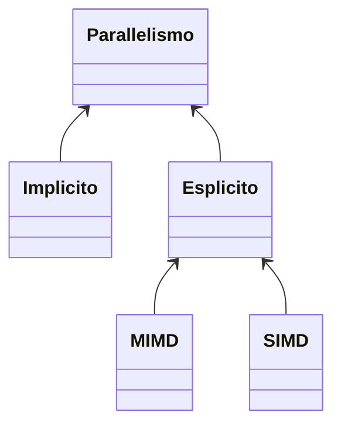
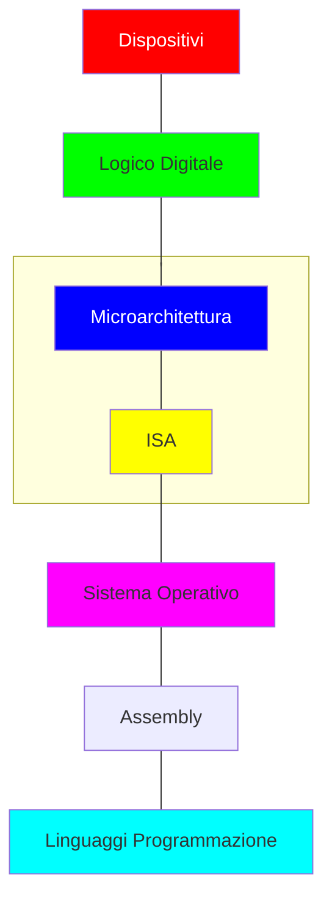

# Architetture e programmazione dei sistemi di elaborazione

Appunti di **PsykeDady** 

Corso del professore **Angiulli Fabrizio**

Anno Accademico **2017/2018**

$$Versione\ 1.0$$ 

[TOC]

## Prefazione

Gli appunti di seguito sono una trascrizione di quanto compreso nei miei studi, non sono da prendersi come verità assoluti, potrebbero essere pieni di errori e inesattezze anche se, avendoli pubblicati, son stati sufficienti per il mio conseguimento dell'esame.

### Grazie a ...

*Gianpaolo Cascardo* che ha raccolto, riordinato, rielaborato e trascritto vari appunti in forma cartacea ( tra cui i miei ) in modo da dare anche a me una base solida da cui partire 

### Strumenti utilizzati

- Il documento è stato trascritto interamente in Markdown utilizzando poi il software [Typora](https://typora.io/) come rendering per ottenere il pdf finale.
- Disegni e appunti "manuali" son stati ottenuti con il software [Stylus Labs Write](http://www.styluslabs.com) scritti su un vecchio [Surface Pro 4](en.wikipedia.org/wiki/Surface_Pro_4) 

## Introduzione

### Lo scopo

Lo scopo della materia è approfondire ed ottimizzare lo studio dei calcolatori per poterne ottimizzare e sfruttare le piene potenzialità tramite l'uso di tecniche *assembly e c* combinate.

Si partirà dunque dalla storia, le motivazioni che hanno portato allo sviluppo di un eventuale tecnologia in un modo specifico fino ad arrivare alle più recenti implementazioni.

### Tipologie di calcolatori, in breve

Si studieranno i seguenti calcolatori:

- **Macchina Multiciclo** : ogni operazione termina in più cicli (di clock)
- **Macchina Monociclo** : ogni operazione inizia e termina in un ciclo
- **Macchina Pipeline** : una struttura a catena permette il susseguirsi delle varie istruzioni un ciclo dopo l'altro
- **Macchina Superscalare** :
- **Macchina Parallela** :  

### Il parallelismo, in breve

Il parallelismo si divide come segue 

- **MIMD** : Multi istructions, multi data ( più istruzioni, più dati )
- **SIMD** : Single istruction, multi data ( un istruzione, più dati )

### Struttura del calcolatore multilivello

La progettazione del calcolatore può essere suddivisa in più moduli:

In particolare modo, verranno approfonditi i due livelli:

- **microarchitettura** : ordine, disposizione e logica con cui vengono assemblate le parti più semplici per ottenere un componente complesso
- **ISA** : o **I**struction **S**et **A**rchitecture, repertorio di istruzioni che consente di accedere alla potenza e alle funzionalità dei singoli elementi complessi

E come questi influenzano direttamente le potenzialità e le funzionalità del **Linguaggio Assembly**.
Attraverso questa struttura si è reso molto versatile l'utilizzo dei vari componenti del calcolatore, che si combinano dinamicamente nel formare una determinata funzionalità tramite una serie di istruzioni. 

Queste tecnica è detta anche **microprogrammazione**,

> <u>NOTA STORICA</u>:
>
> La distinzione a livelli avvenne dopo gli anni 50. Prima ogni istruzione era identificata da un determinato componente e basta. 

### legge di Moore

Nel 1965 Gordon Moore ipotizzò che il numero dei transistori sarebbe raddoppiato ogni 12 mesi, questa osservazione cambia negli anni 80 dove il periodo di raddoppiamento raddoppia anch'esso ( il numero dei transistori raddoppia ogni 24 mesi ) e si stabilizza in un secondo momento in una versione finale così formulata: 

> <u>**La legge di Moore (ver. finale)**</u>
>
> *"La capacità di elaborazione raddoppia ogni 18 mesi"*

## Il processo di produzione dei microprocessori

Per produrre componenti di calcolo, la risorsa più importante è il silicio che, attraverso la drogatura, può diventare *un conduttore o un isolante*, permettendo quindi di creare chiusure ed aperture di circuito che simuleranno nei componenti degli 0 e degli 1 logici.

Il silicio viene prelevato in forma granulosa e impura dai fondali del mare, viene quindi depurato e fuso in lingotti (o barre) purissimi. 

Il processo di produzione, detto anche **tecnologia planare del silicio**, inizia quindi da <u>una barra di silicio</u> di `30 cm` o `60 cm` ( ci sono proposte per portare il processo ad usare `45 cm` ) con diametro pari a `15` o `30 cm`.

Questo lingotto viene poi "*affettato*" in dischi chiamati **wafer** dello spessore di `2,5 cm`, i dischi vengono poi lavorati per ridurre impurità e rugosità attraverso i seguenti metodi:

- **Lappatura** : attraverso un abrasivo viene lisciata la superficie
- **attacco chimico** : attraverso componenti chimici, vengono eliminate le impurità, anche quelle dovute alla lappatura
- **lucidatura** : si rende lucida la superficie del wafer

Vengono poi applicate le seguenti fasi: 

- **Prima ossidazione e prima deposizione di emulsione fotosensibile.** Sulla superficie si forma uno strato continuo di SiO2 dello spessore di 0,6 ÷ 0,8 m e si ricopre poi la superficie ossidata con un sottile strato di KPR.
- **Prima mascheratura (tecnica fotolitografica).**  Con la tecnica fotolitografica si aprono delle finestre. Attualmente la mascheratura avviene per proiezione della maschera originale in modo da ottenere dimensioni ridotte sul wafer rispetto a quelle della maschera originale.
- **Diffusione di base e seconda ossidazione.** Avviene la diffusione di *materiale drogante* (in genere *boro*)
- **Seconda deposizione di emulsione fotosensibile e mascheratura.**  Si ricopre di nuovo il wafer di silicio con una nuova laccatura di materiale fotosensibile.

Il wafer viene suddiviso poi in piccoli pezzi regolari e su ognuno di questi vengono posizionati i componenti, viene così creato il componente. Più i componenti creati ( e quindi i pezzi ) sono piccoli, più probabilmente verranno fuori difetti dai vari componenti (che quindi verranno eliminati) 

Nel tempo, si è andati per la così detta "**miniaturizzazione**" dei componenti, si è passati dall'ordine dei <u>*10&micro;m* nel 1971 con intel 4004</u> e si è arrivati, più recentemente (nel 2018 con **Apple A12**, *processore ARM*) alla tecnologia a `7nm`, son previste tecnologie a `5nm` per i prossimi anni ma si parla anche di "*stop della miniaturizzazione*", per via dei limiti fisici e prestazionali del processo.

## Prestazioni del calcolatore 

Le prestazioni sono c

# LEGENDA

Template e legenda di note e stili di scrittura usati

> <u>NOTA</u>:
>
> note varie 

> <u>**Citazione o legge**</u>
>
> *"testo della citazione o della legge"*