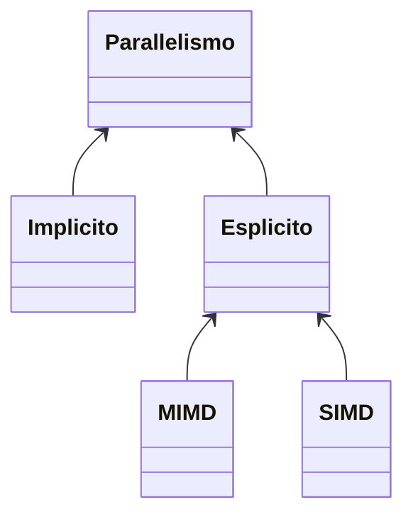
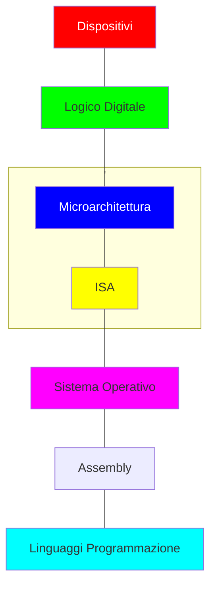

# Architetture e programmazione dei sistemi di elaborazione

Appunti di **PsykeDady** 

Corso del professore **Angiulli Fabrizio**

Anno Accademico **2017/2018**

$$Versione\ 1.0$$ 

[TOC]

## Prefazione

Gli appunti di seguito sono una trascrizione di quanto compreso nei miei studi, non sono da prendersi come verità assoluti, potrebbero essere pieni di errori e inesattezze anche se, avendoli pubblicati, son stati sufficienti per il mio conseguimento dell'esame.

### Grazie a ...

*Gianpaolo Cascardo* che ha raccolto, riordinato, rielaborato e trascritto vari appunti in forma cartacea ( tra cui i miei ) in modo da dare anche a me una base solida da cui partire 

### Strumenti utilizzati

- Il documento è stato trascritto interamente in Markdown utilizzando poi il software [Typora](https://typora.io/) come rendering per ottenere il pdf finale.
- Disegni e appunti "manuali" son stati ottenuti con il software [Stylus Labs Write](http://www.styluslabs.com) scritti su un vecchio [Surface Pro 4](en.wikipedia.org/wiki/Surface_Pro_4) 

## Introduzione

### Lo scopo

Lo scopo della materia è approfondire ed ottimizzare lo studio dei calcolatori per poterne ottimizzare e sfruttare le piene potenzialità tramite l'uso di tecniche *assembly e c* combinate.

Si partirà dunque dalla storia, le motivazioni che hanno portato allo sviluppo di un eventuale tecnologia in un modo specifico fino ad arrivare alle più recenti implementazioni.

### Tipologie di calcolatori, in breve

Si studieranno i seguenti calcolatori:

- **Macchina Multiciclo** : ogni operazione termina in più cicli (di clock)
- **Macchina Monociclo** : ogni operazione inizia e termina in un ciclo
- **Macchina Pipeline** : una struttura a catena permette il susseguirsi delle varie istruzioni un ciclo dopo l'altro
- **Macchina Superscalare** :
- **Macchina Parallela** :  

### Il parallelismo, in breve

Il parallelismo si divide come segue 

- **MIMD** : Multi istructions, multi data ( più istruzioni, più dati )
- **SIMD** : Single istruction, multi data ( un istruzione, più dati )

### Struttura del calcolatore multilivello

La progettazione del calcolatore può essere suddivisa in più moduli:

In particolare modo, verranno approfonditi i due livelli:

- **microarchitettura** : ordine, disposizione e logica con cui vengono assemblate le parti più semplici per ottenere un componente complesso
- **ISA** : o **I**struction **S**et **A**rchitecture, repertorio di istruzioni che consente di accedere alla potenza e alle funzionalità dei singoli elementi complessi

E come questi influenzano direttamente le potenzialità e le funzionalità del **Linguaggio Assembly**.
Attraverso questa struttura si è reso molto versatile l'utilizzo dei vari componenti del calcolatore, che si combinano dinamicamente nel formare una determinata funzionalità tramite una serie di istruzioni.
Queste tecnica è detta anche **microprogrammazione**,

> <u>NOTA STORICA</u>:
>
> La distinzione a livelli avvenne dopo gli anni 50. Prima ogni istruzione era identificata da un determinato componente e basta. 